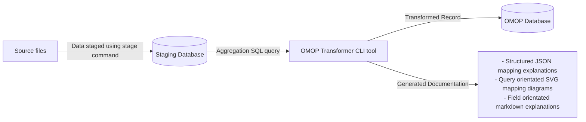

<details open markdown="block">
  <summary>
    Table of contents
  </summary>
  {: .text-delta }
- TOC
{:toc}
</details>

# Data Transformation

## Overview

This ETL tool has been designed to be documentation centric. This means that the same code is used to transform the data as is used to generate the documentation. They can never drift away from each other.

This tool extracts and transforms the data using a two step process.



## Data extract

At this stage of a data extract we simply run a SQL query. This query is to be used to handle any data aggregations, joins or any special cases.

The query is declared within a named XML file. The file format importantly includes an explanation of the query.

### Query file format

* `Sql` this element contains the query definition.
* `Query/Explanations/Explanation/@columnName` this attribute ties the explanation to one of the output fields of the query.
* `Query/Explanations/Explanation/Description` a human readable explanation of what the field output from the query is including a summary of any logic (markdown supported)
* `Query/Explanations/Explanation/Origin` an element that lists each NHS Data Dictionary element name that is used to produce the field. This element can occur many times per explanation.

Example

```xml
<Query>
    <Sql>
select
	distinct
		Patient_Postcode,
		NHS_Number,
		Date_Of_Birth,
		Person_Stated_Gender_Code
from omop_staging.sact_staging
	</Sql>

	<Explanations>
		<Explanation columnName="NHS_Number">
			<Description>Patient NHS Number</Description>
			<Origin>NHS NUMBER</Origin>
		</Explanation>

		<Explanation columnName="Patient_Postcode">
			<Description>Patient's Postcode.</Description>
			<Origin>POSTCODE</Origin>
		</Explanation>

		<Explanation columnName="Date_Of_Birth">
			<Description>Patient's date of birth.</Description>
			<Origin>PERSON BIRTH DATE</Origin>
		</Explanation>
		<Explanation columnName="Person_Stated_Gender_Code">
			<Description>The patient's Sex</Description>
			<Origin>PERSON GENDER CODE CURRENT</Origin>
		</Explanation>
	</Explanations>
</Query>
```

## Transformation

Results from the first stage aggregation are transformed to the OMOP format using C# annotations.

Transformations are strongly typed between the incoming query record and the target OMOP record. This is achieved through polymorphism and attributes.

A transformation can be declared by inherting a class that derrives from one of the base OMOP classes. Each class represents a table in the OMOP database.

Supported OMOP classes
* `OmopConditionOccurrence`
* `OmopDeath`
* `OmopDrugExposure`
* `OmopDeviceExposure`
* `OmopLocation`
* `OmopObservation`
* `OmopPerson`
* `OmopCareSite`
* `OmopProvider`
* `OmopMeasurement`
* `OmopProcedureOccurrence`
* `OmopVisitDetail`
* `OmopVisitOccurrence`

When inherting from the base class, the source type must be specified as type `T`. The source type should represent a row of data from the incoming query.

### Example

Declare a class to represent a row of incoming Data that uses the `OmopDemographics.xml` query.

```csharp
[DataOrigin("COSD")]
[Description("COSD Demographics")]
[SourceQuery("OmopDemographics.xml")]
internal class CosdDemographics
{
    public string? StreetAddressLine1 { get; set; }
    public string? StreetAddressLine2 { get; set; }
    public string? StreetAddressLine3 { get; set; }
    public string? StreetAddressLine4 { get; set; }
    public string? Postcode { get; set; }
    public string? NhsNumber { get; set; }
    public string? PersonBirthDate { get; set; }
    public string? DateOfBirth { get; set; }
    public string? EthnicCategory { get; set; }
}
``` 

Declare a class to form a relationship between the `OmopLocation` type and the incoming `CosdDemographics` type.

```csharp
using OmopTransformer.Annotations;
using OmopTransformer.COSD.Demographics;
using OmopTransformer.Omop.Location;
using OmopTransformer.Transformation;

namespace OmopTransformer.COSD;

internal class CosdLocation : OmopLocation<CosdDemographics>
{
    [Transform(typeof(UppercaseAndTrimWhitespace), nameof(Source.StreetAddressLine1))]
    public override string? address_1 { get; set; }

    [Transform(typeof(UppercaseAndTrimWhitespace), nameof(Source.StreetAddressLine2))]
    public override string? address_2 { get; set; }

    [Transform(typeof(UppercaseAndTrimWhitespace), nameof(Source.StreetAddressLine3))]
    public override string? city { get; set; }

    [Transform(typeof(UppercaseAndTrimWhitespace), nameof(Source.StreetAddressLine4))]
    public override string? county { get; set; }

    [Transform(typeof(PostcodeFormatter), nameof(Source.Postcode))]
    public override string? zip { get; set; }

    [Transform(
        typeof(TextDeliminator),
        nameof(Source.StreetAddressLine1),
        nameof(Source.StreetAddressLine2),
        nameof(Source.StreetAddressLine3),
        nameof(Source.StreetAddressLine4),
        nameof(Source.Postcode))]
    public override string? location_source_value { get; set; }

    [CopyValue(nameof(Source.NhsNumber))]
    public override string? nhs_number { get; set; }
}
```

A relationship is formed between a number of source fields and a OMOP target field by overriding the OMOP base classes field and adding the `Transform` attribute. 

```csharp
[Transform(typeof(PostcodeFormatter), nameof(Source.Postcode))]
public override string? zip { get; set; }
```

## Field attributes

Three attributes can be used to populate an OMOP field. Each is declared in `OmopTransformer/Annotations/`.

### `Transform`

Invokes an [`ISelector`](#iselector-selectors) or [`ILookup`](#ilookup-lookups) with one or more source field values.

```csharp
[Transform(typeof(PostcodeFormatter), nameof(Source.Postcode))]
public override string? zip { get; set; }
```

Set `useOmopTypeAsSource: true` to read the input from a field on the OMOP target type rather than the source record. This is commonly used to resolve a previously-populated `*_source_concept_id` into its standard concept:

```csharp
[Transform(typeof(StandardDrugConceptSelector), useOmopTypeAsSource: true, nameof(drug_source_concept_id))]
public override int? drug_concept_id { get; set; }
```

### `CopyValue`

Copies a source field onto the OMOP field without any transformation.

```csharp
[CopyValue(nameof(Source.NHS_NUMBER))]
public override string? nhs_number { get; set; }
```

### `ConstantValue`

Populates the OMOP field with a fixed value. The second argument is a human-readable label surfaced in the generated documentation.

```csharp
[ConstantValue(32828, "EHR episode record")]
public override int? observation_type_concept_id { get; set; }
```

## Transformations

A transformation used by `[Transform(typeof(X), ...)]` is one of three things:

* A general-purpose **converter** (a plain `ISelector`) - parses or reformats a value.
* An [**`ILookup`**](#ilookup-lookups) - maps a source code to an OMOP concept via a static in-memory table.
* An [**`ISelector`** vocabulary selector](#iselector-selectors) - resolves a code against the loaded OMOP vocabulary using a singleton `*Resolver` service.

### General-purpose converters

Simple `ISelector` implementations under `OmopTransformer/Transformation/` that take one or more source values and return a converted value.

| Name | Purpose |
|------|---------|
| `DateConverter` | Parses a source string into a `DateTime`. |
| `DateOnlyConverter` | Parses a source string into a `DateOnly`. |
| `DateAndTimeCombiner` | Combines a date (eg `20240101`) with a time (eg `100500`) into a `DateTime`. |
| `DateParser` | Parses a date in a number of accepted formats. |
| `TimeParser` | Parses a time-of-day. |
| `NumberParser` | Parses an integer. |
| `DoubleParser` | Parses a `double`. |
| `FloatParser` | Parses a `float`. |
| `UppercaseAndTrimWhitespace` | Uppercases and trims the source value. |
| `PostcodeFormatter` | Normalises a UK postcode. |
| `TextDeliminator` | Joins multiple source values with a delimiter into a single source-value string. |
| `YearSelector` | Extracts the year component from a date. |
| `MonthOfYearSelector` | Extracts the month component from a date. |
| `DayOfMonthSelector` | Extracts the day-of-month component from a date. |

### `ILookup` lookups

`ILookup` implementations hold a `Dictionary<string, ValueWithNote>` that maps an NHS data-dictionary code to an OMOP concept id (with an optional note used in the generated documentation). They are invoked by passing a single source field as the argument to `[Transform]`.

| Name | Purpose |
|------|---------|
| `NhsGenderLookup` | NHS gender code → gender concept. |
| `RtdsGenderLookup` | RTDS-specific gender code → gender concept. |
| `RaceConceptLookup` / `RaceSourceConceptLookup` | NHS ethnic category → race / race source concept. |
| `AccidentAndEmergencyDischargeDestinationLookup` | A&E discharge destination code → concept. |
| `AccidentAndEmergencyInvestigationLookup` | A&E investigation code → concept. |
| `NhsAEDiagnosisLookup` | A&E diagnosis code → condition concept. |
| `NhsAETreatmentLookup` | A&E treatment code → procedure concept. |
| `AdmittedSourceLookup` | Admission source code → concept. |
| `DischargeDestinationLookup` | Discharge destination code (inpatient) → concept. |
| `NhsMainSpecialityCodeLookup` | NHS main speciality code → provider concept. |
| `NhsCriticalCareActivityCodeLookup` | CCMDS activity code → procedure concept. |
| `NhsCriticalCareActivityDeviceLookup` | CCMDS activity code → device concept. |
| `BiopsyAnaestheticTypeLookup` | COSD biopsy anaesthetic type → concept. |
| `DataDictionaryBasisOfDiagnosisCancerLookup` | Basis of diagnosis (cancer) → concept. |
| `GradeDifferentiationLookup` | Tumour grade/differentiation → concept. |
| `TCategoryLookup`, `NCategoryLookup`, `MCategoryLookup`, `TNMCategoryLookup` | TNM staging codes → concepts. |
| `MetastasisSiteLookup` | Metastasis site code → concept. |
| `RelapseMethodOfDetectionLungLookup` | Lung cancer relapse detection method → concept. |
| `SurgicalAccessTypeLungLookup` | Lung surgical access type → concept. |
| `SynchronousTumourLookup` | Synchronous tumour indicator → concept. |
| `TumourLateralityLookup` | Tumour laterality → concept. |
| `PrescribingDrugRouteLookup` | Prescribing route code → route concept. |
| `SactAdjunctiveTherapyTypeLookup` | SACT adjunctive therapy type → concept. |
| `SactDrugAdministrationRouteLookup` | SACT administration route → route concept. |
| `SactTreatmentIntentLookup` | SACT treatment intent → concept. |
| `SactUnitOfMeasurement` | SACT unit of measurement → unit concept. |
| `RxNormLookup` | Oxford drug catalog code → RxNorm concept. |
| `LabTestLookup` | Oxford lab event code → LOINC measurement concept. |
| `SactDrugLookup` | SACT drug name → drug concept. |

The full mapping tables are generated into the field-level documentation by the [`docs` command](#docs-command).

### `ISelector` vocabulary selectors

`ISelector` selectors resolve a code against the OMOP vocabulary loaded by [`init`](#init-command). They delegate to singleton `*Resolver` services (`StandardConceptResolver`, `Icd10StandardResolver`, `Icd10NonStandardResolver`, `Opcs4Resolver`, `Icdo3Resolver`, `SnomedResolver`, `MeasurementMapsToValueResolver`) that are registered in `Program.cs` and share vocabulary data across all transformations.

| Name | Purpose |
|------|---------|
| `StandardConceptSelector` | Resolves a concept id to its standard concept (any domain). |
| `StandardConditionConceptSelector` | Resolves a concept id to its standard **condition** concept. |
| `StandardDeviceConceptSelector` | Resolves a concept id to its standard **device** concept. |
| `StandardDrugConceptSelector` | Resolves a concept id to its standard **drug** concept. |
| `StandardMeasurementConceptSelector` | Resolves a concept id to its standard **measurement** concept. |
| `StandardObservationConceptSelector` | Resolves a concept id to its standard **observation** concept. |
| `StandardProcedureConceptSelector` | Resolves a concept id to its standard **procedure** concept. |
| `ConceptDeviceSelector` | Variant of the standard-concept lookup specialised for device exposure. |
| `Icd10StandardSelector` | Resolves an ICD-10 code to its standard OMOP concept. |
| `Icd10StandardNonStandardSelector` | Resolves an ICD-10 code to its non-standard (source) OMOP concept. |
| `Opcs4Selector` | Resolves an OPCS-4 procedure code to a concept. |
| `Icdo3Selector` | Resolves an ICD-O-3 histology + topography pair to a concept. |
| `SnomedSelector` | Resolves a SNOMED CT code to a concept. |
| `RelationshipSelector` | Resolves a concept via its `Maps to value` relationship (used for measurement value domains). |

These selectors are typically combined with `useOmopTypeAsSource: true` to populate the standard `*_concept_id` field from a previously-populated `*_source_concept_id`:

```csharp
[CopyValue(nameof(Source.concept_identifier))]
public override int? drug_source_concept_id { get; set; }

[Transform(typeof(StandardDrugConceptSelector), useOmopTypeAsSource: true, nameof(drug_source_concept_id))]
public override int? drug_concept_id { get; set; }
```

## Notes

*Note: JSON would be used instead of XML but it does not support strings that spans many lines. Multiline text can be stored, but only one a single line, which would have caused readability/review issues.*