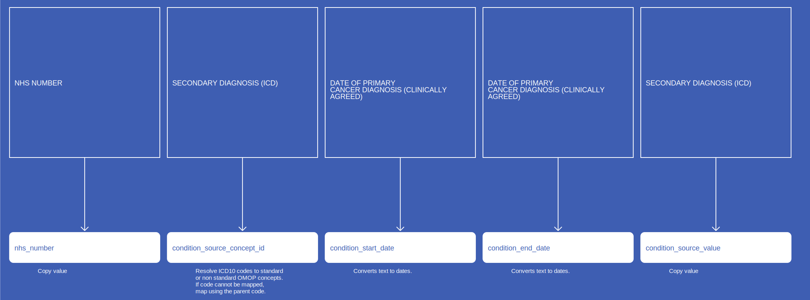
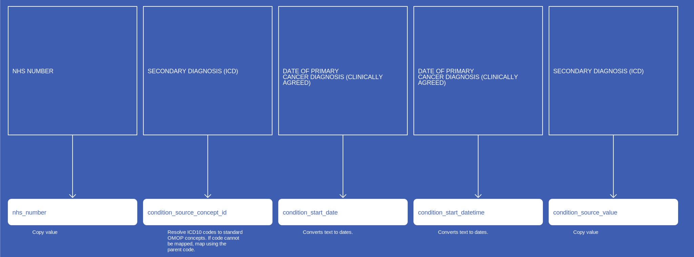
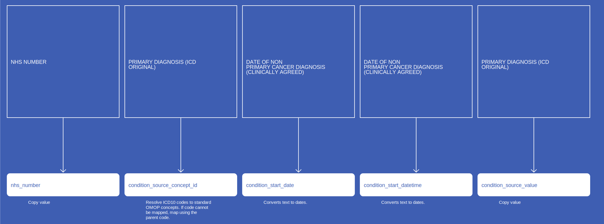
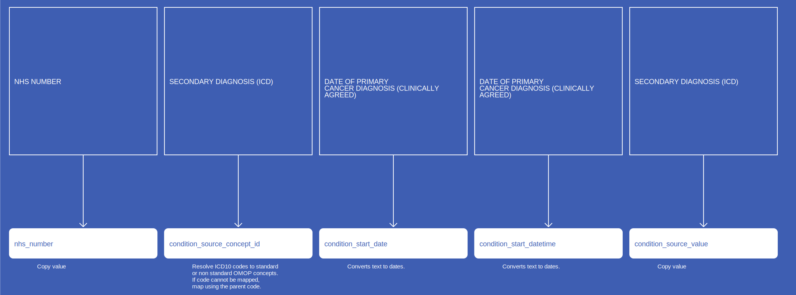
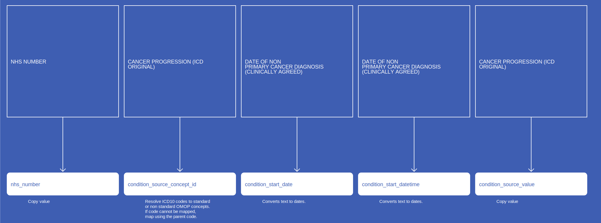
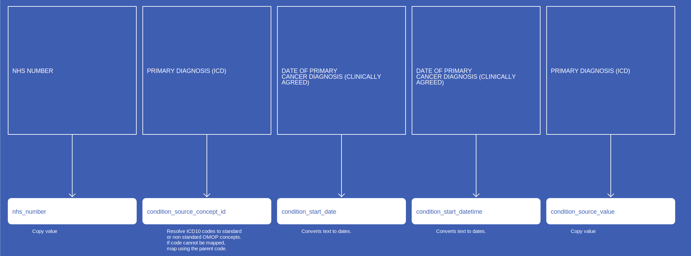
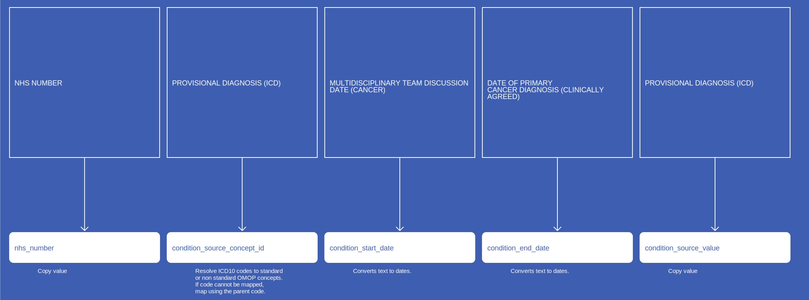
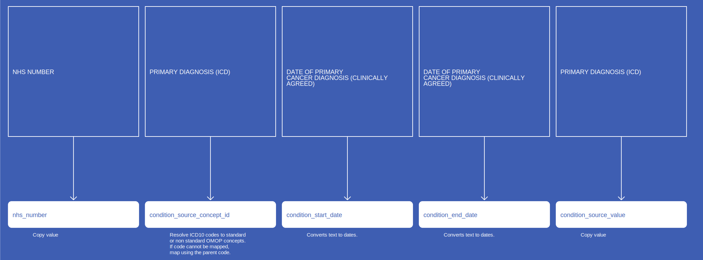

# ConditionOccurrence
* [nhs_number]()
* [condition_source_concept_id]()
* [condition_concept_id]()
* [condition_start_date]()
* [condition_start_datetime]()
* [condition_end_date]()
* [condition_end_datetime]()
* [condition_source_value]()
* [condition_type_concept_id]()
* [RecordConnectionIdentifier]()
* [condition_status_concept_id]()
* [condition_status_source_value]()

## SusOPConditionOccurrence

[Comment or raise an issue for this mapping.](https://github.com/answerdigital/oxford-omop-data-mapper/issues/new?title=SusOPConditionOccurrence%20mapping){: .btn }
## SusAPCConditionOccurrence

[Comment or raise an issue for this mapping.](https://github.com/answerdigital/oxford-omop-data-mapper/issues/new?title=SusAPCConditionOccurrence%20mapping){: .btn }
## SusAEConditionOccurrence

[Comment or raise an issue for this mapping.](https://github.com/answerdigital/oxford-omop-data-mapper/issues/new?title=SusAEConditionOccurrence%20mapping){: .btn }
## SactConditionOccurrence

[Comment or raise an issue for this mapping.](https://github.com/answerdigital/oxford-omop-data-mapper/issues/new?title=SactConditionOccurrence%20mapping){: .btn }
## RtdsConditionOccurrence

[Comment or raise an issue for this mapping.](https://github.com/answerdigital/oxford-omop-data-mapper/issues/new?title=RtdsConditionOccurrence%20mapping){: .btn }
## OxfordGPConditionOccurrence

[Comment or raise an issue for this mapping.](https://github.com/answerdigital/oxford-omop-data-mapper/issues/new?title=OxfordGPConditionOccurrence%20mapping){: .btn }
## COSDv9URConditionOccurrenceSecondaryDiagnosisICD

[Comment or raise an issue for this mapping.](https://github.com/answerdigital/oxford-omop-data-mapper/issues/new?title=COSDv9URConditionOccurrenceSecondaryDiagnosisICD%20mapping){: .btn }
## COSDv9URConditionOccurrencePrimaryDiagnosisICD

[Comment or raise an issue for this mapping.](https://github.com/answerdigital/oxford-omop-data-mapper/issues/new?title=COSDv9URConditionOccurrencePrimaryDiagnosisICD%20mapping){: .btn }
## COSDv9URConditionOccurrenceOriginalPrimaryDiagnosisICD

[Comment or raise an issue for this mapping.](https://github.com/answerdigital/oxford-omop-data-mapper/issues/new?title=COSDv9URConditionOccurrenceOriginalPrimaryDiagnosisICD%20mapping){: .btn }
## COSDv9URConditionOccurrenceCancerProgressionICD

[Comment or raise an issue for this mapping.](https://github.com/answerdigital/oxford-omop-data-mapper/issues/new?title=COSDv9URConditionOccurrenceCancerProgressionICD%20mapping){: .btn }
## COSDv8URConditionOccurrencePrimaryDiagnosisICD

[Comment or raise an issue for this mapping.](https://github.com/answerdigital/oxford-omop-data-mapper/issues/new?title=COSDv8URConditionOccurrencePrimaryDiagnosisICD%20mapping){: .btn }
## COSDv8URConditionOccurrenceCancerProgressionICD

[Comment or raise an issue for this mapping.](https://github.com/answerdigital/oxford-omop-data-mapper/issues/new?title=COSDv8URConditionOccurrenceCancerProgressionICD%20mapping){: .btn }
## COSDv9UGConditionOccurrenceSecondaryDiagnosisICD

[Comment or raise an issue for this mapping.](https://github.com/answerdigital/oxford-omop-data-mapper/issues/new?title=COSDv9UGConditionOccurrenceSecondaryDiagnosisICD%20mapping){: .btn }
## COSDv9UGConditionOccurrencePrimaryDiagnosisICD

[Comment or raise an issue for this mapping.](https://github.com/answerdigital/oxford-omop-data-mapper/issues/new?title=COSDv9UGConditionOccurrencePrimaryDiagnosisICD%20mapping){: .btn }
## COSDv9UGConditionOccurrenceOriginalPrimaryDiagnosisICD

[Comment or raise an issue for this mapping.](https://github.com/answerdigital/oxford-omop-data-mapper/issues/new?title=COSDv9UGConditionOccurrenceOriginalPrimaryDiagnosisICD%20mapping){: .btn }
## COSDv9UGConditionOccurrenceCancerProgressionICD

[Comment or raise an issue for this mapping.](https://github.com/answerdigital/oxford-omop-data-mapper/issues/new?title=COSDv9UGConditionOccurrenceCancerProgressionICD%20mapping){: .btn }
## COSDv8UGConditionOccurrencePrimaryDiagnosisICD

[Comment or raise an issue for this mapping.](https://github.com/answerdigital/oxford-omop-data-mapper/issues/new?title=COSDv8UGConditionOccurrencePrimaryDiagnosisICD%20mapping){: .btn }
## COSDv8UGConditionOccurrenceCancerProgressionICD

[Comment or raise an issue for this mapping.](https://github.com/answerdigital/oxford-omop-data-mapper/issues/new?title=COSDv8UGConditionOccurrenceCancerProgressionICD%20mapping){: .btn }
## COSDv9SKConditionOccurrenceSecondaryDiagnosisICD

[Comment or raise an issue for this mapping.](https://github.com/answerdigital/oxford-omop-data-mapper/issues/new?title=COSDv9SKConditionOccurrenceSecondaryDiagnosisICD%20mapping){: .btn }
## COSDv9SKConditionOccurrencePrimaryDiagnosisICD

[Comment or raise an issue for this mapping.](https://github.com/answerdigital/oxford-omop-data-mapper/issues/new?title=COSDv9SKConditionOccurrencePrimaryDiagnosisICD%20mapping){: .btn }
## COSDv9SKConditionOccurrenceOriginalPrimaryDiagnosisICD

[Comment or raise an issue for this mapping.](https://github.com/answerdigital/oxford-omop-data-mapper/issues/new?title=COSDv9SKConditionOccurrenceOriginalPrimaryDiagnosisICD%20mapping){: .btn }
## COSDv9SKConditionOccurrenceCancerProgressionICD

[Comment or raise an issue for this mapping.](https://github.com/answerdigital/oxford-omop-data-mapper/issues/new?title=COSDv9SKConditionOccurrenceCancerProgressionICD%20mapping){: .btn }
## COSDv8SKConditionOccurrenceSecondaryDiagnosisICD

[Comment or raise an issue for this mapping.](https://github.com/answerdigital/oxford-omop-data-mapper/issues/new?title=COSDv8SKConditionOccurrenceSecondaryDiagnosisICD%20mapping){: .btn }
## COSDv8SKConditionOccurrencePrimaryDiagnosisICD

[Comment or raise an issue for this mapping.](https://github.com/answerdigital/oxford-omop-data-mapper/issues/new?title=COSDv8SKConditionOccurrencePrimaryDiagnosisICD%20mapping){: .btn }
## COSDv8SKConditionOccurrenceCancerProgressionICD

[Comment or raise an issue for this mapping.](https://github.com/answerdigital/oxford-omop-data-mapper/issues/new?title=COSDv8SKConditionOccurrenceCancerProgressionICD%20mapping){: .btn }
## COSDv9SAConditionOccurrenceSecondaryDiagnosisICD

[Comment or raise an issue for this mapping.](https://github.com/answerdigital/oxford-omop-data-mapper/issues/new?title=COSDv9SAConditionOccurrenceSecondaryDiagnosisICD%20mapping){: .btn }
## COSDv9SAConditionOccurrencePrimaryDiagnosisICD

[Comment or raise an issue for this mapping.](https://github.com/answerdigital/oxford-omop-data-mapper/issues/new?title=COSDv9SAConditionOccurrencePrimaryDiagnosisICD%20mapping){: .btn }
## COSDv9SAConditionOccurrenceOriginalPrimaryDiagnosisICD

[Comment or raise an issue for this mapping.](https://github.com/answerdigital/oxford-omop-data-mapper/issues/new?title=COSDv9SAConditionOccurrenceOriginalPrimaryDiagnosisICD%20mapping){: .btn }
## COSDv9SAConditionOccurrenceCancerProgressionICD

[Comment or raise an issue for this mapping.](https://github.com/answerdigital/oxford-omop-data-mapper/issues/new?title=COSDv9SAConditionOccurrenceCancerProgressionICD%20mapping){: .btn }
## COSDv8SAConditionOccurrencePrimaryDiagnosisICD

[Comment or raise an issue for this mapping.](https://github.com/answerdigital/oxford-omop-data-mapper/issues/new?title=COSDv8SAConditionOccurrencePrimaryDiagnosisICD%20mapping){: .btn }
## COSDv8SAConditionOccurrenceCancerProgressionICD

[Comment or raise an issue for this mapping.](https://github.com/answerdigital/oxford-omop-data-mapper/issues/new?title=COSDv8SAConditionOccurrenceCancerProgressionICD%20mapping){: .btn }
## COSDv9LVConditionOccurrenceSecondaryDiagnosisICD

[Comment or raise an issue for this mapping.](https://github.com/answerdigital/oxford-omop-data-mapper/issues/new?title=COSDv9LVConditionOccurrenceSecondaryDiagnosisICD%20mapping){: .btn }
## COSDv9LVConditionOccurrencePrimaryDiagnosisICD

[Comment or raise an issue for this mapping.](https://github.com/answerdigital/oxford-omop-data-mapper/issues/new?title=COSDv9LVConditionOccurrencePrimaryDiagnosisICD%20mapping){: .btn }
## COSDv9LVConditionOccurrenceOriginalPrimaryDiagnosisICD

[Comment or raise an issue for this mapping.](https://github.com/answerdigital/oxford-omop-data-mapper/issues/new?title=COSDv9LVConditionOccurrenceOriginalPrimaryDiagnosisICD%20mapping){: .btn }
## COSDv9LVConditionOccurrenceCancerProgressionICD

[Comment or raise an issue for this mapping.](https://github.com/answerdigital/oxford-omop-data-mapper/issues/new?title=COSDv9LVConditionOccurrenceCancerProgressionICD%20mapping){: .btn }
## COSDv8LVConditionOccurrencePrimaryDiagnosisICD

[Comment or raise an issue for this mapping.](https://github.com/answerdigital/oxford-omop-data-mapper/issues/new?title=COSDv8LVConditionOccurrencePrimaryDiagnosisICD%20mapping){: .btn }
## COSDv8LVConditionOccurrenceCancerProgressionICD

[Comment or raise an issue for this mapping.](https://github.com/answerdigital/oxford-omop-data-mapper/issues/new?title=COSDv8LVConditionOccurrenceCancerProgressionICD%20mapping){: .btn }
## CosdV9LungConditionOccurrenceRecurrence

{: .important-title }
> Assumptions
>
> * Any changes in a Diagnosis that may occur in later submissions, for the same Diagnosis date, is taken to be an additional diagnosis as opposed to a change (hence removal of the original)
> * If the same Diagnosis occurs but we have 2 separate "basis of diagnosis" values, then the first one will be taken only

[Comment or raise an issue for this mapping.](https://github.com/answerdigital/oxford-omop-data-mapper/issues/new?title=CosdV9LungConditionOccurrenceRecurrence%20mapping){: .btn }
## CosdV9LungConditionOccurrenceProgression

{: .important-title }
> Assumptions
>
> * Any changes in a Diagnosis that may occur in later submissions, for the same Diagnosis date, is taken to be an additional diagnosis as opposed to a change (hence removal of the original)
> * If the same Diagnosis occurs but we have 2 separate "basis of diagnosis" values, then the first one will be taken only

[Comment or raise an issue for this mapping.](https://github.com/answerdigital/oxford-omop-data-mapper/issues/new?title=CosdV9LungConditionOccurrenceProgression%20mapping){: .btn }
## CosdV8LungConditionOccurrenceProgression

{: .important-title }
> Assumptions
>
> * Any changes in a Diagnosis that may occur in later submissions, for the same Diagnosis date, is taken to be an additional diagnosis as opposed to a change (hence removal of the original)
> * If the same Diagnosis occurs but we have 2 separate "basis of diagnosis" values, then the first one will be taken only

[Comment or raise an issue for this mapping.](https://github.com/answerdigital/oxford-omop-data-mapper/issues/new?title=CosdV8LungConditionOccurrenceProgression%20mapping){: .btn }
## CosdV8LungConditionOccurrencePrimaryDiagnosis

{: .important-title }
> Assumptions
>
> * Any changes in a Diagnosis that may occur in later submissions, for the same Diagnosis date, is taken to be an additional diagnosis as opposed to a change (hence removal of the original)
> * If the same Diagnosis occurs but we have 2 separate "basis of diagnosis" values, then the first one will be taken only

[Comment or raise an issue for this mapping.](https://github.com/answerdigital/oxford-omop-data-mapper/issues/new?title=CosdV8LungConditionOccurrencePrimaryDiagnosis%20mapping){: .btn }
## CosdV8LungConditionOccurrencePrimaryDiagnosisHistologyTopography

{: .important-title }
> Assumptions
>
> * For a given Diagnosis date, all valid combinations of Histology and Topography are added (thereby giving us an ICD-O-3 condition) as well as the ICD10 Diagnosis.
> * Any changes in a Diagnosis that may occur in later submissions, for the same Diagnosis date, is taken to be an additional diagnosis as opposed to a change (hence removal of the original)
> * If the same Diagnosis occurs but we have 2 separate "basis of diagnosis" values, then the first one will be taken only

[Comment or raise an issue for this mapping.](https://github.com/answerdigital/oxford-omop-data-mapper/issues/new?title=CosdV8LungConditionOccurrencePrimaryDiagnosisHistologyTopography%20mapping){: .btn }
## COSDv9HNConditionOccurrenceSecondaryDiagnosisICD

[Comment or raise an issue for this mapping.](https://github.com/answerdigital/oxford-omop-data-mapper/issues/new?title=COSDv9HNConditionOccurrenceSecondaryDiagnosisICD%20mapping){: .btn }
## COSDv9HNConditionOccurrencePrimaryDiagnosisICD

[Comment or raise an issue for this mapping.](https://github.com/answerdigital/oxford-omop-data-mapper/issues/new?title=COSDv9HNConditionOccurrencePrimaryDiagnosisICD%20mapping){: .btn }
## COSDv9HNConditionOccurrenceOriginalPrimaryDiagnosisICD

[Comment or raise an issue for this mapping.](https://github.com/answerdigital/oxford-omop-data-mapper/issues/new?title=COSDv9HNConditionOccurrenceOriginalPrimaryDiagnosisICD%20mapping){: .btn }
## COSDv9HNConditionOccurrenceCancerProgressionICD

[Comment or raise an issue for this mapping.](https://github.com/answerdigital/oxford-omop-data-mapper/issues/new?title=COSDv9HNConditionOccurrenceCancerProgressionICD%20mapping){: .btn }
## COSDv8HNConditionOccurrencePrimaryDiagnosisICD

[Comment or raise an issue for this mapping.](https://github.com/answerdigital/oxford-omop-data-mapper/issues/new?title=COSDv8HNConditionOccurrencePrimaryDiagnosisICD%20mapping){: .btn }
## COSDv8HNConditionOccurrenceCancerProgressionICD

[Comment or raise an issue for this mapping.](https://github.com/answerdigital/oxford-omop-data-mapper/issues/new?title=COSDv8HNConditionOccurrenceCancerProgressionICD%20mapping){: .btn }
## COSDv9GYConditionOccurrenceSecondaryDiagnosisICD

[Comment or raise an issue for this mapping.](https://github.com/answerdigital/oxford-omop-data-mapper/issues/new?title=COSDv9GYConditionOccurrenceSecondaryDiagnosisICD%20mapping){: .btn }
## COSDv9GYConditionOccurrencePrimaryDiagnosisICD

[Comment or raise an issue for this mapping.](https://github.com/answerdigital/oxford-omop-data-mapper/issues/new?title=COSDv9GYConditionOccurrencePrimaryDiagnosisICD%20mapping){: .btn }
## COSDv9GYConditionOccurrenceOriginalPrimaryDiagnosisICD

[Comment or raise an issue for this mapping.](https://github.com/answerdigital/oxford-omop-data-mapper/issues/new?title=COSDv9GYConditionOccurrenceOriginalPrimaryDiagnosisICD%20mapping){: .btn }
## COSDv9GYConditionOccurrenceCancerProgressionICD

[Comment or raise an issue for this mapping.](https://github.com/answerdigital/oxford-omop-data-mapper/issues/new?title=COSDv9GYConditionOccurrenceCancerProgressionICD%20mapping){: .btn }
## COSDv8GYConditionOccurrenceSecondaryDiagnosisICD

[Comment or raise an issue for this mapping.](https://github.com/answerdigital/oxford-omop-data-mapper/issues/new?title=COSDv8GYConditionOccurrenceSecondaryDiagnosisICD%20mapping){: .btn }
## COSDv8GYConditionOccurrencePrimaryDiagnosisICD

[Comment or raise an issue for this mapping.](https://github.com/answerdigital/oxford-omop-data-mapper/issues/new?title=COSDv8GYConditionOccurrencePrimaryDiagnosisICD%20mapping){: .btn }
## COSDv8GYConditionOccurrenceCancerProgressionICD

[Comment or raise an issue for this mapping.](https://github.com/answerdigital/oxford-omop-data-mapper/issues/new?title=COSDv8GYConditionOccurrenceCancerProgressionICD%20mapping){: .btn }
## COSDv9CTConditionOccurrenceSecondaryDiagnosisICD

[Comment or raise an issue for this mapping.](https://github.com/answerdigital/oxford-omop-data-mapper/issues/new?title=COSDv9CTConditionOccurrenceSecondaryDiagnosisICD%20mapping){: .btn }
## COSDv9CTConditionOccurrencePrimaryDiagnosisICD

[Comment or raise an issue for this mapping.](https://github.com/answerdigital/oxford-omop-data-mapper/issues/new?title=COSDv9CTConditionOccurrencePrimaryDiagnosisICD%20mapping){: .btn }
## COSDv9CTConditionOccurrenceOriginalPrimaryDiagnosisICD

[Comment or raise an issue for this mapping.](https://github.com/answerdigital/oxford-omop-data-mapper/issues/new?title=COSDv9CTConditionOccurrenceOriginalPrimaryDiagnosisICD%20mapping){: .btn }
## COSDv9CTConditionOccurrenceCancerProgressionICD

[Comment or raise an issue for this mapping.](https://github.com/answerdigital/oxford-omop-data-mapper/issues/new?title=COSDv9CTConditionOccurrenceCancerProgressionICD%20mapping){: .btn }
## COSDv8CTConditionOccurrencePrimaryDiagnosisICD

[Comment or raise an issue for this mapping.](https://github.com/answerdigital/oxford-omop-data-mapper/issues/new?title=COSDv8CTConditionOccurrencePrimaryDiagnosisICD%20mapping){: .btn }
## COSDv8CTConditionOccurrenceCancerProgressionICD

[Comment or raise an issue for this mapping.](https://github.com/answerdigital/oxford-omop-data-mapper/issues/new?title=COSDv8CTConditionOccurrenceCancerProgressionICD%20mapping){: .btn }
## COSDv9CRConditionOccurrenceSecondaryDiagnosisICD

[Comment or raise an issue for this mapping.](https://github.com/answerdigital/oxford-omop-data-mapper/issues/new?title=COSDv9CRConditionOccurrenceSecondaryDiagnosisICD%20mapping){: .btn }
## COSDv9CRConditionOccurrencePrimaryDiagnosisICD

[Comment or raise an issue for this mapping.](https://github.com/answerdigital/oxford-omop-data-mapper/issues/new?title=COSDv9CRConditionOccurrencePrimaryDiagnosisICD%20mapping){: .btn }
## COSDv9CRConditionOccurrenceOriginalPrimaryDiagnosisICD

[Comment or raise an issue for this mapping.](https://github.com/answerdigital/oxford-omop-data-mapper/issues/new?title=COSDv9CRConditionOccurrenceOriginalPrimaryDiagnosisICD%20mapping){: .btn }
## COSDv9CRConditionOccurrenceCancerProgressionICD

[Comment or raise an issue for this mapping.](https://github.com/answerdigital/oxford-omop-data-mapper/issues/new?title=COSDv9CRConditionOccurrenceCancerProgressionICD%20mapping){: .btn }
## COSDv8CRConditionOccurrencePrimaryDiagnosisICD

[Comment or raise an issue for this mapping.](https://github.com/answerdigital/oxford-omop-data-mapper/issues/new?title=COSDv8CRConditionOccurrencePrimaryDiagnosisICD%20mapping){: .btn }
## COSDv8CRConditionOccurrenceCancerProgressionICD

[Comment or raise an issue for this mapping.](https://github.com/answerdigital/oxford-omop-data-mapper/issues/new?title=COSDv8CRConditionOccurrenceCancerProgressionICD%20mapping){: .btn }
## CosdV8ConditionOccurrencePrimaryDiagnosis

{: .important-title }
> Assumptions
>
> * Any changes in a Diagnosis that may occur in later submissions, for the same Diagnosis date, is taken to be an additional diagnosis as opposed to a change (hence removal of the original)
> * If the same Diagnosis occurs but we have 2 separate "basis of diagnosis" values, then the first one will be taken only

[Comment or raise an issue for this mapping.](https://github.com/answerdigital/oxford-omop-data-mapper/issues/new?title=CosdV8ConditionOccurrencePrimaryDiagnosis%20mapping){: .btn }
## CosdV8ConditionOccurrencePrimaryDiagnosisHistologyTopography

{: .important-title }
> Assumptions
>
> * For a given Diagnosis date, all valid combinations of Histology and Topography are added (thereby giving us an ICD-O-3 condition) as well as the ICD10 Diagnosis.
> * Any changes in a Diagnosis that may occur in later submissions, for the same Diagnosis date, is taken to be an additional diagnosis as opposed to a change (hence removal of the original)
> * If the same Diagnosis occurs but we have 2 separate "basis of diagnosis" values, then the first one will be taken only

[Comment or raise an issue for this mapping.](https://github.com/answerdigital/oxford-omop-data-mapper/issues/new?title=CosdV8ConditionOccurrencePrimaryDiagnosisHistologyTopography%20mapping){: .btn }
## CosdV9ConditionOccurrenceSecondaryDiagnosis

[Comment or raise an issue for this mapping.](https://github.com/answerdigital/oxford-omop-data-mapper/issues/new?title=CosdV9ConditionOccurrenceSecondaryDiagnosis%20mapping){: .btn }
## CosdV9ConditionOccurrenceRecurrence

{: .important-title }
> Assumptions
>
> * Any changes in a Diagnosis that may occur in later submissions, for the same Diagnosis date, is taken to be an additional diagnosis as opposed to a change (hence removal of the original)
> * If the same Diagnosis occurs but we have 2 separate "basis of diagnosis" values, then the first one will be taken only

[Comment or raise an issue for this mapping.](https://github.com/answerdigital/oxford-omop-data-mapper/issues/new?title=CosdV9ConditionOccurrenceRecurrence%20mapping){: .btn }
## CosdV9ConditionOccurrenceProgression

{: .important-title }
> Assumptions
>
> * Any changes in a Diagnosis that may occur in later submissions, for the same Diagnosis date, is taken to be an additional diagnosis as opposed to a change (hence removal of the original)
> * If the same Diagnosis occurs but we have 2 separate "basis of diagnosis" values, then the first one will be taken only

[Comment or raise an issue for this mapping.](https://github.com/answerdigital/oxford-omop-data-mapper/issues/new?title=CosdV9ConditionOccurrenceProgression%20mapping){: .btn }
## CosdConditionOccurrencePrimaryDiagnosis

{: .important-title }
> Assumptions
>
> * Any changes in a Diagnosis that may occur in later submissions, for the same Diagnosis date, is taken to be an additional diagnosis as opposed to a change (hence removal of the original)
> * If the same Diagnosis occurs but we have 2 separate "basis of diagnosis" values, then the first one will be taken only

[Comment or raise an issue for this mapping.](https://github.com/answerdigital/oxford-omop-data-mapper/issues/new?title=CosdConditionOccurrencePrimaryDiagnosis%20mapping){: .btn }
## CosdConditionOccurrencePrimaryDiagnosisHistologyTopography

{: .important-title }
> Assumptions
>
> * For a given Diagnosis date, all valid combinations of Histology and Topography are added (thereby giving us an ICD-O-3 condition) as well as the ICD10 Diagnosis.
> * Any changes in a Diagnosis that may occur in later submissions, for the same Diagnosis date, is taken to be an additional diagnosis as opposed to a change (hence removal of the original)
> * If the same Diagnosis occurs but we have 2 separate "basis of diagnosis" values, then the first one will be taken only

[Comment or raise an issue for this mapping.](https://github.com/answerdigital/oxford-omop-data-mapper/issues/new?title=CosdConditionOccurrencePrimaryDiagnosisHistologyTopography%20mapping){: .btn }
## CosdV9BreastConditionOccurrenceSecondaryDiagnosis

[Comment or raise an issue for this mapping.](https://github.com/answerdigital/oxford-omop-data-mapper/issues/new?title=CosdV9BreastConditionOccurrenceSecondaryDiagnosis%20mapping){: .btn }
## CosdV9BreastConditionOccurrenceRecurrence

{: .important-title }
> Assumptions
>
> * Any changes in a Diagnosis that may occur in later submissions, for the same Diagnosis date, is taken to be an additional diagnosis as opposed to a change (hence removal of the original)
> * If the same Diagnosis occurs but we have 2 separate "basis of diagnosis" values, then the first one will be taken only

[Comment or raise an issue for this mapping.](https://github.com/answerdigital/oxford-omop-data-mapper/issues/new?title=CosdV9BreastConditionOccurrenceRecurrence%20mapping){: .btn }
## CosdV9BreastConditionOccurrenceProgression

{: .important-title }
> Assumptions
>
> * Any changes in a Diagnosis that may occur in later submissions, for the same Diagnosis date, is taken to be an additional diagnosis as opposed to a change (hence removal of the original)
> * If the same Diagnosis occurs but we have 2 separate "basis of diagnosis" values, then the first one will be taken only

[Comment or raise an issue for this mapping.](https://github.com/answerdigital/oxford-omop-data-mapper/issues/new?title=CosdV9BreastConditionOccurrenceProgression%20mapping){: .btn }
## CosdV9BreastConditionOccurrencePrimaryDiagnosis

{: .important-title }
> Assumptions
>
> * Any changes in a Diagnosis that may occur in later submissions, for the same Diagnosis date, is taken to be an additional diagnosis as opposed to a change (hence removal of the original)
> * If the same Diagnosis occurs but we have 2 separate "basis of diagnosis" values, then the first one will be taken only

[Comment or raise an issue for this mapping.](https://github.com/answerdigital/oxford-omop-data-mapper/issues/new?title=CosdV9BreastConditionOccurrencePrimaryDiagnosis%20mapping){: .btn }
## CosdV9BreastConditionOccurrencePrimaryDiagnosisHistologyTopography

{: .important-title }
> Assumptions
>
> * For a given Diagnosis date, all valid combinations of Histology and Topography are added (thereby giving us an ICD-O-3 condition) as well as the ICD10 Diagnosis.
> * Any changes in a Diagnosis that may occur in later submissions, for the same Diagnosis date, is taken to be an additional diagnosis as opposed to a change (hence removal of the original)
> * If the same Diagnosis occurs but we have 2 separate "basis of diagnosis" values, then the first one will be taken only

[Comment or raise an issue for this mapping.](https://github.com/answerdigital/oxford-omop-data-mapper/issues/new?title=CosdV9BreastConditionOccurrencePrimaryDiagnosisHistologyTopography%20mapping){: .btn }
## CosdV8BreastConditionOccurrenceProgression

{: .important-title }
> Assumptions
>
> * Any changes in a Diagnosis that may occur in later submissions, for the same Diagnosis date, is taken to be an additional diagnosis as opposed to a change (hence removal of the original)
> * If the same Diagnosis occurs but we have 2 separate "basis of diagnosis" values, then the first one will be taken only

[Comment or raise an issue for this mapping.](https://github.com/answerdigital/oxford-omop-data-mapper/issues/new?title=CosdV8BreastConditionOccurrenceProgression%20mapping){: .btn }
## CosdV8BreastConditionOccurrencePrimaryDiagnosis

{: .important-title }
> Assumptions
>
> * Any changes in a Diagnosis that may occur in later submissions, for the same Diagnosis date, is taken to be an additional diagnosis as opposed to a change (hence removal of the original)
> * If the same Diagnosis occurs but we have 2 separate "basis of diagnosis" values, then the first one will be taken only

[Comment or raise an issue for this mapping.](https://github.com/answerdigital/oxford-omop-data-mapper/issues/new?title=CosdV8BreastConditionOccurrencePrimaryDiagnosis%20mapping){: .btn }
## CosdV8BreastConditionOccurrencePrimaryDiagnosisHistologyTopography

{: .important-title }
> Assumptions
>
> * For a given Diagnosis date, all valid combinations of Histology and Topography are added (thereby giving us an ICD-O-3 condition) as well as the ICD10 Diagnosis.
> * Any changes in a Diagnosis that may occur in later submissions, for the same Diagnosis date, is taken to be an additional diagnosis as opposed to a change (hence removal of the original)
> * If the same Diagnosis occurs but we have 2 separate "basis of diagnosis" values, then the first one will be taken only

[Comment or raise an issue for this mapping.](https://github.com/answerdigital/oxford-omop-data-mapper/issues/new?title=CosdV8BreastConditionOccurrencePrimaryDiagnosisHistologyTopography%20mapping){: .btn }
## COSDv9BAConditionOccurrenceSecondaryDiagnosisICD

[Comment or raise an issue for this mapping.](https://github.com/answerdigital/oxford-omop-data-mapper/issues/new?title=COSDv9BAConditionOccurrenceSecondaryDiagnosisICD%20mapping){: .btn }
## COSDv9BAConditionOccurrencePrimaryDiagnosisICD

[Comment or raise an issue for this mapping.](https://github.com/answerdigital/oxford-omop-data-mapper/issues/new?title=COSDv9BAConditionOccurrencePrimaryDiagnosisICD%20mapping){: .btn }
## COSDv9BAConditionOccurrenceOriginalPrimaryDiagnosisICD

[Comment or raise an issue for this mapping.](https://github.com/answerdigital/oxford-omop-data-mapper/issues/new?title=COSDv9BAConditionOccurrenceOriginalPrimaryDiagnosisICD%20mapping){: .btn }
## COSDv9BAConditionOccurrenceCancerProgressionICD

[Comment or raise an issue for this mapping.](https://github.com/answerdigital/oxford-omop-data-mapper/issues/new?title=COSDv9BAConditionOccurrenceCancerProgressionICD%20mapping){: .btn }
## COSDv8BAConditionOccurrenceProvisionalDiagnosisICD

[Comment or raise an issue for this mapping.](https://github.com/answerdigital/oxford-omop-data-mapper/issues/new?title=COSDv8BAConditionOccurrenceProvisionalDiagnosisICD%20mapping){: .btn }
## COSDv8BAConditionOccurrencePrimaryDiagnosisICD

[Comment or raise an issue for this mapping.](https://github.com/answerdigital/oxford-omop-data-mapper/issues/new?title=COSDv8BAConditionOccurrencePrimaryDiagnosisICD%20mapping){: .btn }
## COSDv8BAConditionOccurrenceCancerProgressionICD

[Comment or raise an issue for this mapping.](https://github.com/answerdigital/oxford-omop-data-mapper/issues/new?title=COSDv8BAConditionOccurrenceCancerProgressionICD%20mapping){: .btn }
