# Measurement
* [nhs_number]()
* [measurement_date]()
* [measurement_datetime]()
* [measurement_type_concept_id]()
* [measurement_source_concept_id]()
* [value_source_value]()
* [measurement_concept_id]()
* [measurement_source_value]()
* [operator_concept_id]()
* [value_as_number]()
* [unit_concept_id]()
* [range_low]()
* [range_high]()
* [unit_source_value]()
* [RecordConnectionIdentifier]()

## SusOPMeasurement

[Comment or raise an issue for this mapping.](https://github.com/answerdigital/oxford-omop-data-mapper/issues/new?title=SusOPMeasurement%20mapping){: .btn }
## SusCCMDSMeasurementGestationLength

[Comment or raise an issue for this mapping.](https://github.com/answerdigital/oxford-omop-data-mapper/issues/new?title=SusCCMDSMeasurementGestationLength%20mapping){: .btn }
## SusCCMDSMeasurementPersonWeight

[Comment or raise an issue for this mapping.](https://github.com/answerdigital/oxford-omop-data-mapper/issues/new?title=SusCCMDSMeasurementPersonWeight%20mapping){: .btn }
## SusAPCMeasurement

[Comment or raise an issue for this mapping.](https://github.com/answerdigital/oxford-omop-data-mapper/issues/new?title=SusAPCMeasurement%20mapping){: .btn }
## SactMeasurementWeightAtStartOfRegimen

[Comment or raise an issue for this mapping.](https://github.com/answerdigital/oxford-omop-data-mapper/issues/new?title=SactMeasurementWeightAtStartOfRegimen%20mapping){: .btn }
## SactMeasurementWeightAtStartOfCycle

[Comment or raise an issue for this mapping.](https://github.com/answerdigital/oxford-omop-data-mapper/issues/new?title=SactMeasurementWeightAtStartOfCycle%20mapping){: .btn }
## SactMeasurementHeight

[Comment or raise an issue for this mapping.](https://github.com/answerdigital/oxford-omop-data-mapper/issues/new?title=SactMeasurementHeight%20mapping){: .btn }
## OxfordLabMeasurement

[Comment or raise an issue for this mapping.](https://github.com/answerdigital/oxford-omop-data-mapper/issues/new?title=OxfordLabMeasurement%20mapping){: .btn }
## COSDv9URMeasurementTumourLaterality
<a href="COSDv9URMeasurementTumourLaterality.svg" target="_blank">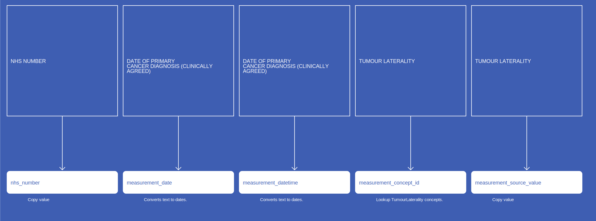</a>

[Comment or raise an issue for this mapping.](https://github.com/answerdigital/oxford-omop-data-mapper/issues/new?title=COSDv9URMeasurementTumourLaterality%20mapping){: .btn }
## COSDv9URMeasurementTNMcategoryIntegratedStage

[Comment or raise an issue for this mapping.](https://github.com/answerdigital/oxford-omop-data-mapper/issues/new?title=COSDv9URMeasurementTNMcategoryIntegratedStage%20mapping){: .btn }
## COSDv9URMeasurementTNMcategoryFinalPreTreatmentStage
<a href="COSDv9URMeasurementTNMcategoryFinalPreTreatmentStage.svg" target="_blank">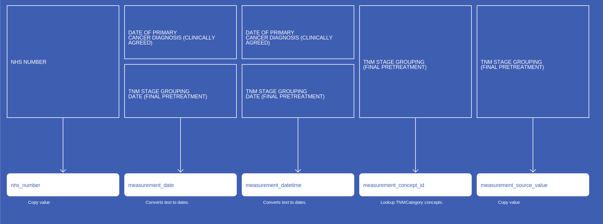</a>

[Comment or raise an issue for this mapping.](https://github.com/answerdigital/oxford-omop-data-mapper/issues/new?title=COSDv9URMeasurementTNMcategoryFinalPreTreatmentStage%20mapping){: .btn }
## COSDv9URMeasurementTcategoryIntegratedStage

[Comment or raise an issue for this mapping.](https://github.com/answerdigital/oxford-omop-data-mapper/issues/new?title=COSDv9URMeasurementTcategoryIntegratedStage%20mapping){: .btn }
## COSDv9URMeasurementTcategoryFinalPreTreatmentStage
<a href="COSDv9URMeasurementTcategoryFinalPreTreatmentStage.svg" target="_blank">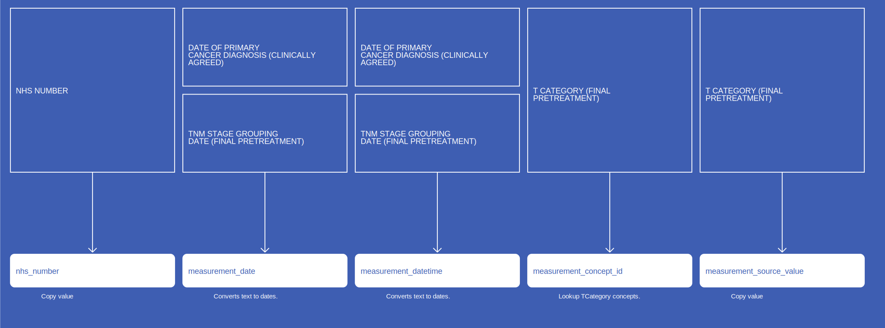</a>

[Comment or raise an issue for this mapping.](https://github.com/answerdigital/oxford-omop-data-mapper/issues/new?title=COSDv9URMeasurementTcategoryFinalPreTreatmentStage%20mapping){: .btn }
## COSDv9URMeasurementProstateSpecificAntigenDiagnosis

[Comment or raise an issue for this mapping.](https://github.com/answerdigital/oxford-omop-data-mapper/issues/new?title=COSDv9URMeasurementProstateSpecificAntigenDiagnosis%20mapping){: .btn }
## COSDv9URMeasurementPrimaryPathwayMetastaticSite

[Comment or raise an issue for this mapping.](https://github.com/answerdigital/oxford-omop-data-mapper/issues/new?title=COSDv9URMeasurementPrimaryPathwayMetastaticSite%20mapping){: .btn }
## COSDv9URMeasurementNonPrimaryPathwayRecurrenceMetastaticSite

[Comment or raise an issue for this mapping.](https://github.com/answerdigital/oxford-omop-data-mapper/issues/new?title=COSDv9URMeasurementNonPrimaryPathwayRecurrenceMetastaticSite%20mapping){: .btn }
## COSDv9URMeasurementNonPrimaryPathwayProgressionMetastaticSite

[Comment or raise an issue for this mapping.](https://github.com/answerdigital/oxford-omop-data-mapper/issues/new?title=COSDv9URMeasurementNonPrimaryPathwayProgressionMetastaticSite%20mapping){: .btn }
## COSDv9URMeasurementNcategoryIntegratedStage

[Comment or raise an issue for this mapping.](https://github.com/answerdigital/oxford-omop-data-mapper/issues/new?title=COSDv9URMeasurementNcategoryIntegratedStage%20mapping){: .btn }
## COSDv9URMeasurementNcategoryFinalPreTreatmentStage

[Comment or raise an issue for this mapping.](https://github.com/answerdigital/oxford-omop-data-mapper/issues/new?title=COSDv9URMeasurementNcategoryFinalPreTreatmentStage%20mapping){: .btn }
## COSDv9URMeasurementMcategoryIntegratedStage

[Comment or raise an issue for this mapping.](https://github.com/answerdigital/oxford-omop-data-mapper/issues/new?title=COSDv9URMeasurementMcategoryIntegratedStage%20mapping){: .btn }
## COSDv9URMeasurementMcategoryFinalPreTreatmentStage
<a href="COSDv9URMeasurementMcategoryFinalPreTreatmentStage.svg" target="_blank">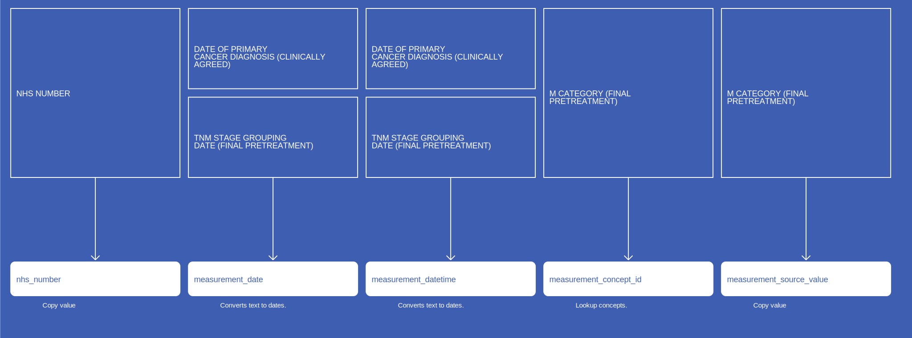</a>

[Comment or raise an issue for this mapping.](https://github.com/answerdigital/oxford-omop-data-mapper/issues/new?title=COSDv9URMeasurementMcategoryFinalPreTreatmentStage%20mapping){: .btn }
## COSDv9URMeasurementGradeOfDifferentiation
<a href="COSDv9URMeasurementGradeOfDifferentiation.svg" target="_blank">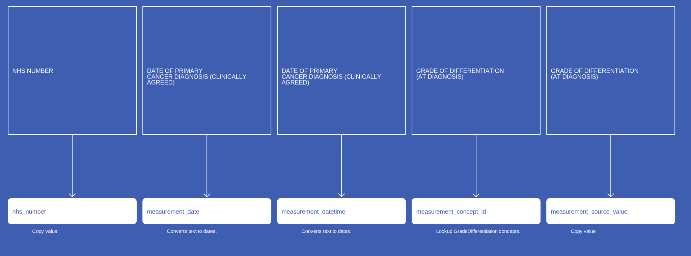</a>

[Comment or raise an issue for this mapping.](https://github.com/answerdigital/oxford-omop-data-mapper/issues/new?title=COSDv9URMeasurementGradeOfDifferentiation%20mapping){: .btn }
## COSDv9URMeasurementAdultComorbidityEvaluation

[Comment or raise an issue for this mapping.](https://github.com/answerdigital/oxford-omop-data-mapper/issues/new?title=COSDv9URMeasurementAdultComorbidityEvaluation%20mapping){: .btn }
## COSDv8URMeasurementTumourLaterality

[Comment or raise an issue for this mapping.](https://github.com/answerdigital/oxford-omop-data-mapper/issues/new?title=COSDv8URMeasurementTumourLaterality%20mapping){: .btn }
## COSDv8URMeasurementTNMcategoryIntegratedStage

[Comment or raise an issue for this mapping.](https://github.com/answerdigital/oxford-omop-data-mapper/issues/new?title=COSDv8URMeasurementTNMcategoryIntegratedStage%20mapping){: .btn }
## COSDv8URMeasurementTNMcategoryFinalPreTreatmentStage

[Comment or raise an issue for this mapping.](https://github.com/answerdigital/oxford-omop-data-mapper/issues/new?title=COSDv8URMeasurementTNMcategoryFinalPreTreatmentStage%20mapping){: .btn }
## COSDv8URMeasurementTcategoryIntegratedStage

[Comment or raise an issue for this mapping.](https://github.com/answerdigital/oxford-omop-data-mapper/issues/new?title=COSDv8URMeasurementTcategoryIntegratedStage%20mapping){: .btn }
## COSDv8URMeasurementTcategoryFinalPreTreatmentStage

[Comment or raise an issue for this mapping.](https://github.com/answerdigital/oxford-omop-data-mapper/issues/new?title=COSDv8URMeasurementTcategoryFinalPreTreatmentStage%20mapping){: .btn }
## COSDv8URMeasurementProstateSpecificAntigenDiagnosis

[Comment or raise an issue for this mapping.](https://github.com/answerdigital/oxford-omop-data-mapper/issues/new?title=COSDv8URMeasurementProstateSpecificAntigenDiagnosis%20mapping){: .btn }
## COSDv8URMeasurementPrimaryPathwayMetastaticSite

[Comment or raise an issue for this mapping.](https://github.com/answerdigital/oxford-omop-data-mapper/issues/new?title=COSDv8URMeasurementPrimaryPathwayMetastaticSite%20mapping){: .btn }
## COSDv8URMeasurementNonPrimaryPathwayMetastaticSite
<a href="COSDv8URMeasurementNonPrimaryPathwayMetastaticSite.svg" target="_blank">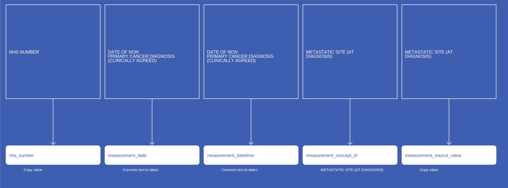</a>

[Comment or raise an issue for this mapping.](https://github.com/answerdigital/oxford-omop-data-mapper/issues/new?title=COSDv8URMeasurementNonPrimaryPathwayMetastaticSite%20mapping){: .btn }
## COSDv8URMeasurementNcategoryIntegratedStage

[Comment or raise an issue for this mapping.](https://github.com/answerdigital/oxford-omop-data-mapper/issues/new?title=COSDv8URMeasurementNcategoryIntegratedStage%20mapping){: .btn }
## COSDv8URMeasurementNcategoryFinalPreTreatmentStage

[Comment or raise an issue for this mapping.](https://github.com/answerdigital/oxford-omop-data-mapper/issues/new?title=COSDv8URMeasurementNcategoryFinalPreTreatmentStage%20mapping){: .btn }
## COSDv8URMeasurementMcategoryIntegratedStage

[Comment or raise an issue for this mapping.](https://github.com/answerdigital/oxford-omop-data-mapper/issues/new?title=COSDv8URMeasurementMcategoryIntegratedStage%20mapping){: .btn }
## COSDv8URMeasurementMcategoryFinalPreTreatmentStage

[Comment or raise an issue for this mapping.](https://github.com/answerdigital/oxford-omop-data-mapper/issues/new?title=COSDv8URMeasurementMcategoryFinalPreTreatmentStage%20mapping){: .btn }
## COSDv8URMeasurementGradeOfDifferentiation
<a href="COSDv8URMeasurementGradeOfDifferentiation.svg" target="_blank">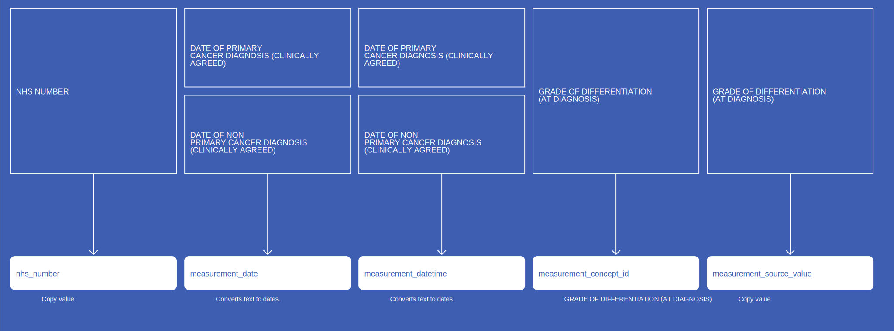</a>

[Comment or raise an issue for this mapping.](https://github.com/answerdigital/oxford-omop-data-mapper/issues/new?title=COSDv8URMeasurementGradeOfDifferentiation%20mapping){: .btn }
## COSDv8UGMeasurementTumourLaterality

[Comment or raise an issue for this mapping.](https://github.com/answerdigital/oxford-omop-data-mapper/issues/new?title=COSDv8UGMeasurementTumourLaterality%20mapping){: .btn }
## COSDv8UGMeasurementPrimaryPathwayMetastaticSite

[Comment or raise an issue for this mapping.](https://github.com/answerdigital/oxford-omop-data-mapper/issues/new?title=COSDv8UGMeasurementPrimaryPathwayMetastaticSite%20mapping){: .btn }
## COSDv8UGMeasurementNonPrimaryPathwayMetastaticSite

[Comment or raise an issue for this mapping.](https://github.com/answerdigital/oxford-omop-data-mapper/issues/new?title=COSDv8UGMeasurementNonPrimaryPathwayMetastaticSite%20mapping){: .btn }
## COSDv8UGMeasurementIntegratedStageTNMStageGrouping
<a href="COSDv8UGMeasurementIntegratedStageTNMStageGrouping.svg" target="_blank">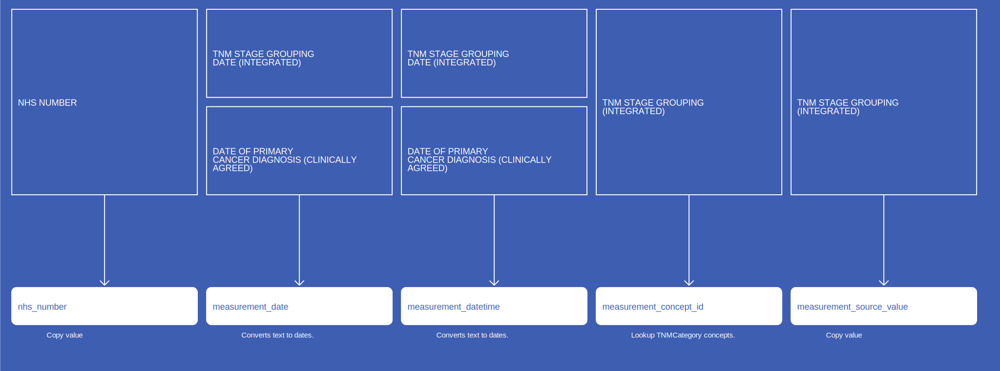</a>

[Comment or raise an issue for this mapping.](https://github.com/answerdigital/oxford-omop-data-mapper/issues/new?title=COSDv8UGMeasurementIntegratedStageTNMStageGrouping%20mapping){: .btn }
## COSDv8UGMeasurementIntegratedStageTCategory
<a href="COSDv8UGMeasurementIntegratedStageTCategory.svg" target="_blank">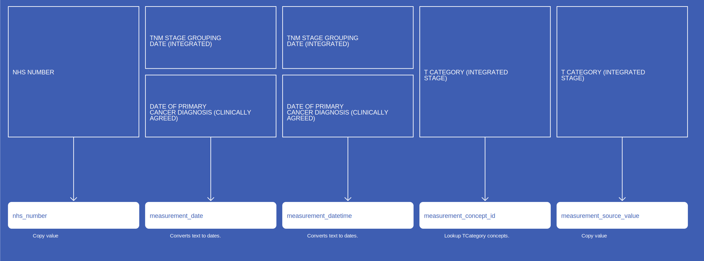</a>

[Comment or raise an issue for this mapping.](https://github.com/answerdigital/oxford-omop-data-mapper/issues/new?title=COSDv8UGMeasurementIntegratedStageTCategory%20mapping){: .btn }
## COSDv8UGMeasurementIntegratedStageNCategory

[Comment or raise an issue for this mapping.](https://github.com/answerdigital/oxford-omop-data-mapper/issues/new?title=COSDv8UGMeasurementIntegratedStageNCategory%20mapping){: .btn }
## COSDv8UGMeasurementIntegratedStageMCategory

[Comment or raise an issue for this mapping.](https://github.com/answerdigital/oxford-omop-data-mapper/issues/new?title=COSDv8UGMeasurementIntegratedStageMCategory%20mapping){: .btn }
## COSDv8UGMeasurementGradeOfDifferentiation

[Comment or raise an issue for this mapping.](https://github.com/answerdigital/oxford-omop-data-mapper/issues/new?title=COSDv8UGMeasurementGradeOfDifferentiation%20mapping){: .btn }
## COSDv8UGMeasurementFinalPretreatmentTNMStageGrouping

[Comment or raise an issue for this mapping.](https://github.com/answerdigital/oxford-omop-data-mapper/issues/new?title=COSDv8UGMeasurementFinalPretreatmentTNMStageGrouping%20mapping){: .btn }
## COSDv8UGMeasurementFinalPretreatmentTCategory

[Comment or raise an issue for this mapping.](https://github.com/answerdigital/oxford-omop-data-mapper/issues/new?title=COSDv8UGMeasurementFinalPretreatmentTCategory%20mapping){: .btn }
## COSDv8UGMeasurementFinalPretreatmentNCategory

[Comment or raise an issue for this mapping.](https://github.com/answerdigital/oxford-omop-data-mapper/issues/new?title=COSDv8UGMeasurementFinalPretreatmentNCategory%20mapping){: .btn }
## COSDv8UGMeasurementFinalPretreatmentMCategory

[Comment or raise an issue for this mapping.](https://github.com/answerdigital/oxford-omop-data-mapper/issues/new?title=COSDv8UGMeasurementFinalPretreatmentMCategory%20mapping){: .btn }
## COSDv8UGMeasurementAdultComorbidityEvaluation
<a href="COSDv8UGMeasurementAdultComorbidityEvaluation.svg" target="_blank">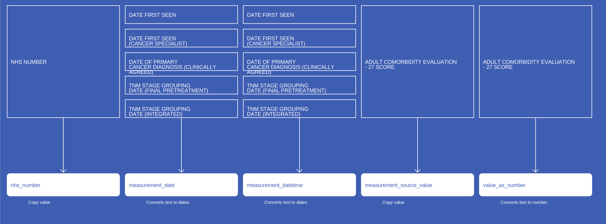</a>

[Comment or raise an issue for this mapping.](https://github.com/answerdigital/oxford-omop-data-mapper/issues/new?title=COSDv8UGMeasurementAdultComorbidityEvaluation%20mapping){: .btn }
## COSDv8SKMeasurementTumourLaterality

[Comment or raise an issue for this mapping.](https://github.com/answerdigital/oxford-omop-data-mapper/issues/new?title=COSDv8SKMeasurementTumourLaterality%20mapping){: .btn }
## COSDv8SKMeasurementTNMStageGroupingIntegrated

[Comment or raise an issue for this mapping.](https://github.com/answerdigital/oxford-omop-data-mapper/issues/new?title=COSDv8SKMeasurementTNMStageGroupingIntegrated%20mapping){: .btn }
## COSDv8SKMeasurementTNMStageGroupingFinalPretreatment

[Comment or raise an issue for this mapping.](https://github.com/answerdigital/oxford-omop-data-mapper/issues/new?title=COSDv8SKMeasurementTNMStageGroupingFinalPretreatment%20mapping){: .btn }
## COSDv8SKMeasurementTCategoryIntegratedStage

[Comment or raise an issue for this mapping.](https://github.com/answerdigital/oxford-omop-data-mapper/issues/new?title=COSDv8SKMeasurementTCategoryIntegratedStage%20mapping){: .btn }
## COSDv8SKMeasurementTCategoryFinalPretreatment

[Comment or raise an issue for this mapping.](https://github.com/answerdigital/oxford-omop-data-mapper/issues/new?title=COSDv8SKMeasurementTCategoryFinalPretreatment%20mapping){: .btn }
## COSDv8SKMeasurementPrimaryPathwayMetastaticSite

[Comment or raise an issue for this mapping.](https://github.com/answerdigital/oxford-omop-data-mapper/issues/new?title=COSDv8SKMeasurementPrimaryPathwayMetastaticSite%20mapping){: .btn }
## COSDv8SKMeasurementNonPrimaryPathwayMetastaticSite

[Comment or raise an issue for this mapping.](https://github.com/answerdigital/oxford-omop-data-mapper/issues/new?title=COSDv8SKMeasurementNonPrimaryPathwayMetastaticSite%20mapping){: .btn }
## COSDv8SKMeasurementNCategoryIntegratedStage

[Comment or raise an issue for this mapping.](https://github.com/answerdigital/oxford-omop-data-mapper/issues/new?title=COSDv8SKMeasurementNCategoryIntegratedStage%20mapping){: .btn }
## COSDv8SKMeasurementNCategoryFinalPretreatment

[Comment or raise an issue for this mapping.](https://github.com/answerdigital/oxford-omop-data-mapper/issues/new?title=COSDv8SKMeasurementNCategoryFinalPretreatment%20mapping){: .btn }
## COSDv8SKMeasurementMCategoryIntegratedStage

[Comment or raise an issue for this mapping.](https://github.com/answerdigital/oxford-omop-data-mapper/issues/new?title=COSDv8SKMeasurementMCategoryIntegratedStage%20mapping){: .btn }
## COSDv8SKMeasurementMCategoryFinalPretreatment

[Comment or raise an issue for this mapping.](https://github.com/answerdigital/oxford-omop-data-mapper/issues/new?title=COSDv8SKMeasurementMCategoryFinalPretreatment%20mapping){: .btn }
## COSDv8SKMeasurementGradeOfDifferentiation

[Comment or raise an issue for this mapping.](https://github.com/answerdigital/oxford-omop-data-mapper/issues/new?title=COSDv8SKMeasurementGradeOfDifferentiation%20mapping){: .btn }
## COSDv8SKMeasurementAdultComorbidityEvaluation
<a href="COSDv8SKMeasurementAdultComorbidityEvaluation.svg" target="_blank">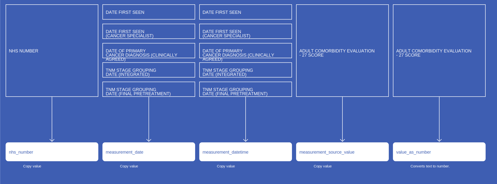</a>

[Comment or raise an issue for this mapping.](https://github.com/answerdigital/oxford-omop-data-mapper/issues/new?title=COSDv8SKMeasurementAdultComorbidityEvaluation%20mapping){: .btn }
## COSDv9LVMeasurementTumourLaterality

[Comment or raise an issue for this mapping.](https://github.com/answerdigital/oxford-omop-data-mapper/issues/new?title=COSDv9LVMeasurementTumourLaterality%20mapping){: .btn }
## COSDv9LVMeasurementTNMStageGroupingIntegrated

[Comment or raise an issue for this mapping.](https://github.com/answerdigital/oxford-omop-data-mapper/issues/new?title=COSDv9LVMeasurementTNMStageGroupingIntegrated%20mapping){: .btn }
## COSDv9LVMeasurementTNMStageGroupingFinalPreTreatmentStage

[Comment or raise an issue for this mapping.](https://github.com/answerdigital/oxford-omop-data-mapper/issues/new?title=COSDv9LVMeasurementTNMStageGroupingFinalPreTreatmentStage%20mapping){: .btn }
## COSDv9LVMeasurementTcategoryIntegratedStage

[Comment or raise an issue for this mapping.](https://github.com/answerdigital/oxford-omop-data-mapper/issues/new?title=COSDv9LVMeasurementTcategoryIntegratedStage%20mapping){: .btn }
## COSDv9LVMeasurementTcategoryFinalPreTreatmentStage

[Comment or raise an issue for this mapping.](https://github.com/answerdigital/oxford-omop-data-mapper/issues/new?title=COSDv9LVMeasurementTcategoryFinalPreTreatmentStage%20mapping){: .btn }
## COSDv9LVMeasurementPrimaryPathwayMetastaticSite

[Comment or raise an issue for this mapping.](https://github.com/answerdigital/oxford-omop-data-mapper/issues/new?title=COSDv9LVMeasurementPrimaryPathwayMetastaticSite%20mapping){: .btn }
## COSDv9LVMeasurementNonPrimaryPathwayRecurrenceMetastaticSite

[Comment or raise an issue for this mapping.](https://github.com/answerdigital/oxford-omop-data-mapper/issues/new?title=COSDv9LVMeasurementNonPrimaryPathwayRecurrenceMetastaticSite%20mapping){: .btn }
## COSDv9LVMeasurementNonPrimaryPathwayProgressionMetastaticSite

[Comment or raise an issue for this mapping.](https://github.com/answerdigital/oxford-omop-data-mapper/issues/new?title=COSDv9LVMeasurementNonPrimaryPathwayProgressionMetastaticSite%20mapping){: .btn }
## COSDv9LVMeasurementNcategoryIntegratedStage

[Comment or raise an issue for this mapping.](https://github.com/answerdigital/oxford-omop-data-mapper/issues/new?title=COSDv9LVMeasurementNcategoryIntegratedStage%20mapping){: .btn }
## COSDv9LVMeasurementNcategoryFinalPreTreatmentStage

[Comment or raise an issue for this mapping.](https://github.com/answerdigital/oxford-omop-data-mapper/issues/new?title=COSDv9LVMeasurementNcategoryFinalPreTreatmentStage%20mapping){: .btn }
## COSDv9LVMeasurementMcategoryIntegratedStage

[Comment or raise an issue for this mapping.](https://github.com/answerdigital/oxford-omop-data-mapper/issues/new?title=COSDv9LVMeasurementMcategoryIntegratedStage%20mapping){: .btn }
## COSDv9LVMeasurementMcategoryFinalPreTreatmentStage

[Comment or raise an issue for this mapping.](https://github.com/answerdigital/oxford-omop-data-mapper/issues/new?title=COSDv9LVMeasurementMcategoryFinalPreTreatmentStage%20mapping){: .btn }
## COSDv9LVMeasurementGradeOfDifferentiation

[Comment or raise an issue for this mapping.](https://github.com/answerdigital/oxford-omop-data-mapper/issues/new?title=COSDv9LVMeasurementGradeOfDifferentiation%20mapping){: .btn }
## COSDv9LVMeasurementAdultComorbidityEvaluation

{: .important-title }
> Notes
>
> Observation dates are approximated using other date fields.
>

[Comment or raise an issue for this mapping.](https://github.com/answerdigital/oxford-omop-data-mapper/issues/new?title=COSDv9LVMeasurementAdultComorbidityEvaluation%20mapping){: .btn }
## COSDv8LVMeasurementTumourLaterality

[Comment or raise an issue for this mapping.](https://github.com/answerdigital/oxford-omop-data-mapper/issues/new?title=COSDv8LVMeasurementTumourLaterality%20mapping){: .btn }
## COSDv8LVMeasurementTNMStageGroupingIntegrated
<a href="COSDv8LVMeasurementTNMStageGroupingIntegrated.svg" target="_blank">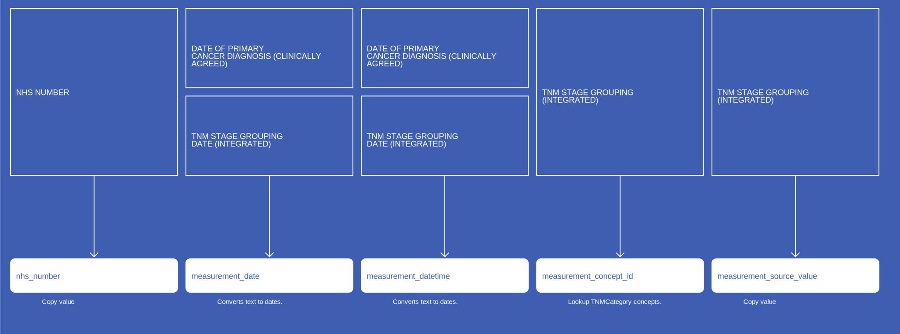</a>

[Comment or raise an issue for this mapping.](https://github.com/answerdigital/oxford-omop-data-mapper/issues/new?title=COSDv8LVMeasurementTNMStageGroupingIntegrated%20mapping){: .btn }
## COSDv8LVMeasurementTcategoryIntegratedStage

[Comment or raise an issue for this mapping.](https://github.com/answerdigital/oxford-omop-data-mapper/issues/new?title=COSDv8LVMeasurementTcategoryIntegratedStage%20mapping){: .btn }
## COSDv8LVMeasurementPrimaryPathwayMetastaticSite

[Comment or raise an issue for this mapping.](https://github.com/answerdigital/oxford-omop-data-mapper/issues/new?title=COSDv8LVMeasurementPrimaryPathwayMetastaticSite%20mapping){: .btn }
## COSDv8LVMeasurementNcategoryIntegratedStage

[Comment or raise an issue for this mapping.](https://github.com/answerdigital/oxford-omop-data-mapper/issues/new?title=COSDv8LVMeasurementNcategoryIntegratedStage%20mapping){: .btn }
## COSDv8LVMeasurementMcategoryIntegratedStage

[Comment or raise an issue for this mapping.](https://github.com/answerdigital/oxford-omop-data-mapper/issues/new?title=COSDv8LVMeasurementMcategoryIntegratedStage%20mapping){: .btn }
## COSDv8LVMeasurementGradeOfDifferentiation

[Comment or raise an issue for this mapping.](https://github.com/answerdigital/oxford-omop-data-mapper/issues/new?title=COSDv8LVMeasurementGradeOfDifferentiation%20mapping){: .btn }
## COSDv8LVMeasurementAdultComorbidityEvaluation
<a href="COSDv8LVMeasurementAdultComorbidityEvaluation.svg" target="_blank">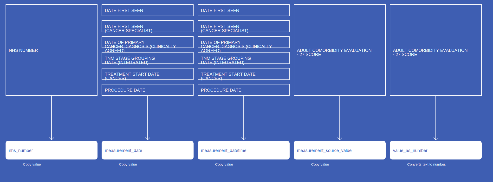</a>

[Comment or raise an issue for this mapping.](https://github.com/answerdigital/oxford-omop-data-mapper/issues/new?title=COSDv8LVMeasurementAdultComorbidityEvaluation%20mapping){: .btn }
## CosdV9LungMeasurementTumourLaterality

[Comment or raise an issue for this mapping.](https://github.com/answerdigital/oxford-omop-data-mapper/issues/new?title=CosdV9LungMeasurementTumourLaterality%20mapping){: .btn }
## CosdV9LungMeasurementTNMcategoryIntegratedStage

[Comment or raise an issue for this mapping.](https://github.com/answerdigital/oxford-omop-data-mapper/issues/new?title=CosdV9LungMeasurementTNMcategoryIntegratedStage%20mapping){: .btn }
## CosdV9LungMeasurementTNMcategoryFinalPreTreatmentStage

[Comment or raise an issue for this mapping.](https://github.com/answerdigital/oxford-omop-data-mapper/issues/new?title=CosdV9LungMeasurementTNMcategoryFinalPreTreatmentStage%20mapping){: .btn }
## CosdV9LungMeasurementTcategoryIntegratedStage

[Comment or raise an issue for this mapping.](https://github.com/answerdigital/oxford-omop-data-mapper/issues/new?title=CosdV9LungMeasurementTcategoryIntegratedStage%20mapping){: .btn }
## CosdV9LungMeasurementTcategoryFinalPreTreatmentStage

[Comment or raise an issue for this mapping.](https://github.com/answerdigital/oxford-omop-data-mapper/issues/new?title=CosdV9LungMeasurementTcategoryFinalPreTreatmentStage%20mapping){: .btn }
## CosdV9LungMeasurementPrimaryPathwayMetastasis

[Comment or raise an issue for this mapping.](https://github.com/answerdigital/oxford-omop-data-mapper/issues/new?title=CosdV9LungMeasurementPrimaryPathwayMetastasis%20mapping){: .btn }
## CosdV9LungMeasurementNonPrimaryPathwayRecurrenceMetastasis

[Comment or raise an issue for this mapping.](https://github.com/answerdigital/oxford-omop-data-mapper/issues/new?title=CosdV9LungMeasurementNonPrimaryPathwayRecurrenceMetastasis%20mapping){: .btn }
## CosdV9LungMeasurementNonPrimaryPathwayProgressionMetastasis

[Comment or raise an issue for this mapping.](https://github.com/answerdigital/oxford-omop-data-mapper/issues/new?title=CosdV9LungMeasurementNonPrimaryPathwayProgressionMetastasis%20mapping){: .btn }
## CosdV9LungMeasurementNcategoryIntegratedStage

[Comment or raise an issue for this mapping.](https://github.com/answerdigital/oxford-omop-data-mapper/issues/new?title=CosdV9LungMeasurementNcategoryIntegratedStage%20mapping){: .btn }
## CosdV9LungMeasurementNcategoryFinalPreTreatmentStage

[Comment or raise an issue for this mapping.](https://github.com/answerdigital/oxford-omop-data-mapper/issues/new?title=CosdV9LungMeasurementNcategoryFinalPreTreatmentStage%20mapping){: .btn }
## CosdV9LungMeasurementMcategoryIntegratedStage

[Comment or raise an issue for this mapping.](https://github.com/answerdigital/oxford-omop-data-mapper/issues/new?title=CosdV9LungMeasurementMcategoryIntegratedStage%20mapping){: .btn }
## CosdV9LungMeasurementMcategoryFinalPreTreatmentStage

[Comment or raise an issue for this mapping.](https://github.com/answerdigital/oxford-omop-data-mapper/issues/new?title=CosdV9LungMeasurementMcategoryFinalPreTreatmentStage%20mapping){: .btn }
## CosdV9LungMeasurementGradeOfDifferentiation

[Comment or raise an issue for this mapping.](https://github.com/answerdigital/oxford-omop-data-mapper/issues/new?title=CosdV9LungMeasurementGradeOfDifferentiation%20mapping){: .btn }
## CosdV8LungMeasurementTumourLaterality

[Comment or raise an issue for this mapping.](https://github.com/answerdigital/oxford-omop-data-mapper/issues/new?title=CosdV8LungMeasurementTumourLaterality%20mapping){: .btn }
## CosdV8LungMeasurementTNMcategoryIntegratedStage

[Comment or raise an issue for this mapping.](https://github.com/answerdigital/oxford-omop-data-mapper/issues/new?title=CosdV8LungMeasurementTNMcategoryIntegratedStage%20mapping){: .btn }
## CosdV8LungMeasurementTNMcategoryFinalPreTreatmentStage

[Comment or raise an issue for this mapping.](https://github.com/answerdigital/oxford-omop-data-mapper/issues/new?title=CosdV8LungMeasurementTNMcategoryFinalPreTreatmentStage%20mapping){: .btn }
## CosdV8LungMeasurementTcategoryIntegratedStage

[Comment or raise an issue for this mapping.](https://github.com/answerdigital/oxford-omop-data-mapper/issues/new?title=CosdV8LungMeasurementTcategoryIntegratedStage%20mapping){: .btn }
## CosdV8LungMeasurementTcategoryFinalPreTreatmentStage

[Comment or raise an issue for this mapping.](https://github.com/answerdigital/oxford-omop-data-mapper/issues/new?title=CosdV8LungMeasurementTcategoryFinalPreTreatmentStage%20mapping){: .btn }
## CosdV8LungMeasurementPrimaryPathwayMetastasis

[Comment or raise an issue for this mapping.](https://github.com/answerdigital/oxford-omop-data-mapper/issues/new?title=CosdV8LungMeasurementPrimaryPathwayMetastasis%20mapping){: .btn }
## CosdV8LungMeasurementNonPrimaryPathwayMetastasis

[Comment or raise an issue for this mapping.](https://github.com/answerdigital/oxford-omop-data-mapper/issues/new?title=CosdV8LungMeasurementNonPrimaryPathwayMetastasis%20mapping){: .btn }
## CosdV8LungMeasurementNcategoryIntegratedStage

[Comment or raise an issue for this mapping.](https://github.com/answerdigital/oxford-omop-data-mapper/issues/new?title=CosdV8LungMeasurementNcategoryIntegratedStage%20mapping){: .btn }
## CosdV8LungMeasurementNcategoryFinalPreTreatmentStage

[Comment or raise an issue for this mapping.](https://github.com/answerdigital/oxford-omop-data-mapper/issues/new?title=CosdV8LungMeasurementNcategoryFinalPreTreatmentStage%20mapping){: .btn }
## CosdV8LungMeasurementMcategoryIntegratedStage

[Comment or raise an issue for this mapping.](https://github.com/answerdigital/oxford-omop-data-mapper/issues/new?title=CosdV8LungMeasurementMcategoryIntegratedStage%20mapping){: .btn }
## CosdV8LungMeasurementMcategoryFinalPreTreatmentStage

[Comment or raise an issue for this mapping.](https://github.com/answerdigital/oxford-omop-data-mapper/issues/new?title=CosdV8LungMeasurementMcategoryFinalPreTreatmentStage%20mapping){: .btn }
## CosdV8LungMeasurementGradeOfDifferentiation

[Comment or raise an issue for this mapping.](https://github.com/answerdigital/oxford-omop-data-mapper/issues/new?title=CosdV8LungMeasurementGradeOfDifferentiation%20mapping){: .btn }
## COSDv9HNMeasurementTnmStageGroupingIntegrated

[Comment or raise an issue for this mapping.](https://github.com/answerdigital/oxford-omop-data-mapper/issues/new?title=COSDv9HNMeasurementTnmStageGroupingIntegrated%20mapping){: .btn }
## COSDv9HNMeasurementTnmStageGroupingFinalPretreatment
<a href="COSDv9HNMeasurementTnmStageGroupingFinalPretreatment.svg" target="_blank">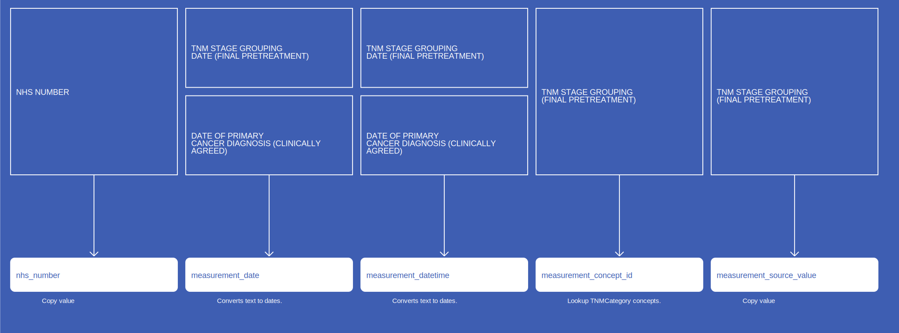</a>

[Comment or raise an issue for this mapping.](https://github.com/answerdigital/oxford-omop-data-mapper/issues/new?title=COSDv9HNMeasurementTnmStageGroupingFinalPretreatment%20mapping){: .btn }
## COSDv9HNMeasurementTCategoryIntegratedStage

[Comment or raise an issue for this mapping.](https://github.com/answerdigital/oxford-omop-data-mapper/issues/new?title=COSDv9HNMeasurementTCategoryIntegratedStage%20mapping){: .btn }
## COSDv9HNMeasurementTCategoryFinalPretreatment

[Comment or raise an issue for this mapping.](https://github.com/answerdigital/oxford-omop-data-mapper/issues/new?title=COSDv9HNMeasurementTCategoryFinalPretreatment%20mapping){: .btn }
## COSDv9HNMeasurementPrimaryPathwayMetastaticSite

[Comment or raise an issue for this mapping.](https://github.com/answerdigital/oxford-omop-data-mapper/issues/new?title=COSDv9HNMeasurementPrimaryPathwayMetastaticSite%20mapping){: .btn }
## COSDv9HNMeasurementNonPrimaryPathwayRecurrenceMetastaticSite

[Comment or raise an issue for this mapping.](https://github.com/answerdigital/oxford-omop-data-mapper/issues/new?title=COSDv9HNMeasurementNonPrimaryPathwayRecurrenceMetastaticSite%20mapping){: .btn }
## COSDv9HNMeasurementNonPrimaryPathwayProgressionMetastaticSite

[Comment or raise an issue for this mapping.](https://github.com/answerdigital/oxford-omop-data-mapper/issues/new?title=COSDv9HNMeasurementNonPrimaryPathwayProgressionMetastaticSite%20mapping){: .btn }
## COSDv9HNMeasurementNCategoryIntegratedStage

[Comment or raise an issue for this mapping.](https://github.com/answerdigital/oxford-omop-data-mapper/issues/new?title=COSDv9HNMeasurementNCategoryIntegratedStage%20mapping){: .btn }
## COSDv9HNMeasurementNCategoryFinalPretreatment

[Comment or raise an issue for this mapping.](https://github.com/answerdigital/oxford-omop-data-mapper/issues/new?title=COSDv9HNMeasurementNCategoryFinalPretreatment%20mapping){: .btn }
## COSDv9HNMeasurementMCategoryIntegratedStage

[Comment or raise an issue for this mapping.](https://github.com/answerdigital/oxford-omop-data-mapper/issues/new?title=COSDv9HNMeasurementMCategoryIntegratedStage%20mapping){: .btn }
## COSDv9HNMeasurementMCategoryFinalPretreatment

[Comment or raise an issue for this mapping.](https://github.com/answerdigital/oxford-omop-data-mapper/issues/new?title=COSDv9HNMeasurementMCategoryFinalPretreatment%20mapping){: .btn }
## COSDv9HNMeasurementGradeOfDifferentiationAtDiagnosis

[Comment or raise an issue for this mapping.](https://github.com/answerdigital/oxford-omop-data-mapper/issues/new?title=COSDv9HNMeasurementGradeOfDifferentiationAtDiagnosis%20mapping){: .btn }
## COSDv9HNMeasurementAdultComorbidityEvaluation
<a href="COSDv9HNMeasurementAdultComorbidityEvaluation.svg" target="_blank">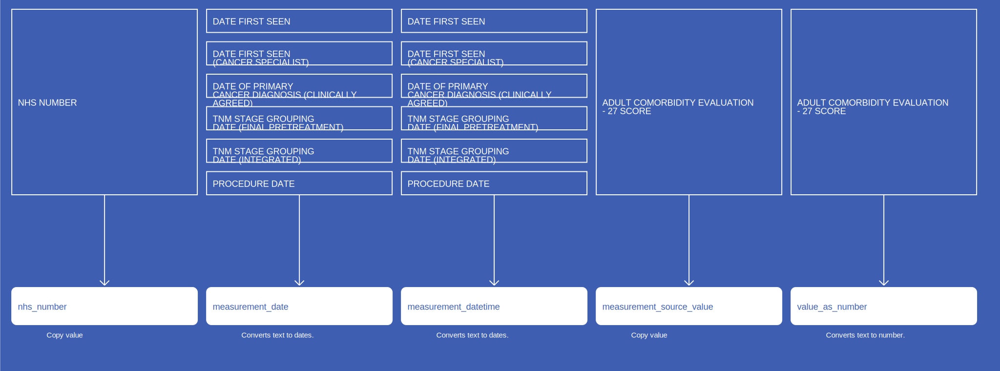</a>

[Comment or raise an issue for this mapping.](https://github.com/answerdigital/oxford-omop-data-mapper/issues/new?title=COSDv9HNMeasurementAdultComorbidityEvaluation%20mapping){: .btn }
## COSDv8HNMeasurementTumourLaterality

[Comment or raise an issue for this mapping.](https://github.com/answerdigital/oxford-omop-data-mapper/issues/new?title=COSDv8HNMeasurementTumourLaterality%20mapping){: .btn }
## COSDv8HNMeasurementTNMcategoryIntegratedStage

[Comment or raise an issue for this mapping.](https://github.com/answerdigital/oxford-omop-data-mapper/issues/new?title=COSDv8HNMeasurementTNMcategoryIntegratedStage%20mapping){: .btn }
## COSDv8HNMeasurementTNMcategoryFinalPreTreatmentStage

[Comment or raise an issue for this mapping.](https://github.com/answerdigital/oxford-omop-data-mapper/issues/new?title=COSDv8HNMeasurementTNMcategoryFinalPreTreatmentStage%20mapping){: .btn }
## COSDv8HNMeasurementTcategoryIntegratedStage

[Comment or raise an issue for this mapping.](https://github.com/answerdigital/oxford-omop-data-mapper/issues/new?title=COSDv8HNMeasurementTcategoryIntegratedStage%20mapping){: .btn }
## COSDv8HNMeasurementTcategoryFinalPreTreatmentStage

[Comment or raise an issue for this mapping.](https://github.com/answerdigital/oxford-omop-data-mapper/issues/new?title=COSDv8HNMeasurementTcategoryFinalPreTreatmentStage%20mapping){: .btn }
## COSDv8HNMeasurementPrimaryPathwayMetastaticSite

[Comment or raise an issue for this mapping.](https://github.com/answerdigital/oxford-omop-data-mapper/issues/new?title=COSDv8HNMeasurementPrimaryPathwayMetastaticSite%20mapping){: .btn }
## COSDv8HNMeasurementNonPrimaryPathwayMetastaticSite

[Comment or raise an issue for this mapping.](https://github.com/answerdigital/oxford-omop-data-mapper/issues/new?title=COSDv8HNMeasurementNonPrimaryPathwayMetastaticSite%20mapping){: .btn }
## COSDv8HNMeasurementNcategoryIntegratedStage

[Comment or raise an issue for this mapping.](https://github.com/answerdigital/oxford-omop-data-mapper/issues/new?title=COSDv8HNMeasurementNcategoryIntegratedStage%20mapping){: .btn }
## COSDv8HNMeasurementNcategoryFinalPreTreatmentStage
<a href="COSDv8HNMeasurementNcategoryFinalPreTreatmentStage.svg" target="_blank">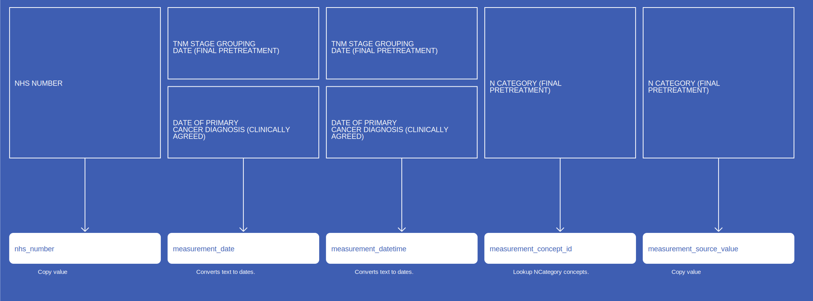</a>

[Comment or raise an issue for this mapping.](https://github.com/answerdigital/oxford-omop-data-mapper/issues/new?title=COSDv8HNMeasurementNcategoryFinalPreTreatmentStage%20mapping){: .btn }
## COSDv8HNMeasurementMcategoryIntegratedStage

[Comment or raise an issue for this mapping.](https://github.com/answerdigital/oxford-omop-data-mapper/issues/new?title=COSDv8HNMeasurementMcategoryIntegratedStage%20mapping){: .btn }
## COSDv8HNMeasurementMcategoryFinalPreTreatmentStage

[Comment or raise an issue for this mapping.](https://github.com/answerdigital/oxford-omop-data-mapper/issues/new?title=COSDv8HNMeasurementMcategoryFinalPreTreatmentStage%20mapping){: .btn }
## COSDv8HNMeasurementGradeOfDifferentiation

[Comment or raise an issue for this mapping.](https://github.com/answerdigital/oxford-omop-data-mapper/issues/new?title=COSDv8HNMeasurementGradeOfDifferentiation%20mapping){: .btn }
## COSDv8HNMeasurementAdultComorbidityEvaluation

[Comment or raise an issue for this mapping.](https://github.com/answerdigital/oxford-omop-data-mapper/issues/new?title=COSDv8HNMeasurementAdultComorbidityEvaluation%20mapping){: .btn }
## COSDv8GYMeasurementTumourLaterality
<a href="COSDv8GYMeasurementTumourLaterality.svg" target="_blank">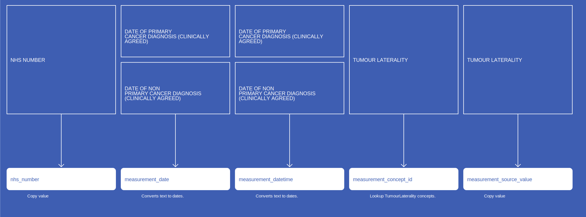</a>

[Comment or raise an issue for this mapping.](https://github.com/answerdigital/oxford-omop-data-mapper/issues/new?title=COSDv8GYMeasurementTumourLaterality%20mapping){: .btn }
## COSDv8GYMeasurementTNMStageGroupingIntegrated

[Comment or raise an issue for this mapping.](https://github.com/answerdigital/oxford-omop-data-mapper/issues/new?title=COSDv8GYMeasurementTNMStageGroupingIntegrated%20mapping){: .btn }
## COSDv8GYMeasurementTNMStageGroupingFinalPreTreatmentStage

[Comment or raise an issue for this mapping.](https://github.com/answerdigital/oxford-omop-data-mapper/issues/new?title=COSDv8GYMeasurementTNMStageGroupingFinalPreTreatmentStage%20mapping){: .btn }
## COSDv8GYMeasurementTcategoryIntegratedStage

[Comment or raise an issue for this mapping.](https://github.com/answerdigital/oxford-omop-data-mapper/issues/new?title=COSDv8GYMeasurementTcategoryIntegratedStage%20mapping){: .btn }
## COSDv8GYMeasurementTcategoryFinalPreTreatmentStage

[Comment or raise an issue for this mapping.](https://github.com/answerdigital/oxford-omop-data-mapper/issues/new?title=COSDv8GYMeasurementTcategoryFinalPreTreatmentStage%20mapping){: .btn }
## COSDv8GYMeasurementPrimaryPathwayMetastaticSite

[Comment or raise an issue for this mapping.](https://github.com/answerdigital/oxford-omop-data-mapper/issues/new?title=COSDv8GYMeasurementPrimaryPathwayMetastaticSite%20mapping){: .btn }
## COSDv8GYMeasurementNonPrimaryPathwayMetastaticSite

[Comment or raise an issue for this mapping.](https://github.com/answerdigital/oxford-omop-data-mapper/issues/new?title=COSDv8GYMeasurementNonPrimaryPathwayMetastaticSite%20mapping){: .btn }
## COSDv8GYMeasurementNcategoryIntegratedStage

[Comment or raise an issue for this mapping.](https://github.com/answerdigital/oxford-omop-data-mapper/issues/new?title=COSDv8GYMeasurementNcategoryIntegratedStage%20mapping){: .btn }
## COSDv8GYMeasurementNcategoryFinalPreTreatmentStage

[Comment or raise an issue for this mapping.](https://github.com/answerdigital/oxford-omop-data-mapper/issues/new?title=COSDv8GYMeasurementNcategoryFinalPreTreatmentStage%20mapping){: .btn }
## COSDv8GYMeasurementMcategoryIntegratedStage

[Comment or raise an issue for this mapping.](https://github.com/answerdigital/oxford-omop-data-mapper/issues/new?title=COSDv8GYMeasurementMcategoryIntegratedStage%20mapping){: .btn }
## COSDv8GYMeasurementMcategoryFinalPreTreatmentStage

[Comment or raise an issue for this mapping.](https://github.com/answerdigital/oxford-omop-data-mapper/issues/new?title=COSDv8GYMeasurementMcategoryFinalPreTreatmentStage%20mapping){: .btn }
## COSDv8GYMeasurementGradeOfDifferentiation

[Comment or raise an issue for this mapping.](https://github.com/answerdigital/oxford-omop-data-mapper/issues/new?title=COSDv8GYMeasurementGradeOfDifferentiation%20mapping){: .btn }
## COSDv8GYMeasurementAdultComorbidityEvaluation

[Comment or raise an issue for this mapping.](https://github.com/answerdigital/oxford-omop-data-mapper/issues/new?title=COSDv8GYMeasurementAdultComorbidityEvaluation%20mapping){: .btn }
## COSDv8CTMeasurementTumourLaterality

[Comment or raise an issue for this mapping.](https://github.com/answerdigital/oxford-omop-data-mapper/issues/new?title=COSDv8CTMeasurementTumourLaterality%20mapping){: .btn }
## COSDv8CTMeasurementTNMStageGroupingIntegrated

[Comment or raise an issue for this mapping.](https://github.com/answerdigital/oxford-omop-data-mapper/issues/new?title=COSDv8CTMeasurementTNMStageGroupingIntegrated%20mapping){: .btn }
## COSDv8CTMeasurementTNMStageGroupingFinalPreTreatmentStage

[Comment or raise an issue for this mapping.](https://github.com/answerdigital/oxford-omop-data-mapper/issues/new?title=COSDv8CTMeasurementTNMStageGroupingFinalPreTreatmentStage%20mapping){: .btn }
## COSDv8CTMeasurementTcategoryIntegratedStage

[Comment or raise an issue for this mapping.](https://github.com/answerdigital/oxford-omop-data-mapper/issues/new?title=COSDv8CTMeasurementTcategoryIntegratedStage%20mapping){: .btn }
## COSDv8CTMeasurementTcategoryFinalPreTreatmentStage

[Comment or raise an issue for this mapping.](https://github.com/answerdigital/oxford-omop-data-mapper/issues/new?title=COSDv8CTMeasurementTcategoryFinalPreTreatmentStage%20mapping){: .btn }
## COSDv8CTMeasurementPrimaryPathwayMetastaticSite

[Comment or raise an issue for this mapping.](https://github.com/answerdigital/oxford-omop-data-mapper/issues/new?title=COSDv8CTMeasurementPrimaryPathwayMetastaticSite%20mapping){: .btn }
## COSDv8CTMeasurementNcategoryIntegratedStage

[Comment or raise an issue for this mapping.](https://github.com/answerdigital/oxford-omop-data-mapper/issues/new?title=COSDv8CTMeasurementNcategoryIntegratedStage%20mapping){: .btn }
## COSDv8CTMeasurementNcategoryFinalPreTreatmentStage

[Comment or raise an issue for this mapping.](https://github.com/answerdigital/oxford-omop-data-mapper/issues/new?title=COSDv8CTMeasurementNcategoryFinalPreTreatmentStage%20mapping){: .btn }
## COSDv8CTMeasurementMcategoryIntegratedStage

[Comment or raise an issue for this mapping.](https://github.com/answerdigital/oxford-omop-data-mapper/issues/new?title=COSDv8CTMeasurementMcategoryIntegratedStage%20mapping){: .btn }
## COSDv8CTMeasurementMcategoryFinalPreTreatmentStage
<a href="COSDv8CTMeasurementMcategoryFinalPreTreatmentStage.svg" target="_blank">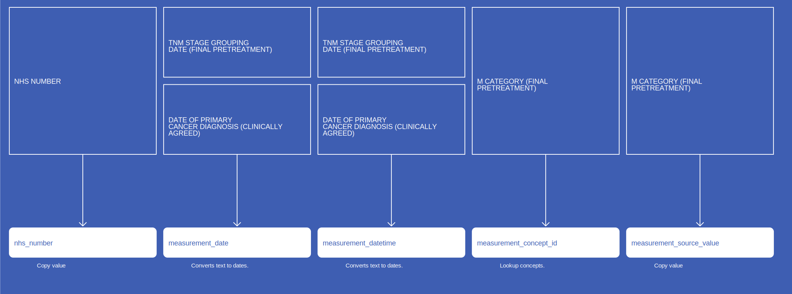</a>

[Comment or raise an issue for this mapping.](https://github.com/answerdigital/oxford-omop-data-mapper/issues/new?title=COSDv8CTMeasurementMcategoryFinalPreTreatmentStage%20mapping){: .btn }
## COSDv8CTMeasurementLactateDehydrogenaseLevelPeakAtDiagnosis

[Comment or raise an issue for this mapping.](https://github.com/answerdigital/oxford-omop-data-mapper/issues/new?title=COSDv8CTMeasurementLactateDehydrogenaseLevelPeakAtDiagnosis%20mapping){: .btn }
## COSDv8CTMeasurementLactateDehydrogenaseLevelNormalUpperLimit
<a href="COSDv8CTMeasurementLactateDehydrogenaseLevelNormalUpperLimit.svg" target="_blank">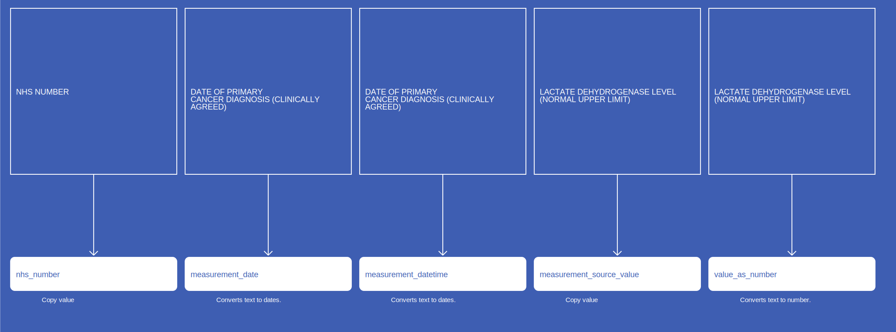</a>

[Comment or raise an issue for this mapping.](https://github.com/answerdigital/oxford-omop-data-mapper/issues/new?title=COSDv8CTMeasurementLactateDehydrogenaseLevelNormalUpperLimit%20mapping){: .btn }
## COSDv8CTMeasurementGradeOfDifferentiation

[Comment or raise an issue for this mapping.](https://github.com/answerdigital/oxford-omop-data-mapper/issues/new?title=COSDv8CTMeasurementGradeOfDifferentiation%20mapping){: .btn }
## COSDv8CTMeasurementAdultComorbidityEvaluation
<a href="COSDv8CTMeasurementAdultComorbidityEvaluation.svg" target="_blank">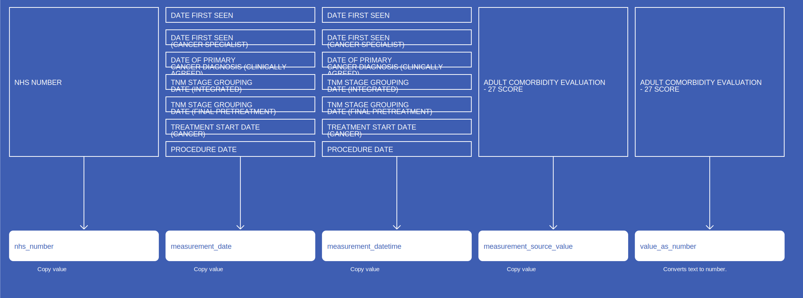</a>

[Comment or raise an issue for this mapping.](https://github.com/answerdigital/oxford-omop-data-mapper/issues/new?title=COSDv8CTMeasurementAdultComorbidityEvaluation%20mapping){: .btn }
## COSDv8CRMeasurementTumourLaterality

[Comment or raise an issue for this mapping.](https://github.com/answerdigital/oxford-omop-data-mapper/issues/new?title=COSDv8CRMeasurementTumourLaterality%20mapping){: .btn }
## COSDv8CRMeasurementTNMcategoryIntegratedStage

[Comment or raise an issue for this mapping.](https://github.com/answerdigital/oxford-omop-data-mapper/issues/new?title=COSDv8CRMeasurementTNMcategoryIntegratedStage%20mapping){: .btn }
## COSDv8CRMeasurementTNMcategoryFinalPreTreatmentStage

[Comment or raise an issue for this mapping.](https://github.com/answerdigital/oxford-omop-data-mapper/issues/new?title=COSDv8CRMeasurementTNMcategoryFinalPreTreatmentStage%20mapping){: .btn }
## COSDv8CRMeasurementTcategoryIntegratedStage

[Comment or raise an issue for this mapping.](https://github.com/answerdigital/oxford-omop-data-mapper/issues/new?title=COSDv8CRMeasurementTcategoryIntegratedStage%20mapping){: .btn }
## COSDv8CRMeasurementTcategoryFinalPreTreatmentStage

[Comment or raise an issue for this mapping.](https://github.com/answerdigital/oxford-omop-data-mapper/issues/new?title=COSDv8CRMeasurementTcategoryFinalPreTreatmentStage%20mapping){: .btn }
## COSDv8CRMeasurementPrimaryPathwayMetastasis
<a href="COSDv8CRMeasurementPrimaryPathwayMetastasis.svg" target="_blank">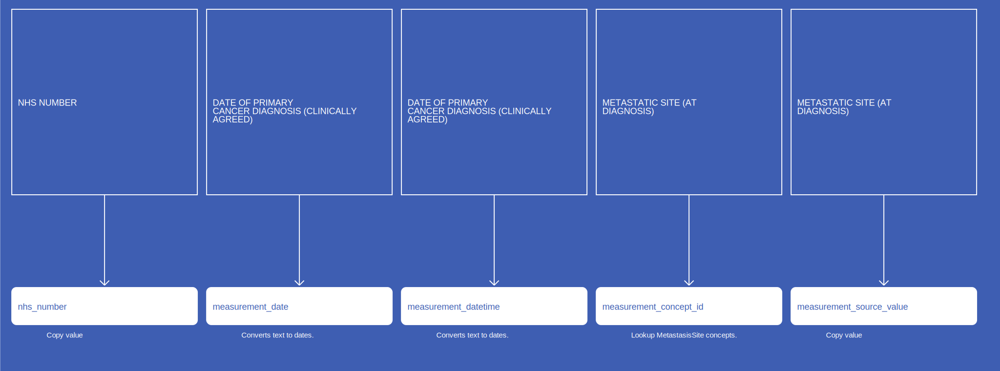</a>

[Comment or raise an issue for this mapping.](https://github.com/answerdigital/oxford-omop-data-mapper/issues/new?title=COSDv8CRMeasurementPrimaryPathwayMetastasis%20mapping){: .btn }
## COSDv8CRMeasurementNonPrimaryPathwayMetastasis

[Comment or raise an issue for this mapping.](https://github.com/answerdigital/oxford-omop-data-mapper/issues/new?title=COSDv8CRMeasurementNonPrimaryPathwayMetastasis%20mapping){: .btn }
## COSDv8CRMeasurementNcategoryIntegratedStage

[Comment or raise an issue for this mapping.](https://github.com/answerdigital/oxford-omop-data-mapper/issues/new?title=COSDv8CRMeasurementNcategoryIntegratedStage%20mapping){: .btn }
## COSDv8CRMeasurementNcategoryFinalPreTreatmentStage

[Comment or raise an issue for this mapping.](https://github.com/answerdigital/oxford-omop-data-mapper/issues/new?title=COSDv8CRMeasurementNcategoryFinalPreTreatmentStage%20mapping){: .btn }
## COSDv8CRMeasurementMcategoryIntegratedStage

[Comment or raise an issue for this mapping.](https://github.com/answerdigital/oxford-omop-data-mapper/issues/new?title=COSDv8CRMeasurementMcategoryIntegratedStage%20mapping){: .btn }
## COSDv8CRMeasurementMcategoryFinalPreTreatmentStage

[Comment or raise an issue for this mapping.](https://github.com/answerdigital/oxford-omop-data-mapper/issues/new?title=COSDv8CRMeasurementMcategoryFinalPreTreatmentStage%20mapping){: .btn }
## COSDv8CRMeasurementGradeOfDifferentiation

[Comment or raise an issue for this mapping.](https://github.com/answerdigital/oxford-omop-data-mapper/issues/new?title=COSDv8CRMeasurementGradeOfDifferentiation%20mapping){: .btn }
## COSDv8CRMeasurementAdultComorbidityEvaluation

[Comment or raise an issue for this mapping.](https://github.com/answerdigital/oxford-omop-data-mapper/issues/new?title=COSDv8CRMeasurementAdultComorbidityEvaluation%20mapping){: .btn }
## CosdV9MeasurementTumourLaterality

[Comment or raise an issue for this mapping.](https://github.com/answerdigital/oxford-omop-data-mapper/issues/new?title=CosdV9MeasurementTumourLaterality%20mapping){: .btn }
## CosdV9MeasurementTNMcategoryIntegratedStage

[Comment or raise an issue for this mapping.](https://github.com/answerdigital/oxford-omop-data-mapper/issues/new?title=CosdV9MeasurementTNMcategoryIntegratedStage%20mapping){: .btn }
## CosdV9MeasurementTNMcategoryFinalPreTreatmentStage

[Comment or raise an issue for this mapping.](https://github.com/answerdigital/oxford-omop-data-mapper/issues/new?title=CosdV9MeasurementTNMcategoryFinalPreTreatmentStage%20mapping){: .btn }
## CosdV9MeasurementTcategoryIntegratedStage

[Comment or raise an issue for this mapping.](https://github.com/answerdigital/oxford-omop-data-mapper/issues/new?title=CosdV9MeasurementTcategoryIntegratedStage%20mapping){: .btn }
## CosdV9MeasurementTcategoryFinalPreTreatmentStage

[Comment or raise an issue for this mapping.](https://github.com/answerdigital/oxford-omop-data-mapper/issues/new?title=CosdV9MeasurementTcategoryFinalPreTreatmentStage%20mapping){: .btn }
## CosdV9MeasurementSynchronousTumourIndicator

[Comment or raise an issue for this mapping.](https://github.com/answerdigital/oxford-omop-data-mapper/issues/new?title=CosdV9MeasurementSynchronousTumourIndicator%20mapping){: .btn }
## CosdV9MeasurementPrimaryPathwayMetastasis

[Comment or raise an issue for this mapping.](https://github.com/answerdigital/oxford-omop-data-mapper/issues/new?title=CosdV9MeasurementPrimaryPathwayMetastasis%20mapping){: .btn }
## CosdV9MeasurementNonPrimaryPathwayRecurrenceMetastasis

[Comment or raise an issue for this mapping.](https://github.com/answerdigital/oxford-omop-data-mapper/issues/new?title=CosdV9MeasurementNonPrimaryPathwayRecurrenceMetastasis%20mapping){: .btn }
## CosdV9MeasurementNonPrimaryPathwayProgressionMetastasis

[Comment or raise an issue for this mapping.](https://github.com/answerdigital/oxford-omop-data-mapper/issues/new?title=CosdV9MeasurementNonPrimaryPathwayProgressionMetastasis%20mapping){: .btn }
## CosdV9MeasurementNcategoryIntegratedStage

[Comment or raise an issue for this mapping.](https://github.com/answerdigital/oxford-omop-data-mapper/issues/new?title=CosdV9MeasurementNcategoryIntegratedStage%20mapping){: .btn }
## CosdV9MeasurementNcategoryFinalPreTreatmentStage

[Comment or raise an issue for this mapping.](https://github.com/answerdigital/oxford-omop-data-mapper/issues/new?title=CosdV9MeasurementNcategoryFinalPreTreatmentStage%20mapping){: .btn }
## CosdV9MeasurementMcategoryIntegratedStage

[Comment or raise an issue for this mapping.](https://github.com/answerdigital/oxford-omop-data-mapper/issues/new?title=CosdV9MeasurementMcategoryIntegratedStage%20mapping){: .btn }
## CosdV9MeasurementMcategoryFinalPreTreatmentStage

[Comment or raise an issue for this mapping.](https://github.com/answerdigital/oxford-omop-data-mapper/issues/new?title=CosdV9MeasurementMcategoryFinalPreTreatmentStage%20mapping){: .btn }
## CosdV9MeasurementGradeOfDifferentiation

[Comment or raise an issue for this mapping.](https://github.com/answerdigital/oxford-omop-data-mapper/issues/new?title=CosdV9MeasurementGradeOfDifferentiation%20mapping){: .btn }
## CosdV9MeasurementAdultComorbidityEvaluation

{: .important-title }
> Notes
>
> Observation dates are approximated using other date fields.
>

[Comment or raise an issue for this mapping.](https://github.com/answerdigital/oxford-omop-data-mapper/issues/new?title=CosdV9MeasurementAdultComorbidityEvaluation%20mapping){: .btn }
## CosdV8MeasurementTumourLaterality

[Comment or raise an issue for this mapping.](https://github.com/answerdigital/oxford-omop-data-mapper/issues/new?title=CosdV8MeasurementTumourLaterality%20mapping){: .btn }
## CosdV8MeasurementTumourHeightAboveAnalVerge

[Comment or raise an issue for this mapping.](https://github.com/answerdigital/oxford-omop-data-mapper/issues/new?title=CosdV8MeasurementTumourHeightAboveAnalVerge%20mapping){: .btn }
## CosdV8MeasurementTNMcategoryIntegratedStage

[Comment or raise an issue for this mapping.](https://github.com/answerdigital/oxford-omop-data-mapper/issues/new?title=CosdV8MeasurementTNMcategoryIntegratedStage%20mapping){: .btn }
## CosdV8MeasurementTNMcategoryFinalPreTreatmentStage

[Comment or raise an issue for this mapping.](https://github.com/answerdigital/oxford-omop-data-mapper/issues/new?title=CosdV8MeasurementTNMcategoryFinalPreTreatmentStage%20mapping){: .btn }
## CosdV8MeasurementTcategoryIntegratedStage

[Comment or raise an issue for this mapping.](https://github.com/answerdigital/oxford-omop-data-mapper/issues/new?title=CosdV8MeasurementTcategoryIntegratedStage%20mapping){: .btn }
## CosdV8MeasurementTcategoryFinalPreTreatmentStage

[Comment or raise an issue for this mapping.](https://github.com/answerdigital/oxford-omop-data-mapper/issues/new?title=CosdV8MeasurementTcategoryFinalPreTreatmentStage%20mapping){: .btn }
## CosdV8MeasurementSynchronousTumourIndicator

[Comment or raise an issue for this mapping.](https://github.com/answerdigital/oxford-omop-data-mapper/issues/new?title=CosdV8MeasurementSynchronousTumourIndicator%20mapping){: .btn }
## CosdV8MeasurementPrimaryPathwayMetastasis

[Comment or raise an issue for this mapping.](https://github.com/answerdigital/oxford-omop-data-mapper/issues/new?title=CosdV8MeasurementPrimaryPathwayMetastasis%20mapping){: .btn }
## CosdV8MeasurementNonPrimaryPathwayMetastasis

[Comment or raise an issue for this mapping.](https://github.com/answerdigital/oxford-omop-data-mapper/issues/new?title=CosdV8MeasurementNonPrimaryPathwayMetastasis%20mapping){: .btn }
## CosdV8MeasurementNcategoryIntegratedStage

[Comment or raise an issue for this mapping.](https://github.com/answerdigital/oxford-omop-data-mapper/issues/new?title=CosdV8MeasurementNcategoryIntegratedStage%20mapping){: .btn }
## CosdV8MeasurementNcategoryFinalPreTreatmentStage

[Comment or raise an issue for this mapping.](https://github.com/answerdigital/oxford-omop-data-mapper/issues/new?title=CosdV8MeasurementNcategoryFinalPreTreatmentStage%20mapping){: .btn }
## CosdV8MeasurementMcategoryIntegratedStage

[Comment or raise an issue for this mapping.](https://github.com/answerdigital/oxford-omop-data-mapper/issues/new?title=CosdV8MeasurementMcategoryIntegratedStage%20mapping){: .btn }
## CosdV8MeasurementMcategoryFinalPreTreatmentStage

[Comment or raise an issue for this mapping.](https://github.com/answerdigital/oxford-omop-data-mapper/issues/new?title=CosdV8MeasurementMcategoryFinalPreTreatmentStage%20mapping){: .btn }
## CosdV8MeasurementGradeOfDifferentiation

[Comment or raise an issue for this mapping.](https://github.com/answerdigital/oxford-omop-data-mapper/issues/new?title=CosdV8MeasurementGradeOfDifferentiation%20mapping){: .btn }
## CosdV8MeasurementAdultComorbidityEvaluation
<a href="CosdV8MeasurementAdultComorbidityEvaluation.svg" target="_blank">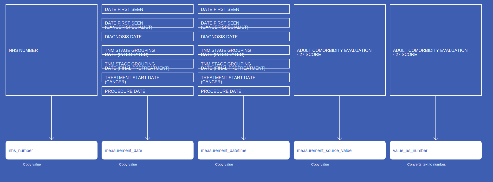</a>

{: .important-title }
> Notes
>
> Observation dates are approximated using other date fields.
>

[Comment or raise an issue for this mapping.](https://github.com/answerdigital/oxford-omop-data-mapper/issues/new?title=CosdV8MeasurementAdultComorbidityEvaluation%20mapping){: .btn }
## CosdV9BreastMeasurementTumourLaterality

[Comment or raise an issue for this mapping.](https://github.com/answerdigital/oxford-omop-data-mapper/issues/new?title=CosdV9BreastMeasurementTumourLaterality%20mapping){: .btn }
## CosdV9BreastMeasurementTNMcategoryIntegratedStage
<a href="CosdV9BreastMeasurementTNMcategoryIntegratedStage.svg" target="_blank">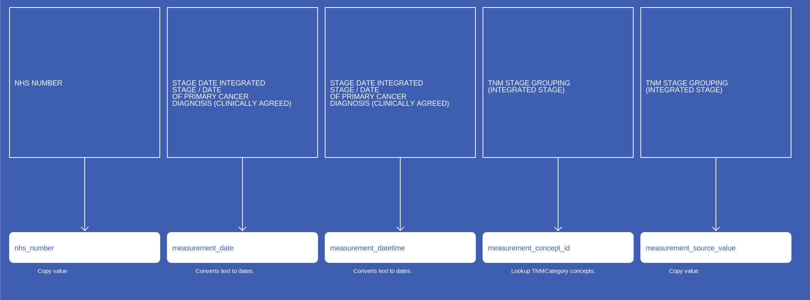</a>

[Comment or raise an issue for this mapping.](https://github.com/answerdigital/oxford-omop-data-mapper/issues/new?title=CosdV9BreastMeasurementTNMcategoryIntegratedStage%20mapping){: .btn }
## CosdV9BreastMeasurementTNMcategoryFinalPreTreatmentStage
<a href="CosdV9BreastMeasurementTNMcategoryFinalPreTreatmentStage.svg" target="_blank">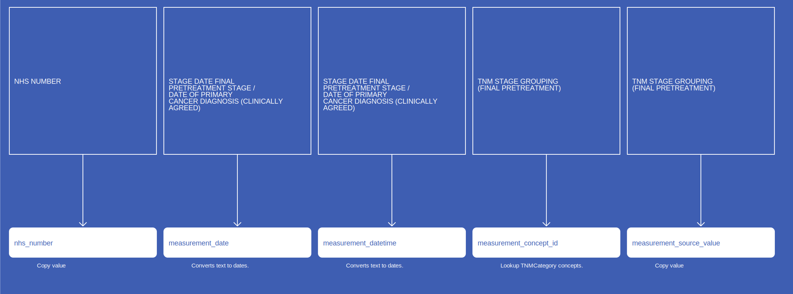</a>

[Comment or raise an issue for this mapping.](https://github.com/answerdigital/oxford-omop-data-mapper/issues/new?title=CosdV9BreastMeasurementTNMcategoryFinalPreTreatmentStage%20mapping){: .btn }
## CosdV9BreastMeasurementTcategoryIntegratedStage
<a href="CosdV9BreastMeasurementTcategoryIntegratedStage.svg" target="_blank">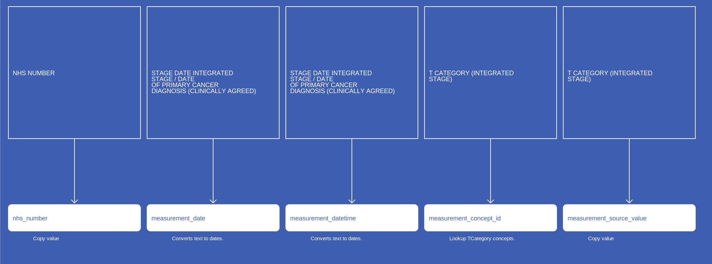</a>

[Comment or raise an issue for this mapping.](https://github.com/answerdigital/oxford-omop-data-mapper/issues/new?title=CosdV9BreastMeasurementTcategoryIntegratedStage%20mapping){: .btn }
## CosdV9BreastMeasurementTcategoryFinalPreTreatmentStage

[Comment or raise an issue for this mapping.](https://github.com/answerdigital/oxford-omop-data-mapper/issues/new?title=CosdV9BreastMeasurementTcategoryFinalPreTreatmentStage%20mapping){: .btn }
## CosdV9BreastMeasurementPrimaryPathwayMetastasis

[Comment or raise an issue for this mapping.](https://github.com/answerdigital/oxford-omop-data-mapper/issues/new?title=CosdV9BreastMeasurementPrimaryPathwayMetastasis%20mapping){: .btn }
## CosdV9BreastMeasurementNonPrimaryPathwayRecurrenceMetastasis

[Comment or raise an issue for this mapping.](https://github.com/answerdigital/oxford-omop-data-mapper/issues/new?title=CosdV9BreastMeasurementNonPrimaryPathwayRecurrenceMetastasis%20mapping){: .btn }
## CosdV9BreastMeasurementNonPrimaryPathwayProgressionMetastasis

[Comment or raise an issue for this mapping.](https://github.com/answerdigital/oxford-omop-data-mapper/issues/new?title=CosdV9BreastMeasurementNonPrimaryPathwayProgressionMetastasis%20mapping){: .btn }
## CosdV9BreastMeasurementNcategoryIntegratedStage

[Comment or raise an issue for this mapping.](https://github.com/answerdigital/oxford-omop-data-mapper/issues/new?title=CosdV9BreastMeasurementNcategoryIntegratedStage%20mapping){: .btn }
## CosdV9BreastMeasurementNcategoryFinalPreTreatmentStage

[Comment or raise an issue for this mapping.](https://github.com/answerdigital/oxford-omop-data-mapper/issues/new?title=CosdV9BreastMeasurementNcategoryFinalPreTreatmentStage%20mapping){: .btn }
## CosdV9BreastMeasurementMcategoryIntegratedStage

[Comment or raise an issue for this mapping.](https://github.com/answerdigital/oxford-omop-data-mapper/issues/new?title=CosdV9BreastMeasurementMcategoryIntegratedStage%20mapping){: .btn }
## CosdV9BreastMeasurementMcategoryFinalPreTreatmentStage

[Comment or raise an issue for this mapping.](https://github.com/answerdigital/oxford-omop-data-mapper/issues/new?title=CosdV9BreastMeasurementMcategoryFinalPreTreatmentStage%20mapping){: .btn }
## CosdV9BreastMeasurementGradeOfDifferentiation

[Comment or raise an issue for this mapping.](https://github.com/answerdigital/oxford-omop-data-mapper/issues/new?title=CosdV9BreastMeasurementGradeOfDifferentiation%20mapping){: .btn }
## CosdV9BreastMeasurementAdultComorbidityEvaluation
<a href="CosdV9BreastMeasurementAdultComorbidityEvaluation.svg" target="_blank">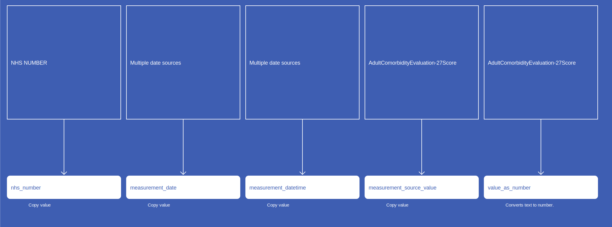</a>

{: .important-title }
> Notes
>
> Observation dates are approximated using other date fields.
>

[Comment or raise an issue for this mapping.](https://github.com/answerdigital/oxford-omop-data-mapper/issues/new?title=CosdV9BreastMeasurementAdultComorbidityEvaluation%20mapping){: .btn }
## CosdV8BreastMeasurementTumourLaterality

[Comment or raise an issue for this mapping.](https://github.com/answerdigital/oxford-omop-data-mapper/issues/new?title=CosdV8BreastMeasurementTumourLaterality%20mapping){: .btn }
## CosdV8BreastMeasurementTNMcategoryFinalPreTreatmentStage

[Comment or raise an issue for this mapping.](https://github.com/answerdigital/oxford-omop-data-mapper/issues/new?title=CosdV8BreastMeasurementTNMcategoryFinalPreTreatmentStage%20mapping){: .btn }
## CosdV8BreastMeasurementTcategoryIntegratedStage

[Comment or raise an issue for this mapping.](https://github.com/answerdigital/oxford-omop-data-mapper/issues/new?title=CosdV8BreastMeasurementTcategoryIntegratedStage%20mapping){: .btn }
## CosdV8BreastMeasurementTcategoryFinalPreTreatmentStage

[Comment or raise an issue for this mapping.](https://github.com/answerdigital/oxford-omop-data-mapper/issues/new?title=CosdV8BreastMeasurementTcategoryFinalPreTreatmentStage%20mapping){: .btn }
## CosdV8BreastMeasurementPrimaryPathwayMetastasis

[Comment or raise an issue for this mapping.](https://github.com/answerdigital/oxford-omop-data-mapper/issues/new?title=CosdV8BreastMeasurementPrimaryPathwayMetastasis%20mapping){: .btn }
## CosdV8BreastMeasurementNonPrimaryPathwayMetastasis

[Comment or raise an issue for this mapping.](https://github.com/answerdigital/oxford-omop-data-mapper/issues/new?title=CosdV8BreastMeasurementNonPrimaryPathwayMetastasis%20mapping){: .btn }
## CosdV8BreastMeasurementNcategoryIntegratedStage

[Comment or raise an issue for this mapping.](https://github.com/answerdigital/oxford-omop-data-mapper/issues/new?title=CosdV8BreastMeasurementNcategoryIntegratedStage%20mapping){: .btn }
## CosdV8BreastMeasurementNcategoryFinalPreTreatmentStage

[Comment or raise an issue for this mapping.](https://github.com/answerdigital/oxford-omop-data-mapper/issues/new?title=CosdV8BreastMeasurementNcategoryFinalPreTreatmentStage%20mapping){: .btn }
## CosdV8BreastMeasurementMcategoryIntegratedStage

[Comment or raise an issue for this mapping.](https://github.com/answerdigital/oxford-omop-data-mapper/issues/new?title=CosdV8BreastMeasurementMcategoryIntegratedStage%20mapping){: .btn }
## CosdV8BreastMeasurementMcategoryFinalPreTreatmentStage

[Comment or raise an issue for this mapping.](https://github.com/answerdigital/oxford-omop-data-mapper/issues/new?title=CosdV8BreastMeasurementMcategoryFinalPreTreatmentStage%20mapping){: .btn }
## CosdV8BreastMeasurementGradeOfDifferentiation

[Comment or raise an issue for this mapping.](https://github.com/answerdigital/oxford-omop-data-mapper/issues/new?title=CosdV8BreastMeasurementGradeOfDifferentiation%20mapping){: .btn }
## CosdV8BreastMeasurementAdultComorbidityEvaluation
<a href="CosdV8BreastMeasurementAdultComorbidityEvaluation.svg" target="_blank">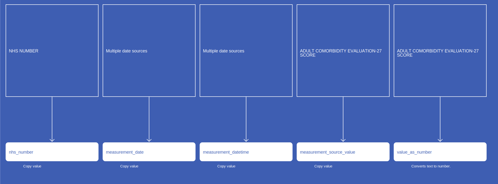</a>

{: .important-title }
> Notes
>
> Observation dates are approximated using other date fields.
>

[Comment or raise an issue for this mapping.](https://github.com/answerdigital/oxford-omop-data-mapper/issues/new?title=CosdV8BreastMeasurementAdultComorbidityEvaluation%20mapping){: .btn }
## COSDv8BAMeasurementTumourLaterality

[Comment or raise an issue for this mapping.](https://github.com/answerdigital/oxford-omop-data-mapper/issues/new?title=COSDv8BAMeasurementTumourLaterality%20mapping){: .btn }
## COSDv8BAMeasurementMetastaticSite

[Comment or raise an issue for this mapping.](https://github.com/answerdigital/oxford-omop-data-mapper/issues/new?title=COSDv8BAMeasurementMetastaticSite%20mapping){: .btn }
## COSDv8BAMeasurementGradeOfDifferentiation

[Comment or raise an issue for this mapping.](https://github.com/answerdigital/oxford-omop-data-mapper/issues/new?title=COSDv8BAMeasurementGradeOfDifferentiation%20mapping){: .btn }
## COSDv8BAMeasurementAdultComorbidityEvaluation
<a href="COSDv8BAMeasurementAdultComorbidityEvaluation.svg" target="_blank">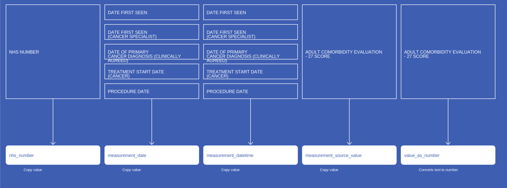</a>

[Comment or raise an issue for this mapping.](https://github.com/answerdigital/oxford-omop-data-mapper/issues/new?title=COSDv8BAMeasurementAdultComorbidityEvaluation%20mapping){: .btn }
