# Observation
* [nhs_number]()
* [RecordConnectionIdentifier]()
* [observation_concept_id]()
* [observation_date]()
* [observation_datetime]()
* [observation_type_concept_id]()
* [value_as_string]()
* [HospitalProviderSpellNumber]()
* [value_as_number]()
* [value_as_concept_id]()
* [qualifier_concept_id]()
* [unit_concept_id]()
* [observation_source_value]()
* [observation_source_concept_id]()
* [qualifier_source_value]()
* [value_source_value]()

## SusOPSourceOfReferralForOutpatients

{: .important-title }
> Notes
>
> Observations do not require a standardized test or other activity to generate clinical fact. Typical observations are medical history, family history, lifestyle choices, healthcare utilization patterns, social circumstances etc
>
> Valid Observation Concepts are not enforced to be from any domain.  They should still be standard concepts and typically belong to the Observation or Measurement domain.
>
> Observations can be stored as attribute value pairs, with the attribute as the Observation Concept and the value representing the clinical fact. This fact can be stored as a Concept (value_as_concept), a numerical value (value_as_number) or a verbatim string (value_as_string)
>

[Comment or raise an issue for this mapping.](https://github.com/answerdigital/oxford-omop-data-mapper/issues/new?title=SusOPSourceOfReferralForOutpatients%20mapping){: .btn }
## SusOPReferralReceivedDateForOutpatients

{: .important-title }
> Notes
>
> Observations do not require a standardized test or other activity to generate clinical fact. Typical observations are medical history, family history, lifestyle choices, healthcare utilization patterns, social circumstances etc
>
> Valid Observation Concepts are not enforced to be from any domain.  They should still be standard concepts and typically belong to the Observation or Measurement domain.
>
> Observations can be stored as attribute value pairs, with the attribute as the Observation Concept and the value representing the clinical fact. This fact can be stored as a Concept (value_as_concept), a numerical value (value_as_number) or a verbatim string (value_as_string)
>

[Comment or raise an issue for this mapping.](https://github.com/answerdigital/oxford-omop-data-mapper/issues/new?title=SusOPReferralReceivedDateForOutpatients%20mapping){: .btn }
## SusOPProcedureObservation

[Comment or raise an issue for this mapping.](https://github.com/answerdigital/oxford-omop-data-mapper/issues/new?title=SusOPProcedureObservation%20mapping){: .btn }
## SusOPICDDiagnosisObservation

[Comment or raise an issue for this mapping.](https://github.com/answerdigital/oxford-omop-data-mapper/issues/new?title=SusOPICDDiagnosisObservation%20mapping){: .btn }
## SusOPCarerSupportIndicator

{: .important-title }
> Notes
>
> Observations do not require a standardized test or other activity to generate clinical fact. Typical observations are medical history, family history, lifestyle choices, healthcare utilization patterns, social circumstances etc
>
> Valid Observation Concepts are not enforced to be from any domain.  They should still be standard concepts and typically belong to the Observation or Measurement domain.
>
> Observations can be stored as attribute value pairs, with the attribute as the Observation Concept and the value representing the clinical fact. This fact can be stored as a Concept (value_as_concept), a numerical value (value_as_number) or a verbatim string (value_as_string)
>

[Comment or raise an issue for this mapping.](https://github.com/answerdigital/oxford-omop-data-mapper/issues/new?title=SusOPCarerSupportIndicator%20mapping){: .btn }
## SusCCMDSHighCostDrugs

[Comment or raise an issue for this mapping.](https://github.com/answerdigital/oxford-omop-data-mapper/issues/new?title=SusCCMDSHighCostDrugs%20mapping){: .btn }
## SusAPCTotalPreviousPregnancies

{: .important-title }
> Notes
>
> Observations do not require a standardized test or other activity to generate clinical fact. Typical observations are medical history, family history, lifestyle choices, healthcare utilization patterns, social circumstances etc
>
> Valid Observation Concepts are not enforced to be from any domain.  They should still be standard concepts and typically belong to the Observation or Measurement domain.
>
> Observations can be stored as attribute value pairs, with the attribute as the Observation Concept and the value representing the clinical fact. This fact can be stored as a Concept (value_as_concept), a numerical value (value_as_number) or a verbatim string (value_as_string)
>

[Comment or raise an issue for this mapping.](https://github.com/answerdigital/oxford-omop-data-mapper/issues/new?title=SusAPCTotalPreviousPregnancies%20mapping){: .btn }
## SusAPCSourceOfReferralForInpatients

{: .important-title }
> Notes
>
> Observations do not require a standardized test or other activity to generate clinical fact. Typical observations are medical history, family history, lifestyle choices, healthcare utilization patterns, social circumstances etc
>
> Valid Observation Concepts are not enforced to be from any domain.  They should still be standard concepts and typically belong to the Observation or Measurement domain.
>
> Observations can be stored as attribute value pairs, with the attribute as the Observation Concept and the value representing the clinical fact. This fact can be stored as a Concept (value_as_concept), a numerical value (value_as_number) or a verbatim string (value_as_string)
>

[Comment or raise an issue for this mapping.](https://github.com/answerdigital/oxford-omop-data-mapper/issues/new?title=SusAPCSourceOfReferralForInpatients%20mapping){: .btn }
## SusAPCReferralReceivedDateForInpatients

{: .important-title }
> Notes
>
> Observations do not require a standardized test or other activity to generate clinical fact. Typical observations are medical history, family history, lifestyle choices, healthcare utilization patterns, social circumstances etc
>
> Valid Observation Concepts are not enforced to be from any domain.  They should still be standard concepts and typically belong to the Observation or Measurement domain.
>
> Observations can be stored as attribute value pairs, with the attribute as the Observation Concept and the value representing the clinical fact. This fact can be stored as a Concept (value_as_concept), a numerical value (value_as_number) or a verbatim string (value_as_string)
>

[Comment or raise an issue for this mapping.](https://github.com/answerdigital/oxford-omop-data-mapper/issues/new?title=SusAPCReferralReceivedDateForInpatients%20mapping){: .btn }
## SusAPCProcedureObservations

[Comment or raise an issue for this mapping.](https://github.com/answerdigital/oxford-omop-data-mapper/issues/new?title=SusAPCProcedureObservations%20mapping){: .btn }
## SusAPCNumberOfBabies

{: .important-title }
> Notes
>
> Observations do not require a standardized test or other activity to generate clinical fact. Typical observations are medical history, family history, lifestyle choices, healthcare utilization patterns, social circumstances etc
>
> Valid Observation Concepts are not enforced to be from any domain.  They should still be standard concepts and typically belong to the Observation or Measurement domain.
>
> Observations can be stored as attribute value pairs, with the attribute as the Observation Concept and the value representing the clinical fact. This fact can be stored as a Concept (value_as_concept), a numerical value (value_as_number) or a verbatim string (value_as_string)
>

[Comment or raise an issue for this mapping.](https://github.com/answerdigital/oxford-omop-data-mapper/issues/new?title=SusAPCNumberOfBabies%20mapping){: .btn }
## SusAPCSusDiagnosisObservation

[Comment or raise an issue for this mapping.](https://github.com/answerdigital/oxford-omop-data-mapper/issues/new?title=SusAPCSusDiagnosisObservation%20mapping){: .btn }
## SusAPCGestationLengthLabourOnset

{: .important-title }
> Notes
>
> Observations do not require a standardized test or other activity to generate clinical fact. Typical observations are medical history, family history, lifestyle choices, healthcare utilization patterns, social circumstances etc
>
> Valid Observation Concepts are not enforced to be from any domain.  They should still be standard concepts and typically belong to the Observation or Measurement domain.
>
> Observations can be stored as attribute value pairs, with the attribute as the Observation Concept and the value representing the clinical fact. This fact can be stored as a Concept (value_as_concept), a numerical value (value_as_number) or a verbatim string (value_as_string)
>

[Comment or raise an issue for this mapping.](https://github.com/answerdigital/oxford-omop-data-mapper/issues/new?title=SusAPCGestationLengthLabourOnset%20mapping){: .btn }
## SusAPCCarerSupportIndicator

{: .important-title }
> Notes
>
> Observations do not require a standardized test or other activity to generate clinical fact. Typical observations are medical history, family history, lifestyle choices, healthcare utilization patterns, social circumstances etc
>
> Valid Observation Concepts are not enforced to be from any domain.  They should still be standard concepts and typically belong to the Observation or Measurement domain.
>
> Observations can be stored as attribute value pairs, with the attribute as the Observation Concept and the value representing the clinical fact. This fact can be stored as a Concept (value_as_concept), a numerical value (value_as_number) or a verbatim string (value_as_string)
>

[Comment or raise an issue for this mapping.](https://github.com/answerdigital/oxford-omop-data-mapper/issues/new?title=SusAPCCarerSupportIndicator%20mapping){: .btn }
## SusAPCBirthWeight

{: .important-title }
> Notes
>
> Observations do not require a standardized test or other activity to generate clinical fact. Typical observations are medical history, family history, lifestyle choices, healthcare utilization patterns, social circumstances etc
>
> Valid Observation Concepts are not enforced to be from any domain.  They should still be standard concepts and typically belong to the Observation or Measurement domain.
>
> Observations can be stored as attribute value pairs, with the attribute as the Observation Concept and the value representing the clinical fact. This fact can be stored as a Concept (value_as_concept), a numerical value (value_as_number) or a verbatim string (value_as_string)
>

[Comment or raise an issue for this mapping.](https://github.com/answerdigital/oxford-omop-data-mapper/issues/new?title=SusAPCBirthWeight%20mapping){: .btn }
## SusAPCAnaestheticGivenPostLabourDelivery

{: .important-title }
> Notes
>
> Observations do not require a standardized test or other activity to generate clinical fact. Typical observations are medical history, family history, lifestyle choices, healthcare utilization patterns, social circumstances etc
>
> Valid Observation Concepts are not enforced to be from any domain.  They should still be standard concepts and typically belong to the Observation or Measurement domain.
>
> Observations can be stored as attribute value pairs, with the attribute as the Observation Concept and the value representing the clinical fact. This fact can be stored as a Concept (value_as_concept), a numerical value (value_as_number) or a verbatim string (value_as_string)
>

[Comment or raise an issue for this mapping.](https://github.com/answerdigital/oxford-omop-data-mapper/issues/new?title=SusAPCAnaestheticGivenPostLabourDelivery%20mapping){: .btn }
## SusAPCAnaestheticDuringLabourDelivery

{: .important-title }
> Notes
>
> Observations do not require a standardized test or other activity to generate clinical fact. Typical observations are medical history, family history, lifestyle choices, healthcare utilization patterns, social circumstances etc
>
> Valid Observation Concepts are not enforced to be from any domain.  They should still be standard concepts and typically belong to the Observation or Measurement domain.
>
> Observations can be stored as attribute value pairs, with the attribute as the Observation Concept and the value representing the clinical fact. This fact can be stored as a Concept (value_as_concept), a numerical value (value_as_number) or a verbatim string (value_as_string)
>

[Comment or raise an issue for this mapping.](https://github.com/answerdigital/oxford-omop-data-mapper/issues/new?title=SusAPCAnaestheticDuringLabourDelivery%20mapping){: .btn }
## SusAESourceOfReferralForAE

{: .important-title }
> Notes
>
> Observations do not require a standardized test or other activity to generate clinical fact. Typical observations are medical history, family history, lifestyle choices, healthcare utilization patterns, social circumstances etc
>
> Valid Observation Concepts are not enforced to be from any domain.  They should still be standard concepts and typically belong to the Observation or Measurement domain.
>
> Observations can be stored as attribute value pairs, with the attribute as the Observation Concept and the value representing the clinical fact. This fact can be stored as a Concept (value_as_concept), a numerical value (value_as_number) or a verbatim string (value_as_string)
>

[Comment or raise an issue for this mapping.](https://github.com/answerdigital/oxford-omop-data-mapper/issues/new?title=SusAESourceOfReferralForAE%20mapping){: .btn }
## SusAEDiabeticPatient

{: .important-title }
> Notes
>
> Observations do not require a standardized test or other activity to generate clinical fact. Typical observations are medical history, family history, lifestyle choices, healthcare utilization patterns, social circumstances etc
>
> Valid Observation Concepts are not enforced to be from any domain.  They should still be standard concepts and typically belong to the Observation or Measurement domain.
>
> Observations can be stored as attribute value pairs, with the attribute as the Observation Concept and the value representing the clinical fact. This fact can be stored as a Concept (value_as_concept), a numerical value (value_as_number) or a verbatim string (value_as_string)
>

[Comment or raise an issue for this mapping.](https://github.com/answerdigital/oxford-omop-data-mapper/issues/new?title=SusAEDiabeticPatient%20mapping){: .btn }
## SusAEAsthmaticPatient

{: .important-title }
> Notes
>
> Observations do not require a standardized test or other activity to generate clinical fact. Typical observations are medical history, family history, lifestyle choices, healthcare utilization patterns, social circumstances etc
>
> Valid Observation Concepts are not enforced to be from any domain.  They should still be standard concepts and typically belong to the Observation or Measurement domain.
>
> Observations can be stored as attribute value pairs, with the attribute as the Observation Concept and the value representing the clinical fact. This fact can be stored as a Concept (value_as_concept), a numerical value (value_as_number) or a verbatim string (value_as_string)
>

[Comment or raise an issue for this mapping.](https://github.com/answerdigital/oxford-omop-data-mapper/issues/new?title=SusAEAsthmaticPatient%20mapping){: .btn }
## SactAdjunctiveTherapyType

[Comment or raise an issue for this mapping.](https://github.com/answerdigital/oxford-omop-data-mapper/issues/new?title=SactAdjunctiveTherapyType%20mapping){: .btn }
## SactAdministrationRoute

[Comment or raise an issue for this mapping.](https://github.com/answerdigital/oxford-omop-data-mapper/issues/new?title=SactAdministrationRoute%20mapping){: .btn }
## SactClinicalTrial

[Comment or raise an issue for this mapping.](https://github.com/answerdigital/oxford-omop-data-mapper/issues/new?title=SactClinicalTrial%20mapping){: .btn }
## SactTreatmentIntent

[Comment or raise an issue for this mapping.](https://github.com/answerdigital/oxford-omop-data-mapper/issues/new?title=SactTreatmentIntent%20mapping){: .btn }
## RtdsDecisionToPerformDate

[Comment or raise an issue for this mapping.](https://github.com/answerdigital/oxford-omop-data-mapper/issues/new?title=RtdsDecisionToPerformDate%20mapping){: .btn }
## RtdsExternalBeamEnergy

{: .important-title }
> Assumptions
>
> * Multiple records around the same time is indicative of one nominal beam energy with multiple control points being recorded

[Comment or raise an issue for this mapping.](https://github.com/answerdigital/oxford-omop-data-mapper/issues/new?title=RtdsExternalBeamEnergy%20mapping){: .btn }
## RtdsNumberOfFractions

[Comment or raise an issue for this mapping.](https://github.com/answerdigital/oxford-omop-data-mapper/issues/new?title=RtdsNumberOfFractions%20mapping){: .btn }
## RtdsReferralDate

[Comment or raise an issue for this mapping.](https://github.com/answerdigital/oxford-omop-data-mapper/issues/new?title=RtdsReferralDate%20mapping){: .btn }
## RtdsTreatmentAnatomicalSite

[Comment or raise an issue for this mapping.](https://github.com/answerdigital/oxford-omop-data-mapper/issues/new?title=RtdsTreatmentAnatomicalSite%20mapping){: .btn }
## OxfordLabGeneralComment

[Comment or raise an issue for this mapping.](https://github.com/answerdigital/oxford-omop-data-mapper/issues/new?title=OxfordLabGeneralComment%20mapping){: .btn }
## COSDv9URObservationSmokingStatusCancer

[Comment or raise an issue for this mapping.](https://github.com/answerdigital/oxford-omop-data-mapper/issues/new?title=COSDv9URObservationSmokingStatusCancer%20mapping){: .btn }
## COSDv9URObservationAlcoholHistoryCancerInLastThreeMonths

[Comment or raise an issue for this mapping.](https://github.com/answerdigital/oxford-omop-data-mapper/issues/new?title=COSDv9URObservationAlcoholHistoryCancerInLastThreeMonths%20mapping){: .btn }
## COSDv9URObservationAlcoholHistoryCancerBeforeLastThreeMonths

[Comment or raise an issue for this mapping.](https://github.com/answerdigital/oxford-omop-data-mapper/issues/new?title=COSDv9URObservationAlcoholHistoryCancerBeforeLastThreeMonths%20mapping){: .btn }
## COSDv8URObservationSmokingStatusCancer

[Comment or raise an issue for this mapping.](https://github.com/answerdigital/oxford-omop-data-mapper/issues/new?title=COSDv8URObservationSmokingStatusCancer%20mapping){: .btn }
## COSDv8URObservationPersonStatedSexualOrientationCodeAtDiagnosis
<a href="COSDv8URObservationPersonStatedSexualOrientationCodeAtDiagnosis.svg" target="_blank">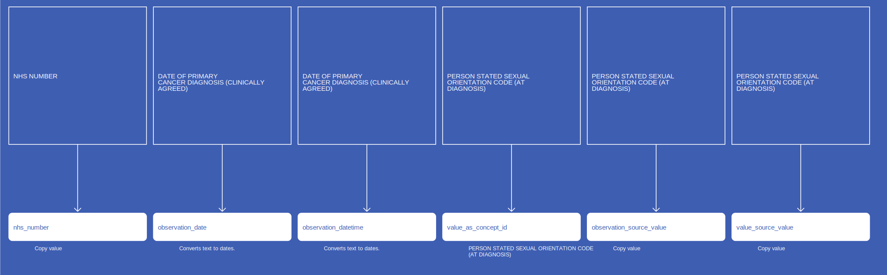</a>

[Comment or raise an issue for this mapping.](https://github.com/answerdigital/oxford-omop-data-mapper/issues/new?title=COSDv8URObservationPersonStatedSexualOrientationCodeAtDiagnosis%20mapping){: .btn }
## COSDv8URObservationAsaPhysicalStatusClassificationSystemCode
<a href="COSDv8URObservationAsaPhysicalStatusClassificationSystemCode.svg" target="_blank">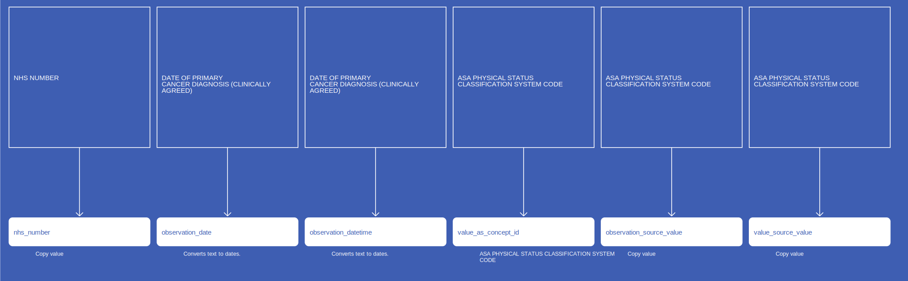</a>

[Comment or raise an issue for this mapping.](https://github.com/answerdigital/oxford-omop-data-mapper/issues/new?title=COSDv8URObservationAsaPhysicalStatusClassificationSystemCode%20mapping){: .btn }
## COSDv8URObservationAlcoholHistoryCancerInLastThreeMonths

[Comment or raise an issue for this mapping.](https://github.com/answerdigital/oxford-omop-data-mapper/issues/new?title=COSDv8URObservationAlcoholHistoryCancerInLastThreeMonths%20mapping){: .btn }
## COSDv8URObservationAlcoholHistoryCancerBeforeLastThreeMonths

[Comment or raise an issue for this mapping.](https://github.com/answerdigital/oxford-omop-data-mapper/issues/new?title=COSDv8URObservationAlcoholHistoryCancerBeforeLastThreeMonths%20mapping){: .btn }
## COSDv9UGObservationSmokingStatusCancer

[Comment or raise an issue for this mapping.](https://github.com/answerdigital/oxford-omop-data-mapper/issues/new?title=COSDv9UGObservationSmokingStatusCancer%20mapping){: .btn }
## COSDv9UGObservationAlcoholHistoryCancerInLastThreeMonths

[Comment or raise an issue for this mapping.](https://github.com/answerdigital/oxford-omop-data-mapper/issues/new?title=COSDv9UGObservationAlcoholHistoryCancerInLastThreeMonths%20mapping){: .btn }
## COSDv9UGObservationAlcoholHistoryCancerBeforeLastThreeMonths

[Comment or raise an issue for this mapping.](https://github.com/answerdigital/oxford-omop-data-mapper/issues/new?title=COSDv9UGObservationAlcoholHistoryCancerBeforeLastThreeMonths%20mapping){: .btn }
## COSDv8UGObservationSmokingStatusCancer

[Comment or raise an issue for this mapping.](https://github.com/answerdigital/oxford-omop-data-mapper/issues/new?title=COSDv8UGObservationSmokingStatusCancer%20mapping){: .btn }
## COSDv8UGObservationAsaPhysicalStatusClassificationSystemCode

[Comment or raise an issue for this mapping.](https://github.com/answerdigital/oxford-omop-data-mapper/issues/new?title=COSDv8UGObservationAsaPhysicalStatusClassificationSystemCode%20mapping){: .btn }
## COSDv8UGObservationAlcoholHistoryCancerInLastThreeMonths
<a href="COSDv8UGObservationAlcoholHistoryCancerInLastThreeMonths.svg" target="_blank">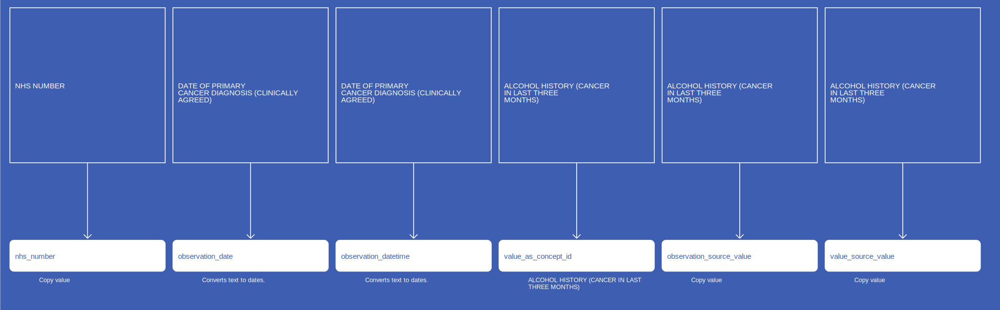</a>

[Comment or raise an issue for this mapping.](https://github.com/answerdigital/oxford-omop-data-mapper/issues/new?title=COSDv8UGObservationAlcoholHistoryCancerInLastThreeMonths%20mapping){: .btn }
## COSDv8UGObservationAlcoholHistoryCancerBeforeLastThreeMonths

[Comment or raise an issue for this mapping.](https://github.com/answerdigital/oxford-omop-data-mapper/issues/new?title=COSDv8UGObservationAlcoholHistoryCancerBeforeLastThreeMonths%20mapping){: .btn }
## COSDv9SKObservationSmokingStatusCancer

[Comment or raise an issue for this mapping.](https://github.com/answerdigital/oxford-omop-data-mapper/issues/new?title=COSDv9SKObservationSmokingStatusCancer%20mapping){: .btn }
## COSDv9SKObservationAlcoholHistoryCancerInLastThreeMonths

[Comment or raise an issue for this mapping.](https://github.com/answerdigital/oxford-omop-data-mapper/issues/new?title=COSDv9SKObservationAlcoholHistoryCancerInLastThreeMonths%20mapping){: .btn }
## COSDv9SKObservationAlcoholHistoryCancerBeforeLastThreeMonths

[Comment or raise an issue for this mapping.](https://github.com/answerdigital/oxford-omop-data-mapper/issues/new?title=COSDv9SKObservationAlcoholHistoryCancerBeforeLastThreeMonths%20mapping){: .btn }
## COSDv8SKObservationSmokingStatusCancer

[Comment or raise an issue for this mapping.](https://github.com/answerdigital/oxford-omop-data-mapper/issues/new?title=COSDv8SKObservationSmokingStatusCancer%20mapping){: .btn }
## COSDv8SKObservationAlcoholHistoryCancerInLastThreeMonths

[Comment or raise an issue for this mapping.](https://github.com/answerdigital/oxford-omop-data-mapper/issues/new?title=COSDv8SKObservationAlcoholHistoryCancerInLastThreeMonths%20mapping){: .btn }
## COSDv8SKObservationAlcoholHistoryCancerBeforeLastThreeMonths

[Comment or raise an issue for this mapping.](https://github.com/answerdigital/oxford-omop-data-mapper/issues/new?title=COSDv8SKObservationAlcoholHistoryCancerBeforeLastThreeMonths%20mapping){: .btn }
## COSDv9SAObservationSmokingStatusCancer
<a href="COSDv9SAObservationSmokingStatusCancer.svg" target="_blank">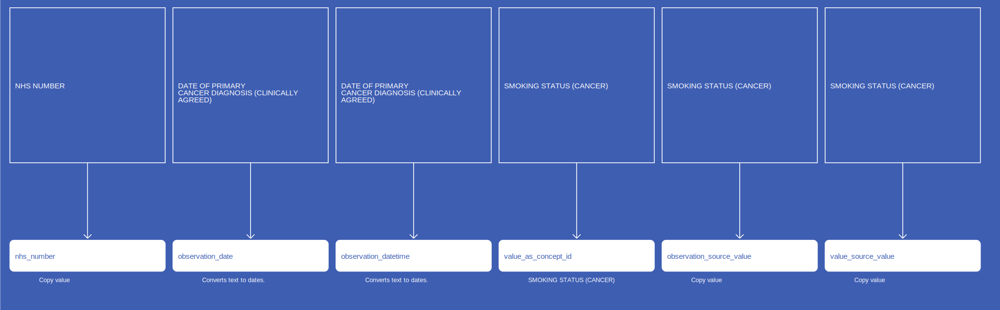</a>

[Comment or raise an issue for this mapping.](https://github.com/answerdigital/oxford-omop-data-mapper/issues/new?title=COSDv9SAObservationSmokingStatusCancer%20mapping){: .btn }
## COSDv9SAObservationAlcoholHistoryCancerInLastThreeMonths

[Comment or raise an issue for this mapping.](https://github.com/answerdigital/oxford-omop-data-mapper/issues/new?title=COSDv9SAObservationAlcoholHistoryCancerInLastThreeMonths%20mapping){: .btn }
## COSDv9SAObservationAlcoholHistoryCancerBeforeLastThreeMonths

[Comment or raise an issue for this mapping.](https://github.com/answerdigital/oxford-omop-data-mapper/issues/new?title=COSDv9SAObservationAlcoholHistoryCancerBeforeLastThreeMonths%20mapping){: .btn }
## COSDv8SAObservationSmokingStatusCancer

[Comment or raise an issue for this mapping.](https://github.com/answerdigital/oxford-omop-data-mapper/issues/new?title=COSDv8SAObservationSmokingStatusCancer%20mapping){: .btn }
## COSDv8SAObservationAlcoholHistoryCancerInLastThreeMonths

[Comment or raise an issue for this mapping.](https://github.com/answerdigital/oxford-omop-data-mapper/issues/new?title=COSDv8SAObservationAlcoholHistoryCancerInLastThreeMonths%20mapping){: .btn }
## COSDv8SAObservationAlcoholHistoryCancerBeforeLastThreeMonths
<a href="COSDv8SAObservationAlcoholHistoryCancerBeforeLastThreeMonths.svg" target="_blank">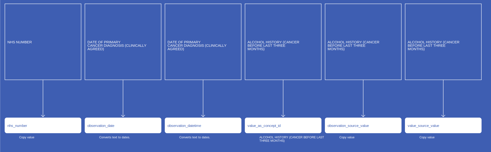</a>

[Comment or raise an issue for this mapping.](https://github.com/answerdigital/oxford-omop-data-mapper/issues/new?title=COSDv8SAObservationAlcoholHistoryCancerBeforeLastThreeMonths%20mapping){: .btn }
## COSDv9LVObservationSmokingStatusCancer

[Comment or raise an issue for this mapping.](https://github.com/answerdigital/oxford-omop-data-mapper/issues/new?title=COSDv9LVObservationSmokingStatusCancer%20mapping){: .btn }
## COSDv9LVObservationPerformanceStatusAdult

[Comment or raise an issue for this mapping.](https://github.com/answerdigital/oxford-omop-data-mapper/issues/new?title=COSDv9LVObservationPerformanceStatusAdult%20mapping){: .btn }
## COSDv9LVObservationFamilialCancerSyndromeIndicator

[Comment or raise an issue for this mapping.](https://github.com/answerdigital/oxford-omop-data-mapper/issues/new?title=COSDv9LVObservationFamilialCancerSyndromeIndicator%20mapping){: .btn }
## COSDv9LVObservationCancerTreatmentIntent

[Comment or raise an issue for this mapping.](https://github.com/answerdigital/oxford-omop-data-mapper/issues/new?title=COSDv9LVObservationCancerTreatmentIntent%20mapping){: .btn }
## COSDv8LVObservationPerformanceStatusAdult

[Comment or raise an issue for this mapping.](https://github.com/answerdigital/oxford-omop-data-mapper/issues/new?title=COSDv8LVObservationPerformanceStatusAdult%20mapping){: .btn }
## COSDv8LVObservationCancerTreatmentIntent

[Comment or raise an issue for this mapping.](https://github.com/answerdigital/oxford-omop-data-mapper/issues/new?title=COSDv8LVObservationCancerTreatmentIntent%20mapping){: .btn }
## CosdV9LungTobaccoSmokingStatus

{: .important-title }
> Notes
>
> Observation dates are approximated using other date fields.
>

[Comment or raise an issue for this mapping.](https://github.com/answerdigital/oxford-omop-data-mapper/issues/new?title=CosdV9LungTobaccoSmokingStatus%20mapping){: .btn }
## CosdV9LungTobaccoSmokingCessation

{: .important-title }
> Notes
>
> Observation dates are approximated using other date fields.
>

[Comment or raise an issue for this mapping.](https://github.com/answerdigital/oxford-omop-data-mapper/issues/new?title=CosdV9LungTobaccoSmokingCessation%20mapping){: .btn }
## CosdV9LungSurgicalAccessType

{: .important-title }
> Notes
>
> Observation dates are approximated using other date fields.
>

[Comment or raise an issue for this mapping.](https://github.com/answerdigital/oxford-omop-data-mapper/issues/new?title=CosdV9LungSurgicalAccessType%20mapping){: .btn }
## CosdV9LungSourceOfReferralForOutpatients

{: .important-title }
> Notes
>
> Observation dates are approximated using other date fields.
>

[Comment or raise an issue for this mapping.](https://github.com/answerdigital/oxford-omop-data-mapper/issues/new?title=CosdV9LungSourceOfReferralForOutpatients%20mapping){: .btn }
## CosdV9LungSourceOfReferralForNonPrimaryCancerPathway

{: .important-title }
> Notes
>
> Observation dates are approximated using other date fields.
>

[Comment or raise an issue for this mapping.](https://github.com/answerdigital/oxford-omop-data-mapper/issues/new?title=CosdV9LungSourceOfReferralForNonPrimaryCancerPathway%20mapping){: .btn }
## CosdV9LungPerformanceStatusAdult

{: .important-title }
> Notes
>
> Observation dates are approximated using other date fields.
>

[Comment or raise an issue for this mapping.](https://github.com/answerdigital/oxford-omop-data-mapper/issues/new?title=CosdV9LungPerformanceStatusAdult%20mapping){: .btn }
## CosdV9LungMenopausalStatus

{: .important-title }
> Notes
>
> Observation dates are approximated using other date fields.
>

[Comment or raise an issue for this mapping.](https://github.com/answerdigital/oxford-omop-data-mapper/issues/new?title=CosdV9LungMenopausalStatus%20mapping){: .btn }
## CosdV9LungHistoryOfAlcoholPast

{: .important-title }
> Notes
>
> Observation dates are approximated using other date fields.
>

[Comment or raise an issue for this mapping.](https://github.com/answerdigital/oxford-omop-data-mapper/issues/new?title=CosdV9LungHistoryOfAlcoholPast%20mapping){: .btn }
## CosdV9LungHistoryOfAlcoholCurrent

{: .important-title }
> Notes
>
> Observation dates are approximated using other date fields.
>

[Comment or raise an issue for this mapping.](https://github.com/answerdigital/oxford-omop-data-mapper/issues/new?title=CosdV9LungHistoryOfAlcoholCurrent%20mapping){: .btn }
## CosdV9LungFamilialCancerSyndrome

{: .important-title }
> Notes
>
> Observation dates are approximated using other date fields.
>

[Comment or raise an issue for this mapping.](https://github.com/answerdigital/oxford-omop-data-mapper/issues/new?title=CosdV9LungFamilialCancerSyndrome%20mapping){: .btn }
## CosdV9LungFamilialCancerSyndromeSubsidiaryComment

{: .important-title }
> Notes
>
> Observation dates are approximated using other date fields.
>

[Comment or raise an issue for this mapping.](https://github.com/answerdigital/oxford-omop-data-mapper/issues/new?title=CosdV9LungFamilialCancerSyndromeSubsidiaryComment%20mapping){: .btn }
## CosdV9LungAsaScore

{: .important-title }
> Notes
>
> Observation dates are approximated using other date fields.
>

[Comment or raise an issue for this mapping.](https://github.com/answerdigital/oxford-omop-data-mapper/issues/new?title=CosdV9LungAsaScore%20mapping){: .btn }
## CosdV9LungAdultComorbidityEvaluation

{: .important-title }
> Notes
>
> Observation dates are approximated using other date fields.
>

[Comment or raise an issue for this mapping.](https://github.com/answerdigital/oxford-omop-data-mapper/issues/new?title=CosdV9LungAdultComorbidityEvaluation%20mapping){: .btn }
## CosdV8LungSurgicalAccessType

{: .important-title }
> Notes
>
> Observation dates are approximated using other date fields.
>

[Comment or raise an issue for this mapping.](https://github.com/answerdigital/oxford-omop-data-mapper/issues/new?title=CosdV8LungSurgicalAccessType%20mapping){: .btn }
## CosdV8LungSourceOfReferralOutPatients

{: .important-title }
> Notes
>
> Observation dates are approximated using other date fields.
>

[Comment or raise an issue for this mapping.](https://github.com/answerdigital/oxford-omop-data-mapper/issues/new?title=CosdV8LungSourceOfReferralOutPatients%20mapping){: .btn }
## CosdV8LungSourceOfReferralForOutPatientsNonPrimaryCancerPathway

{: .important-title }
> Notes
>
> Observation dates are approximated using other date fields.
>

[Comment or raise an issue for this mapping.](https://github.com/answerdigital/oxford-omop-data-mapper/issues/new?title=CosdV8LungSourceOfReferralForOutPatientsNonPrimaryCancerPathway%20mapping){: .btn }
## CosdV8LungSmokingStatusCode

{: .important-title }
> Notes
>
> Observation dates are approximated using other date fields.
>

[Comment or raise an issue for this mapping.](https://github.com/answerdigital/oxford-omop-data-mapper/issues/new?title=CosdV8LungSmokingStatusCode%20mapping){: .btn }
## CosdV8LungPersonStatedSexualOrientationCodeAtDiagnosis

{: .important-title }
> Notes
>
> Observation dates are approximated using other date fields.
>

[Comment or raise an issue for this mapping.](https://github.com/answerdigital/oxford-omop-data-mapper/issues/new?title=CosdV8LungPersonStatedSexualOrientationCodeAtDiagnosis%20mapping){: .btn }
## CosdV8LungFamilialCancerSyndromeIndicator

{: .important-title }
> Notes
>
> Observation dates are approximated using other date fields.
>

[Comment or raise an issue for this mapping.](https://github.com/answerdigital/oxford-omop-data-mapper/issues/new?title=CosdV8LungFamilialCancerSyndromeIndicator%20mapping){: .btn }
## CosdV8LungAlcoholHistoryCancerInLastThreeMonths

{: .important-title }
> Notes
>
> Observation dates are approximated using other date fields.
>

[Comment or raise an issue for this mapping.](https://github.com/answerdigital/oxford-omop-data-mapper/issues/new?title=CosdV8LungAlcoholHistoryCancerInLastThreeMonths%20mapping){: .btn }
## CosdV8LungAlcoholHistoryCancerBeforeLastThreeMonths

{: .important-title }
> Notes
>
> Observation dates are approximated using other date fields.
>

[Comment or raise an issue for this mapping.](https://github.com/answerdigital/oxford-omop-data-mapper/issues/new?title=CosdV8LungAlcoholHistoryCancerBeforeLastThreeMonths%20mapping){: .btn }
## CosdV8LungAdultPerformanceStatus

{: .important-title }
> Notes
>
> Observation dates are approximated using other date fields.
>

[Comment or raise an issue for this mapping.](https://github.com/answerdigital/oxford-omop-data-mapper/issues/new?title=CosdV8LungAdultPerformanceStatus%20mapping){: .btn }
## CosdV8LungAdultComorbidityEvaluation

{: .important-title }
> Notes
>
> Observation dates are approximated using other date fields.
>

[Comment or raise an issue for this mapping.](https://github.com/answerdigital/oxford-omop-data-mapper/issues/new?title=CosdV8LungAdultComorbidityEvaluation%20mapping){: .btn }
## COSDv9HNObservationSmokingStatusCancer

[Comment or raise an issue for this mapping.](https://github.com/answerdigital/oxford-omop-data-mapper/issues/new?title=COSDv9HNObservationSmokingStatusCancer%20mapping){: .btn }
## COSDv9HNObservationPerformanceStatusAdult

[Comment or raise an issue for this mapping.](https://github.com/answerdigital/oxford-omop-data-mapper/issues/new?title=COSDv9HNObservationPerformanceStatusAdult%20mapping){: .btn }
## COSDv9HNObservationFamilialCancerSyndromeIndicator

[Comment or raise an issue for this mapping.](https://github.com/answerdigital/oxford-omop-data-mapper/issues/new?title=COSDv9HNObservationFamilialCancerSyndromeIndicator%20mapping){: .btn }
## COSDv9HNObservationCancerTreatmentIntent

[Comment or raise an issue for this mapping.](https://github.com/answerdigital/oxford-omop-data-mapper/issues/new?title=COSDv9HNObservationCancerTreatmentIntent%20mapping){: .btn }
## COSDv9HNObservationAlcoholHistoryCancerInLastThreeMonths

[Comment or raise an issue for this mapping.](https://github.com/answerdigital/oxford-omop-data-mapper/issues/new?title=COSDv9HNObservationAlcoholHistoryCancerInLastThreeMonths%20mapping){: .btn }
## COSDv9HNObservationAlcoholHistoryCancerBeforeLastThreeMonths

[Comment or raise an issue for this mapping.](https://github.com/answerdigital/oxford-omop-data-mapper/issues/new?title=COSDv9HNObservationAlcoholHistoryCancerBeforeLastThreeMonths%20mapping){: .btn }
## COSDv8HNObservationSmokingStatusCancer

[Comment or raise an issue for this mapping.](https://github.com/answerdigital/oxford-omop-data-mapper/issues/new?title=COSDv8HNObservationSmokingStatusCancer%20mapping){: .btn }
## COSDv8HNObservationPerformanceStatusAdult

[Comment or raise an issue for this mapping.](https://github.com/answerdigital/oxford-omop-data-mapper/issues/new?title=COSDv8HNObservationPerformanceStatusAdult%20mapping){: .btn }
## COSDv8HNObservationFamilialCancerSyndromeIndicator

[Comment or raise an issue for this mapping.](https://github.com/answerdigital/oxford-omop-data-mapper/issues/new?title=COSDv8HNObservationFamilialCancerSyndromeIndicator%20mapping){: .btn }
## COSDv8HNObservationCancerTreatmentIntent

[Comment or raise an issue for this mapping.](https://github.com/answerdigital/oxford-omop-data-mapper/issues/new?title=COSDv8HNObservationCancerTreatmentIntent%20mapping){: .btn }
## COSDv8HNObservationAlcoholHistoryCancerInLastThreeMonths

[Comment or raise an issue for this mapping.](https://github.com/answerdigital/oxford-omop-data-mapper/issues/new?title=COSDv8HNObservationAlcoholHistoryCancerInLastThreeMonths%20mapping){: .btn }
## COSDv8HNObservationAlcoholHistoryCancerBeforeLastThreeMonths

[Comment or raise an issue for this mapping.](https://github.com/answerdigital/oxford-omop-data-mapper/issues/new?title=COSDv8HNObservationAlcoholHistoryCancerBeforeLastThreeMonths%20mapping){: .btn }
## COSDv9HAObservationSmokingStatusCancer

[Comment or raise an issue for this mapping.](https://github.com/answerdigital/oxford-omop-data-mapper/issues/new?title=COSDv9HAObservationSmokingStatusCancer%20mapping){: .btn }
## COSDv9HAObservationPerformanceStatusAdult

[Comment or raise an issue for this mapping.](https://github.com/answerdigital/oxford-omop-data-mapper/issues/new?title=COSDv9HAObservationPerformanceStatusAdult%20mapping){: .btn }
## COSDv9HAObservationFamilialCancerSyndromeIndicator

[Comment or raise an issue for this mapping.](https://github.com/answerdigital/oxford-omop-data-mapper/issues/new?title=COSDv9HAObservationFamilialCancerSyndromeIndicator%20mapping){: .btn }
## COSDv9HAObservationCancerTreatmentIntent

[Comment or raise an issue for this mapping.](https://github.com/answerdigital/oxford-omop-data-mapper/issues/new?title=COSDv9HAObservationCancerTreatmentIntent%20mapping){: .btn }
## COSDv9HAObservationAlcoholHistoryCancerInLastThreeMonths

[Comment or raise an issue for this mapping.](https://github.com/answerdigital/oxford-omop-data-mapper/issues/new?title=COSDv9HAObservationAlcoholHistoryCancerInLastThreeMonths%20mapping){: .btn }
## COSDv9HAObservationAlcoholHistoryCancerBeforeLastThreeMonths

[Comment or raise an issue for this mapping.](https://github.com/answerdigital/oxford-omop-data-mapper/issues/new?title=COSDv9HAObservationAlcoholHistoryCancerBeforeLastThreeMonths%20mapping){: .btn }
## COSDv8HAObservationSmokingStatusCancer

[Comment or raise an issue for this mapping.](https://github.com/answerdigital/oxford-omop-data-mapper/issues/new?title=COSDv8HAObservationSmokingStatusCancer%20mapping){: .btn }
## COSDv8HAObservationPerformanceStatusAdult

[Comment or raise an issue for this mapping.](https://github.com/answerdigital/oxford-omop-data-mapper/issues/new?title=COSDv8HAObservationPerformanceStatusAdult%20mapping){: .btn }
## COSDv8HAObservationFamilialCancerSyndromeIndicator

[Comment or raise an issue for this mapping.](https://github.com/answerdigital/oxford-omop-data-mapper/issues/new?title=COSDv8HAObservationFamilialCancerSyndromeIndicator%20mapping){: .btn }
## COSDv8HAObservationCancerTreatmentIntent

[Comment or raise an issue for this mapping.](https://github.com/answerdigital/oxford-omop-data-mapper/issues/new?title=COSDv8HAObservationCancerTreatmentIntent%20mapping){: .btn }
## COSDv8HAObservationAlcoholHistoryCancerInLastThreeMonths

[Comment or raise an issue for this mapping.](https://github.com/answerdigital/oxford-omop-data-mapper/issues/new?title=COSDv8HAObservationAlcoholHistoryCancerInLastThreeMonths%20mapping){: .btn }
## COSDv8HAObservationAlcoholHistoryCancerBeforeLastThreeMonths

[Comment or raise an issue for this mapping.](https://github.com/answerdigital/oxford-omop-data-mapper/issues/new?title=COSDv8HAObservationAlcoholHistoryCancerBeforeLastThreeMonths%20mapping){: .btn }
## COSDv9GYObservationSmokingStatusCancer

[Comment or raise an issue for this mapping.](https://github.com/answerdigital/oxford-omop-data-mapper/issues/new?title=COSDv9GYObservationSmokingStatusCancer%20mapping){: .btn }
## COSDv9GYObservationPerformanceStatusAdult

[Comment or raise an issue for this mapping.](https://github.com/answerdigital/oxford-omop-data-mapper/issues/new?title=COSDv9GYObservationPerformanceStatusAdult%20mapping){: .btn }
## COSDv9GYObservationFamilialCancerSyndromeIndicator

[Comment or raise an issue for this mapping.](https://github.com/answerdigital/oxford-omop-data-mapper/issues/new?title=COSDv9GYObservationFamilialCancerSyndromeIndicator%20mapping){: .btn }
## COSDv9GYObservationCancerTreatmentIntent

[Comment or raise an issue for this mapping.](https://github.com/answerdigital/oxford-omop-data-mapper/issues/new?title=COSDv9GYObservationCancerTreatmentIntent%20mapping){: .btn }
## COSDv9GYObservationAlcoholHistoryCancerInLastThreeMonths

[Comment or raise an issue for this mapping.](https://github.com/answerdigital/oxford-omop-data-mapper/issues/new?title=COSDv9GYObservationAlcoholHistoryCancerInLastThreeMonths%20mapping){: .btn }
## COSDv9GYObservationAlcoholHistoryCancerBeforeLastThreeMonths

[Comment or raise an issue for this mapping.](https://github.com/answerdigital/oxford-omop-data-mapper/issues/new?title=COSDv9GYObservationAlcoholHistoryCancerBeforeLastThreeMonths%20mapping){: .btn }
## COSDv8GYObservationSmokingStatusCancer

[Comment or raise an issue for this mapping.](https://github.com/answerdigital/oxford-omop-data-mapper/issues/new?title=COSDv8GYObservationSmokingStatusCancer%20mapping){: .btn }
## COSDv8GYObservationPerformanceStatusAdult

[Comment or raise an issue for this mapping.](https://github.com/answerdigital/oxford-omop-data-mapper/issues/new?title=COSDv8GYObservationPerformanceStatusAdult%20mapping){: .btn }
## COSDv8GYObservationFamilialCancerSyndromeIndicator

[Comment or raise an issue for this mapping.](https://github.com/answerdigital/oxford-omop-data-mapper/issues/new?title=COSDv8GYObservationFamilialCancerSyndromeIndicator%20mapping){: .btn }
## COSDv8GYObservationCancerTreatmentIntent

[Comment or raise an issue for this mapping.](https://github.com/answerdigital/oxford-omop-data-mapper/issues/new?title=COSDv8GYObservationCancerTreatmentIntent%20mapping){: .btn }
## COSDv8GYObservationAlcoholHistoryCancerInLastThreeMonths

[Comment or raise an issue for this mapping.](https://github.com/answerdigital/oxford-omop-data-mapper/issues/new?title=COSDv8GYObservationAlcoholHistoryCancerInLastThreeMonths%20mapping){: .btn }
## COSDv8GYObservationAlcoholHistoryCancerBeforeLastThreeMonths

[Comment or raise an issue for this mapping.](https://github.com/answerdigital/oxford-omop-data-mapper/issues/new?title=COSDv8GYObservationAlcoholHistoryCancerBeforeLastThreeMonths%20mapping){: .btn }
## COSDv9CTObservationTobaccoSmokingCessationTreatmentIndicationCode
<a href="COSDv9CTObservationTobaccoSmokingCessationTreatmentIndicationCode.svg" target="_blank">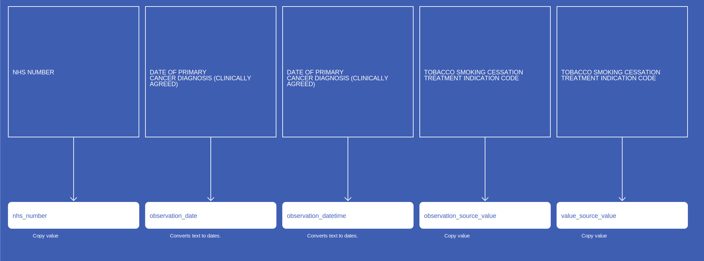</a>

[Comment or raise an issue for this mapping.](https://github.com/answerdigital/oxford-omop-data-mapper/issues/new?title=COSDv9CTObservationTobaccoSmokingCessationTreatmentIndicationCode%20mapping){: .btn }
## COSDv9CTObservationSmokingStatusCancer

[Comment or raise an issue for this mapping.](https://github.com/answerdigital/oxford-omop-data-mapper/issues/new?title=COSDv9CTObservationSmokingStatusCancer%20mapping){: .btn }
## COSDv9CTObservationPerformanceStatusAdult

[Comment or raise an issue for this mapping.](https://github.com/answerdigital/oxford-omop-data-mapper/issues/new?title=COSDv9CTObservationPerformanceStatusAdult%20mapping){: .btn }
## COSDv9CTObservationFamilialCancerSyndromeIndicator

[Comment or raise an issue for this mapping.](https://github.com/answerdigital/oxford-omop-data-mapper/issues/new?title=COSDv9CTObservationFamilialCancerSyndromeIndicator%20mapping){: .btn }
## COSDv9CTObservationCancerTreatmentIntent
<a href="COSDv9CTObservationCancerTreatmentIntent.svg" target="_blank">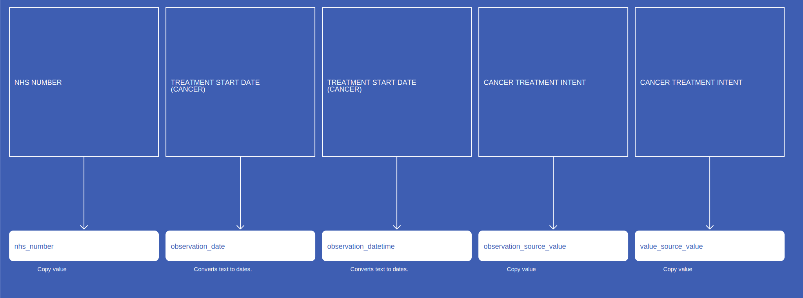</a>

[Comment or raise an issue for this mapping.](https://github.com/answerdigital/oxford-omop-data-mapper/issues/new?title=COSDv9CTObservationCancerTreatmentIntent%20mapping){: .btn }
## COSDv9CTObservationAlcoholHistoryCancerInLastThreeMonths

[Comment or raise an issue for this mapping.](https://github.com/answerdigital/oxford-omop-data-mapper/issues/new?title=COSDv9CTObservationAlcoholHistoryCancerInLastThreeMonths%20mapping){: .btn }
## COSDv9CTObservationAlcoholHistoryCancerBeforeLastThreeMonths

[Comment or raise an issue for this mapping.](https://github.com/answerdigital/oxford-omop-data-mapper/issues/new?title=COSDv9CTObservationAlcoholHistoryCancerBeforeLastThreeMonths%20mapping){: .btn }
## COSDv8CTObservationSmokingStatusCancer

[Comment or raise an issue for this mapping.](https://github.com/answerdigital/oxford-omop-data-mapper/issues/new?title=COSDv8CTObservationSmokingStatusCancer%20mapping){: .btn }
## COSDv8CTObservationPerformanceStatusAdult

[Comment or raise an issue for this mapping.](https://github.com/answerdigital/oxford-omop-data-mapper/issues/new?title=COSDv8CTObservationPerformanceStatusAdult%20mapping){: .btn }
## COSDv8CTObservationFamilialCancerSyndromeIndicator
<a href="COSDv8CTObservationFamilialCancerSyndromeIndicator.svg" target="_blank">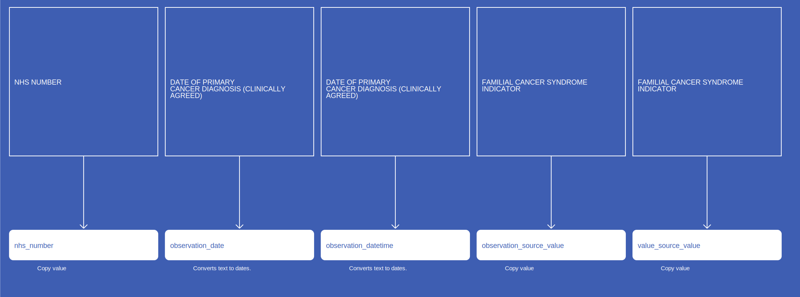</a>

[Comment or raise an issue for this mapping.](https://github.com/answerdigital/oxford-omop-data-mapper/issues/new?title=COSDv8CTObservationFamilialCancerSyndromeIndicator%20mapping){: .btn }
## COSDv8CTObservationAlcoholHistoryCancerInLastThreeMonths

[Comment or raise an issue for this mapping.](https://github.com/answerdigital/oxford-omop-data-mapper/issues/new?title=COSDv8CTObservationAlcoholHistoryCancerInLastThreeMonths%20mapping){: .btn }
## COSDv8CTObservationAlcoholHistoryCancerBeforeLastThreeMonths
<a href="COSDv8CTObservationAlcoholHistoryCancerBeforeLastThreeMonths.svg" target="_blank">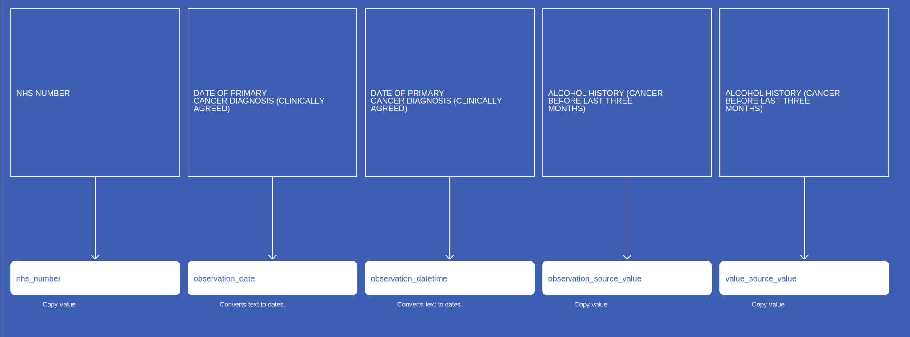</a>

[Comment or raise an issue for this mapping.](https://github.com/answerdigital/oxford-omop-data-mapper/issues/new?title=COSDv8CTObservationAlcoholHistoryCancerBeforeLastThreeMonths%20mapping){: .btn }
## COSDv9CRObservationTobaccoSmokingCessationTreatmentIndicationCode

[Comment or raise an issue for this mapping.](https://github.com/answerdigital/oxford-omop-data-mapper/issues/new?title=COSDv9CRObservationTobaccoSmokingCessationTreatmentIndicationCode%20mapping){: .btn }
## COSDv9CRObservationSmokingStatusCancer
<a href="COSDv9CRObservationSmokingStatusCancer.svg" target="_blank">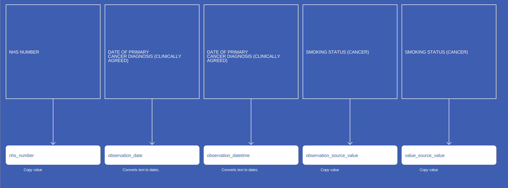</a>

[Comment or raise an issue for this mapping.](https://github.com/answerdigital/oxford-omop-data-mapper/issues/new?title=COSDv9CRObservationSmokingStatusCancer%20mapping){: .btn }
## COSDv9CRObservationPerformanceStatusAdult

[Comment or raise an issue for this mapping.](https://github.com/answerdigital/oxford-omop-data-mapper/issues/new?title=COSDv9CRObservationPerformanceStatusAdult%20mapping){: .btn }
## COSDv9CRObservationFamilialCancerSyndromeIndicator

[Comment or raise an issue for this mapping.](https://github.com/answerdigital/oxford-omop-data-mapper/issues/new?title=COSDv9CRObservationFamilialCancerSyndromeIndicator%20mapping){: .btn }
## COSDv9CRObservationCancerTreatmentIntent

[Comment or raise an issue for this mapping.](https://github.com/answerdigital/oxford-omop-data-mapper/issues/new?title=COSDv9CRObservationCancerTreatmentIntent%20mapping){: .btn }
## COSDv9CRObservationAlcoholHistoryCancerInLastThreeMonths
<a href="COSDv9CRObservationAlcoholHistoryCancerInLastThreeMonths.svg" target="_blank">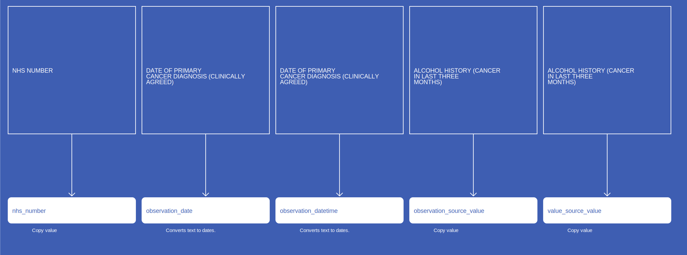</a>

[Comment or raise an issue for this mapping.](https://github.com/answerdigital/oxford-omop-data-mapper/issues/new?title=COSDv9CRObservationAlcoholHistoryCancerInLastThreeMonths%20mapping){: .btn }
## COSDv9CRObservationAlcoholHistoryCancerBeforeLastThreeMonths

[Comment or raise an issue for this mapping.](https://github.com/answerdigital/oxford-omop-data-mapper/issues/new?title=COSDv9CRObservationAlcoholHistoryCancerBeforeLastThreeMonths%20mapping){: .btn }
## COSDv8CRObservationSmokingStatusCancer

[Comment or raise an issue for this mapping.](https://github.com/answerdigital/oxford-omop-data-mapper/issues/new?title=COSDv8CRObservationSmokingStatusCancer%20mapping){: .btn }
## COSDv8CRObservationPerformanceStatusAdult

[Comment or raise an issue for this mapping.](https://github.com/answerdigital/oxford-omop-data-mapper/issues/new?title=COSDv8CRObservationPerformanceStatusAdult%20mapping){: .btn }
## COSDv8CRObservationCancerTreatmentIntent

[Comment or raise an issue for this mapping.](https://github.com/answerdigital/oxford-omop-data-mapper/issues/new?title=COSDv8CRObservationCancerTreatmentIntent%20mapping){: .btn }
## COSDv8CRObservationAlcoholHistoryCancerInLastThreeMonths

[Comment or raise an issue for this mapping.](https://github.com/answerdigital/oxford-omop-data-mapper/issues/new?title=COSDv8CRObservationAlcoholHistoryCancerInLastThreeMonths%20mapping){: .btn }
## COSDv8CRObservationAlcoholHistoryCancerBeforeLastThreeMonths

[Comment or raise an issue for this mapping.](https://github.com/answerdigital/oxford-omop-data-mapper/issues/new?title=COSDv8CRObservationAlcoholHistoryCancerBeforeLastThreeMonths%20mapping){: .btn }
## CosdV9TobaccoSmokingStatus

{: .important-title }
> Notes
>
> Observation dates are approximated using other date fields.
>

[Comment or raise an issue for this mapping.](https://github.com/answerdigital/oxford-omop-data-mapper/issues/new?title=CosdV9TobaccoSmokingStatus%20mapping){: .btn }
## CosdV9TobaccoSmokingCessation

{: .important-title }
> Notes
>
> Observation dates are approximated using other date fields.
>

[Comment or raise an issue for this mapping.](https://github.com/answerdigital/oxford-omop-data-mapper/issues/new?title=CosdV9TobaccoSmokingCessation%20mapping){: .btn }
## CosdV9SourceOfReferralForOutpatients

{: .important-title }
> Notes
>
> Observation dates are approximated using other date fields.
>

[Comment or raise an issue for this mapping.](https://github.com/answerdigital/oxford-omop-data-mapper/issues/new?title=CosdV9SourceOfReferralForOutpatients%20mapping){: .btn }
## CosdV9SourceOfReferralForNonPrimaryCancerPathway

{: .important-title }
> Notes
>
> Observation dates are approximated using other date fields.
>

[Comment or raise an issue for this mapping.](https://github.com/answerdigital/oxford-omop-data-mapper/issues/new?title=CosdV9SourceOfReferralForNonPrimaryCancerPathway%20mapping){: .btn }
## CosdV9PersonSexualOrientationCodeAtDiagnosis

{: .important-title }
> Notes
>
> Observation dates are approximated using other date fields.
>

[Comment or raise an issue for this mapping.](https://github.com/answerdigital/oxford-omop-data-mapper/issues/new?title=CosdV9PersonSexualOrientationCodeAtDiagnosis%20mapping){: .btn }
## CosdV9PerformanceStatusAdult

{: .important-title }
> Notes
>
> Observation dates are approximated using other date fields.
>

[Comment or raise an issue for this mapping.](https://github.com/answerdigital/oxford-omop-data-mapper/issues/new?title=CosdV9PerformanceStatusAdult%20mapping){: .btn }
## CosdV9MenopausalStatus

{: .important-title }
> Notes
>
> Observation dates are approximated using other date fields.
>

[Comment or raise an issue for this mapping.](https://github.com/answerdigital/oxford-omop-data-mapper/issues/new?title=CosdV9MenopausalStatus%20mapping){: .btn }
## CosdV9HistoryOfAlcoholPast

{: .important-title }
> Notes
>
> Observation dates are approximated using other date fields.
>

[Comment or raise an issue for this mapping.](https://github.com/answerdigital/oxford-omop-data-mapper/issues/new?title=CosdV9HistoryOfAlcoholPast%20mapping){: .btn }
## CosdV9HistoryOfAlcoholCurrent

{: .important-title }
> Notes
>
> Observation dates are approximated using other date fields.
>

[Comment or raise an issue for this mapping.](https://github.com/answerdigital/oxford-omop-data-mapper/issues/new?title=CosdV9HistoryOfAlcoholCurrent%20mapping){: .btn }
## CosdV9FamilialCancerSyndrome

{: .important-title }
> Notes
>
> Observation dates are approximated using other date fields.
>

[Comment or raise an issue for this mapping.](https://github.com/answerdigital/oxford-omop-data-mapper/issues/new?title=CosdV9FamilialCancerSyndrome%20mapping){: .btn }
## CosdV9FamilialCancerSyndromeSubsidiaryComment

{: .important-title }
> Notes
>
> Observation dates are approximated using other date fields.
>

[Comment or raise an issue for this mapping.](https://github.com/answerdigital/oxford-omop-data-mapper/issues/new?title=CosdV9FamilialCancerSyndromeSubsidiaryComment%20mapping){: .btn }
## CosdV9AsaScore

{: .important-title }
> Notes
>
> Observation dates are approximated using other date fields.
>

[Comment or raise an issue for this mapping.](https://github.com/answerdigital/oxford-omop-data-mapper/issues/new?title=CosdV9AsaScore%20mapping){: .btn }
## CosdV8SourceOfReferralOutPatients

{: .important-title }
> Notes
>
> Observation dates are approximated using other date fields.
>

[Comment or raise an issue for this mapping.](https://github.com/answerdigital/oxford-omop-data-mapper/issues/new?title=CosdV8SourceOfReferralOutPatients%20mapping){: .btn }
## CosdV8SourceOfReferralForOutPatientsNonPrimaryCancerPathway

{: .important-title }
> Notes
>
> Observation dates are approximated using other date fields.
>

[Comment or raise an issue for this mapping.](https://github.com/answerdigital/oxford-omop-data-mapper/issues/new?title=CosdV8SourceOfReferralForOutPatientsNonPrimaryCancerPathway%20mapping){: .btn }
## CosdV8SmokingStatusCode

{: .important-title }
> Notes
>
> Observation dates are approximated using other date fields.
>

[Comment or raise an issue for this mapping.](https://github.com/answerdigital/oxford-omop-data-mapper/issues/new?title=CosdV8SmokingStatusCode%20mapping){: .btn }
## CosdV8PersonStatedSexualOrientationCodeAtDiagnosis

{: .important-title }
> Notes
>
> Observation dates are approximated using other date fields.
>

[Comment or raise an issue for this mapping.](https://github.com/answerdigital/oxford-omop-data-mapper/issues/new?title=CosdV8PersonStatedSexualOrientationCodeAtDiagnosis%20mapping){: .btn }
## CosdV8FamilialCancerSyndromeIndicator

{: .important-title }
> Notes
>
> Observation dates are approximated using other date fields.
>

[Comment or raise an issue for this mapping.](https://github.com/answerdigital/oxford-omop-data-mapper/issues/new?title=CosdV8FamilialCancerSyndromeIndicator%20mapping){: .btn }
## CosdV8AlcoholHistoryCancerInLastThreeMonths

{: .important-title }
> Notes
>
> Observation dates are approximated using other date fields.
>

[Comment or raise an issue for this mapping.](https://github.com/answerdigital/oxford-omop-data-mapper/issues/new?title=CosdV8AlcoholHistoryCancerInLastThreeMonths%20mapping){: .btn }
## CosdV8AlcoholHistoryCancerBeforeLastThreeMonths

{: .important-title }
> Notes
>
> Observation dates are approximated using other date fields.
>

[Comment or raise an issue for this mapping.](https://github.com/answerdigital/oxford-omop-data-mapper/issues/new?title=CosdV8AlcoholHistoryCancerBeforeLastThreeMonths%20mapping){: .btn }
## CosdV8AdultPerformanceStatus

{: .important-title }
> Notes
>
> Observation dates are approximated using other date fields.
>

[Comment or raise an issue for this mapping.](https://github.com/answerdigital/oxford-omop-data-mapper/issues/new?title=CosdV8AdultPerformanceStatus%20mapping){: .btn }
## CosdV9BreastSourceOfReferralForOutpatients
<a href="CosdV9BreastSourceOfReferralForOutpatients.svg" target="_blank">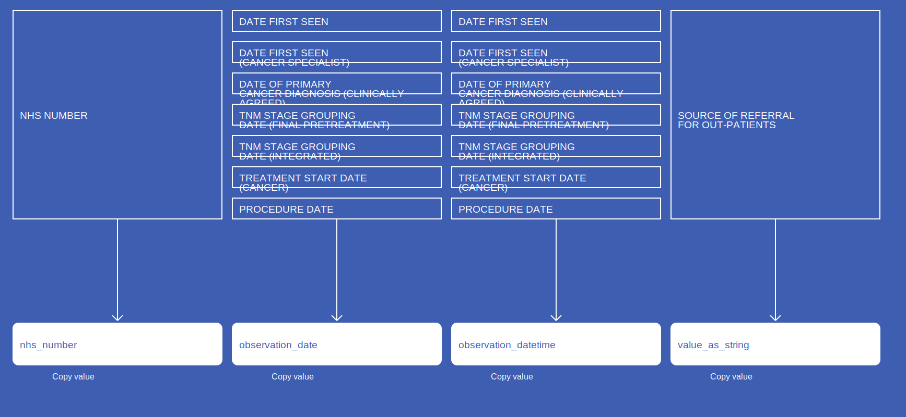</a>

{: .important-title }
> Notes
>
> Observation dates are approximated using other date fields.
>

[Comment or raise an issue for this mapping.](https://github.com/answerdigital/oxford-omop-data-mapper/issues/new?title=CosdV9BreastSourceOfReferralForOutpatients%20mapping){: .btn }
## CosdV9BreastSourceOfReferralForNonPrimaryCancerPathway
<a href="CosdV9BreastSourceOfReferralForNonPrimaryCancerPathway.svg" target="_blank">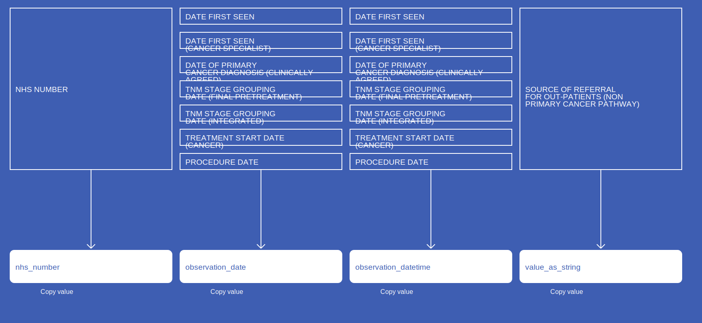</a>

{: .important-title }
> Notes
>
> Observation dates are approximated using other date fields.
>

[Comment or raise an issue for this mapping.](https://github.com/answerdigital/oxford-omop-data-mapper/issues/new?title=CosdV9BreastSourceOfReferralForNonPrimaryCancerPathway%20mapping){: .btn }
## CosdV9BreastPerformanceStatusAdult
<a href="CosdV9BreastPerformanceStatusAdult.svg" target="_blank">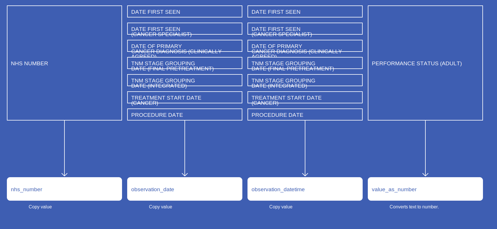</a>

{: .important-title }
> Notes
>
> Observation dates are approximated using other date fields.
>

[Comment or raise an issue for this mapping.](https://github.com/answerdigital/oxford-omop-data-mapper/issues/new?title=CosdV9BreastPerformanceStatusAdult%20mapping){: .btn }
## CosdV9BreastMenopausalStatus
<a href="CosdV9BreastMenopausalStatus.svg" target="_blank">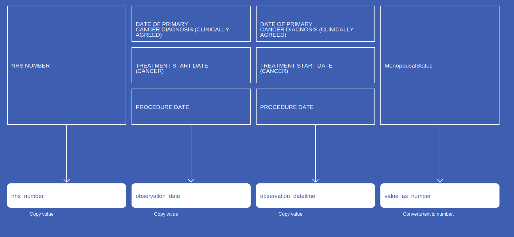</a>

{: .important-title }
> Notes
>
> Observation dates are approximated using other date fields.
>

[Comment or raise an issue for this mapping.](https://github.com/answerdigital/oxford-omop-data-mapper/issues/new?title=CosdV9BreastMenopausalStatus%20mapping){: .btn }
## CosdV9BreastHistoryOfAlcoholPast
<a href="CosdV9BreastHistoryOfAlcoholPast.svg" target="_blank">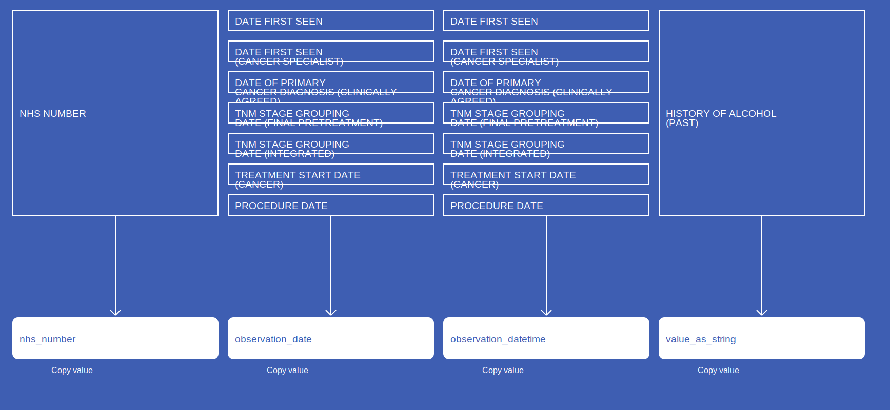</a>

{: .important-title }
> Notes
>
> Observation dates are approximated using other date fields.
>

[Comment or raise an issue for this mapping.](https://github.com/answerdigital/oxford-omop-data-mapper/issues/new?title=CosdV9BreastHistoryOfAlcoholPast%20mapping){: .btn }
## CosdV9BreastHistoryOfAlcoholCurrent

{: .important-title }
> Notes
>
> Observation dates are approximated using other date fields.
>

[Comment or raise an issue for this mapping.](https://github.com/answerdigital/oxford-omop-data-mapper/issues/new?title=CosdV9BreastHistoryOfAlcoholCurrent%20mapping){: .btn }
## CosdV9BreastFamilialCancerSyndrome
<a href="CosdV9BreastFamilialCancerSyndrome.svg" target="_blank">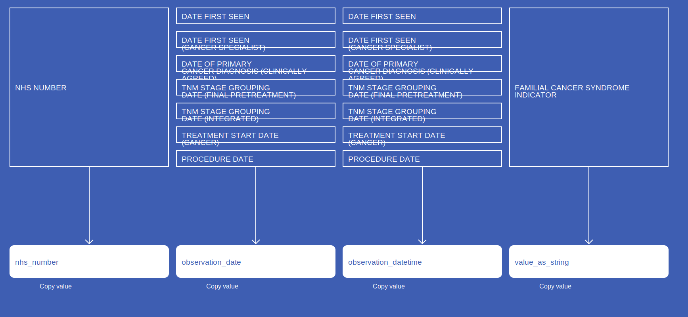</a>

{: .important-title }
> Notes
>
> Observation dates are approximated using other date fields.
>

[Comment or raise an issue for this mapping.](https://github.com/answerdigital/oxford-omop-data-mapper/issues/new?title=CosdV9BreastFamilialCancerSyndrome%20mapping){: .btn }
## CosdV9BreastFamilialCancerSyndromeSubsidiaryComment
<a href="CosdV9BreastFamilialCancerSyndromeSubsidiaryComment.svg" target="_blank">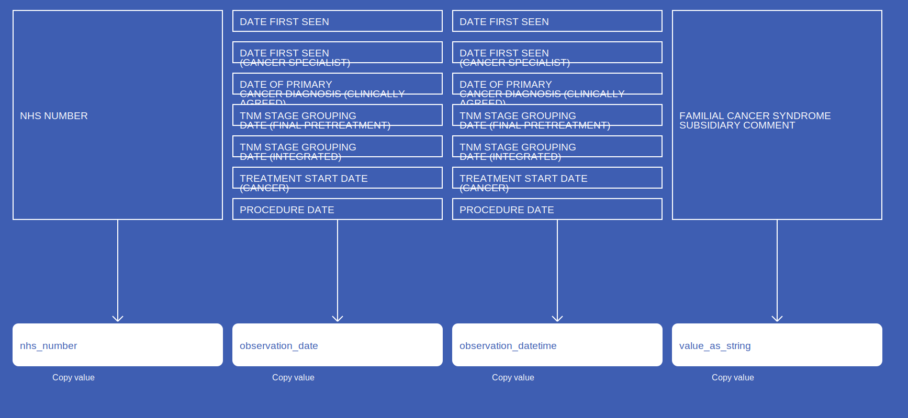</a>

{: .important-title }
> Notes
>
> Observation dates are approximated using other date fields.
>

[Comment or raise an issue for this mapping.](https://github.com/answerdigital/oxford-omop-data-mapper/issues/new?title=CosdV9BreastFamilialCancerSyndromeSubsidiaryComment%20mapping){: .btn }
## CosdV9BreastAsaScore
<a href="CosdV9BreastAsaScore.svg" target="_blank">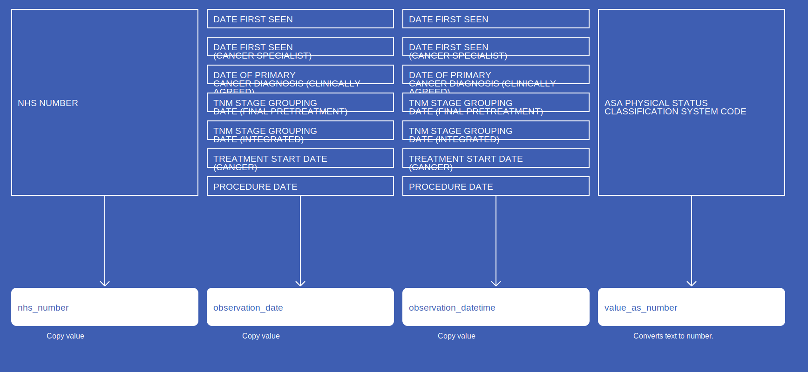</a>

{: .important-title }
> Notes
>
> Observation dates are approximated using other date fields.
>

[Comment or raise an issue for this mapping.](https://github.com/answerdigital/oxford-omop-data-mapper/issues/new?title=CosdV9BreastAsaScore%20mapping){: .btn }
## CosdV8BreastSourceOfReferralOutPatients

{: .important-title }
> Notes
>
> Observation dates are approximated using other date fields.
>

[Comment or raise an issue for this mapping.](https://github.com/answerdigital/oxford-omop-data-mapper/issues/new?title=CosdV8BreastSourceOfReferralOutPatients%20mapping){: .btn }
## CosdV8BreastSourceOfReferralForOutPatientsNonPrimaryCancerPathway

{: .important-title }
> Notes
>
> Observation dates are approximated using other date fields.
>

[Comment or raise an issue for this mapping.](https://github.com/answerdigital/oxford-omop-data-mapper/issues/new?title=CosdV8BreastSourceOfReferralForOutPatientsNonPrimaryCancerPathway%20mapping){: .btn }
## CosdV8BreastSmokingStatusCode
<a href="CosdV8BreastSmokingStatusCode.svg" target="_blank">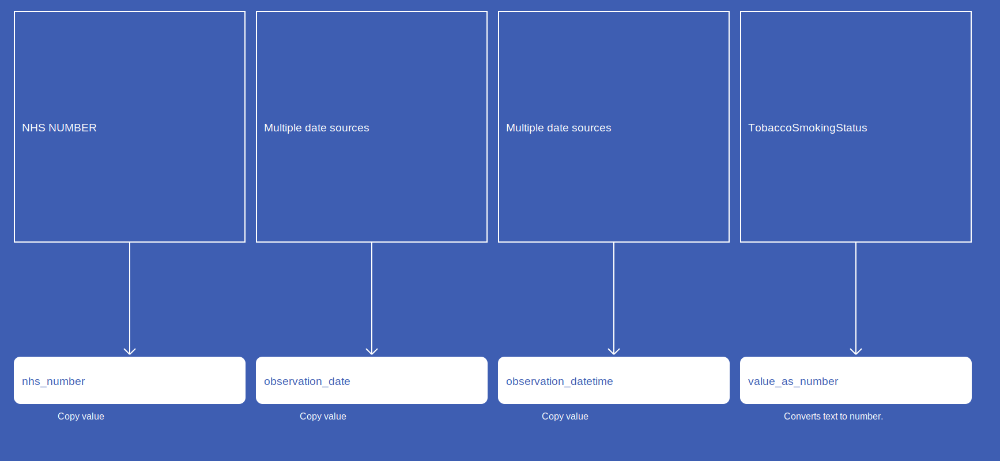</a>

{: .important-title }
> Notes
>
> Observation dates are approximated using other date fields.
>

[Comment or raise an issue for this mapping.](https://github.com/answerdigital/oxford-omop-data-mapper/issues/new?title=CosdV8BreastSmokingStatusCode%20mapping){: .btn }
## CosdV8BreastPersonStatedSexualOrientationCodeAtDiagnosis

{: .important-title }
> Notes
>
> Observation dates are approximated using other date fields.
>

[Comment or raise an issue for this mapping.](https://github.com/answerdigital/oxford-omop-data-mapper/issues/new?title=CosdV8BreastPersonStatedSexualOrientationCodeAtDiagnosis%20mapping){: .btn }
## CosdV8BreastFamilialCancerSyndromeIndicator
<a href="CosdV8BreastFamilialCancerSyndromeIndicator.svg" target="_blank">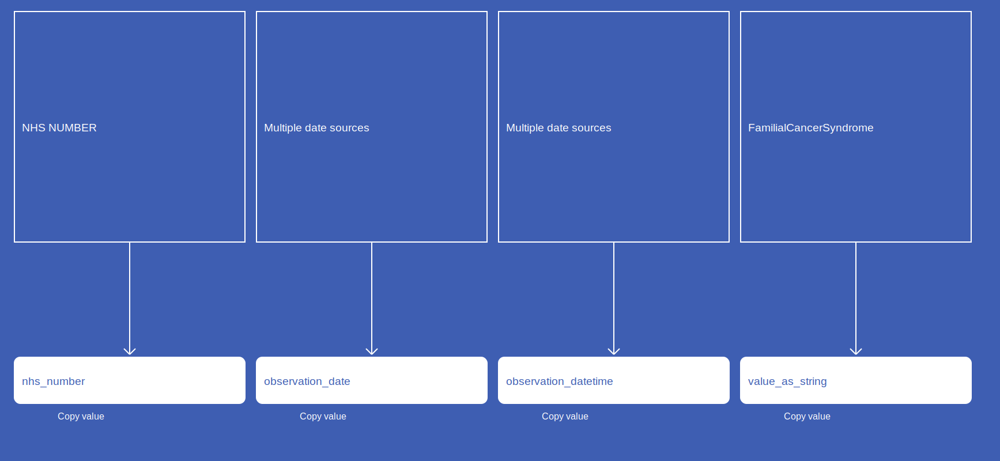</a>

{: .important-title }
> Notes
>
> Observation dates are approximated using other date fields.
>

[Comment or raise an issue for this mapping.](https://github.com/answerdigital/oxford-omop-data-mapper/issues/new?title=CosdV8BreastFamilialCancerSyndromeIndicator%20mapping){: .btn }
## COSDv9BAObservationPerformanceStatusAdult

[Comment or raise an issue for this mapping.](https://github.com/answerdigital/oxford-omop-data-mapper/issues/new?title=COSDv9BAObservationPerformanceStatusAdult%20mapping){: .btn }
## COSDv9BAObservationCancerTreatmentIntent

[Comment or raise an issue for this mapping.](https://github.com/answerdigital/oxford-omop-data-mapper/issues/new?title=COSDv9BAObservationCancerTreatmentIntent%20mapping){: .btn }
## COSDv8BAObservationPerformanceStatusAdult

[Comment or raise an issue for this mapping.](https://github.com/answerdigital/oxford-omop-data-mapper/issues/new?title=COSDv8BAObservationPerformanceStatusAdult%20mapping){: .btn }
## COSDv8BAObservationCancerTreatmentIntent

[Comment or raise an issue for this mapping.](https://github.com/answerdigital/oxford-omop-data-mapper/issues/new?title=COSDv8BAObservationCancerTreatmentIntent%20mapping){: .btn }
