# Observation
* [nhs_number]()
* [RecordConnectionIdentifier]()
* [observation_concept_id]()
* [observation_date]()
* [observation_datetime]()
* [observation_type_concept_id]()
* [value_as_string]()
* [HospitalProviderSpellNumber]()
* [value_as_number]()
* [value_as_concept_id]()
* [qualifier_concept_id]()
* [unit_concept_id]()
* [observation_source_value]()
* [observation_source_concept_id]()
* [qualifier_source_value]()
* [value_source_value]()

## SusOPSourceOfReferralForOutpatients
<a href="SusOPSourceOfReferralForOutpatients.svg" target="_blank">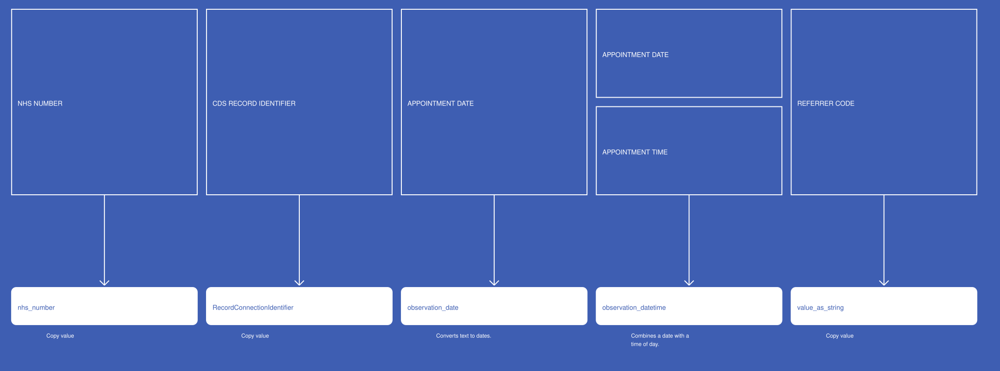</a>

{: .important-title }
> Notes
>
> Observations do not require a standardized test or other activity to generate clinical fact. Typical observations are medical history, family history, lifestyle choices, healthcare utilization patterns, social circumstances etc
>
> Valid Observation Concepts are not enforced to be from any domain.  They should still be standard concepts and typically belong to the Observation or Measurement domain.
>
> Observations can be stored as attribute value pairs, with the attribute as the Observation Concept and the value representing the clinical fact. This fact can be stored as a Concept (value_as_concept), a numerical value (value_as_number) or a verbatim string (value_as_string)
>

[Comment or raise an issue for this mapping.](https://github.com/answerdigital/oxford-omop-data-mapper/issues/new?title=SusOPSourceOfReferralForOutpatients%20mapping){: .btn }
## SusOPReferralReceivedDateForOutpatients
<a href="SusOPReferralReceivedDateForOutpatients.svg" target="_blank">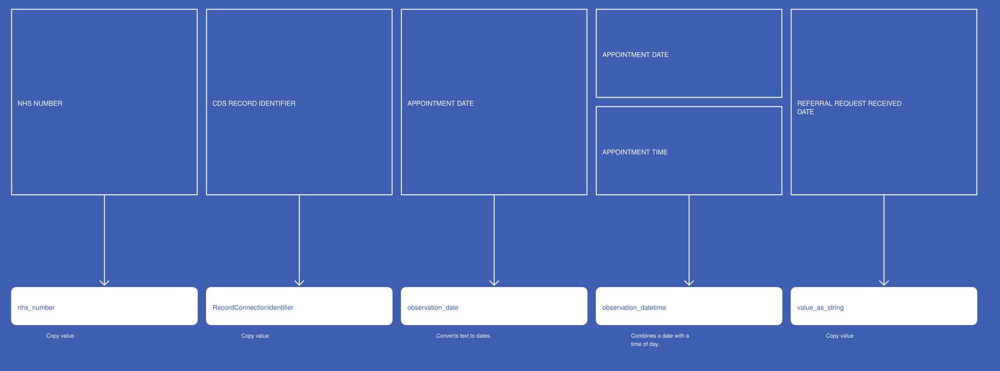</a>

{: .important-title }
> Notes
>
> Observations do not require a standardized test or other activity to generate clinical fact. Typical observations are medical history, family history, lifestyle choices, healthcare utilization patterns, social circumstances etc
>
> Valid Observation Concepts are not enforced to be from any domain.  They should still be standard concepts and typically belong to the Observation or Measurement domain.
>
> Observations can be stored as attribute value pairs, with the attribute as the Observation Concept and the value representing the clinical fact. This fact can be stored as a Concept (value_as_concept), a numerical value (value_as_number) or a verbatim string (value_as_string)
>

[Comment or raise an issue for this mapping.](https://github.com/answerdigital/oxford-omop-data-mapper/issues/new?title=SusOPReferralReceivedDateForOutpatients%20mapping){: .btn }
## SusOPProcedureObservation
<a href="SusOPProcedureObservation.svg" target="_blank">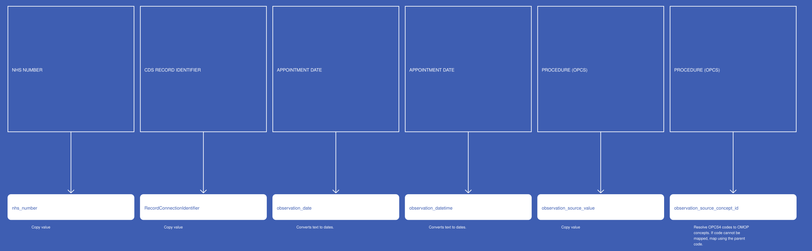</a>

[Comment or raise an issue for this mapping.](https://github.com/answerdigital/oxford-omop-data-mapper/issues/new?title=SusOPProcedureObservation%20mapping){: .btn }
## SusOPICDDiagnosisObservation

[Comment or raise an issue for this mapping.](https://github.com/answerdigital/oxford-omop-data-mapper/issues/new?title=SusOPICDDiagnosisObservation%20mapping){: .btn }
## SusOPCarerSupportIndicator
<a href="SusOPCarerSupportIndicator.svg" target="_blank">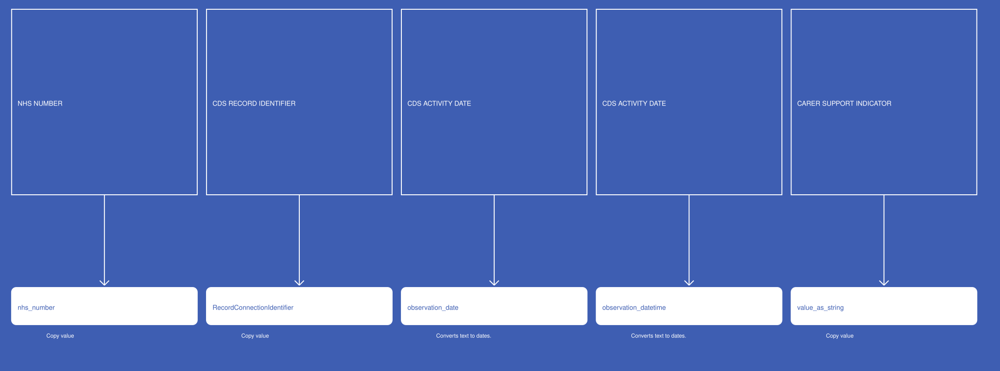</a>

{: .important-title }
> Notes
>
> Observations do not require a standardized test or other activity to generate clinical fact. Typical observations are medical history, family history, lifestyle choices, healthcare utilization patterns, social circumstances etc
>
> Valid Observation Concepts are not enforced to be from any domain.  They should still be standard concepts and typically belong to the Observation or Measurement domain.
>
> Observations can be stored as attribute value pairs, with the attribute as the Observation Concept and the value representing the clinical fact. This fact can be stored as a Concept (value_as_concept), a numerical value (value_as_number) or a verbatim string (value_as_string)
>

[Comment or raise an issue for this mapping.](https://github.com/answerdigital/oxford-omop-data-mapper/issues/new?title=SusOPCarerSupportIndicator%20mapping){: .btn }
## SusCCMDSHighCostDrugs
<a href="SusCCMDSHighCostDrugs.svg" target="_blank">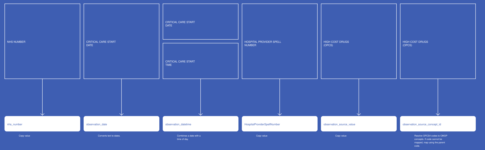</a>

[Comment or raise an issue for this mapping.](https://github.com/answerdigital/oxford-omop-data-mapper/issues/new?title=SusCCMDSHighCostDrugs%20mapping){: .btn }
## SusAPCTotalPreviousPregnancies
<a href="SusAPCTotalPreviousPregnancies.svg" target="_blank">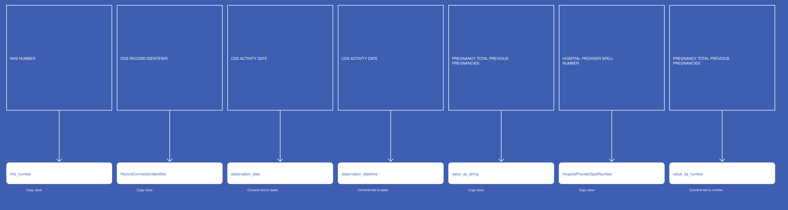</a>

{: .important-title }
> Notes
>
> Observations do not require a standardized test or other activity to generate clinical fact. Typical observations are medical history, family history, lifestyle choices, healthcare utilization patterns, social circumstances etc
>
> Valid Observation Concepts are not enforced to be from any domain.  They should still be standard concepts and typically belong to the Observation or Measurement domain.
>
> Observations can be stored as attribute value pairs, with the attribute as the Observation Concept and the value representing the clinical fact. This fact can be stored as a Concept (value_as_concept), a numerical value (value_as_number) or a verbatim string (value_as_string)
>

[Comment or raise an issue for this mapping.](https://github.com/answerdigital/oxford-omop-data-mapper/issues/new?title=SusAPCTotalPreviousPregnancies%20mapping){: .btn }
## SusAPCSourceOfReferralForInpatients
<a href="SusAPCSourceOfReferralForInpatients.svg" target="_blank">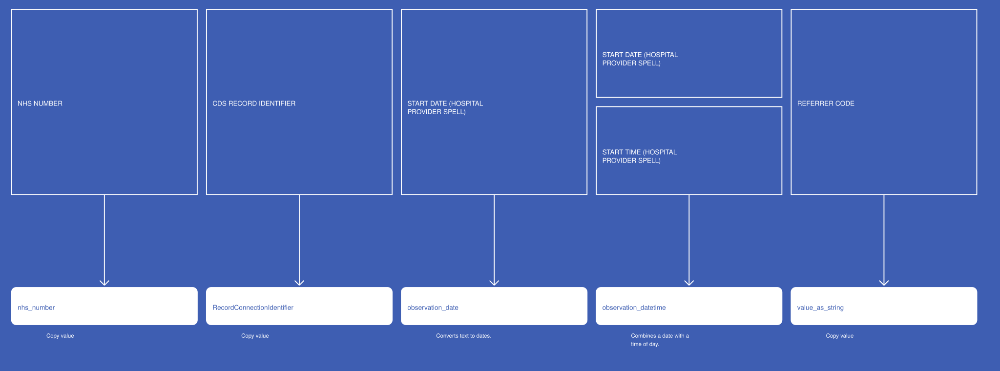</a>

{: .important-title }
> Notes
>
> Observations do not require a standardized test or other activity to generate clinical fact. Typical observations are medical history, family history, lifestyle choices, healthcare utilization patterns, social circumstances etc
>
> Valid Observation Concepts are not enforced to be from any domain.  They should still be standard concepts and typically belong to the Observation or Measurement domain.
>
> Observations can be stored as attribute value pairs, with the attribute as the Observation Concept and the value representing the clinical fact. This fact can be stored as a Concept (value_as_concept), a numerical value (value_as_number) or a verbatim string (value_as_string)
>

[Comment or raise an issue for this mapping.](https://github.com/answerdigital/oxford-omop-data-mapper/issues/new?title=SusAPCSourceOfReferralForInpatients%20mapping){: .btn }
## SusAPCReferralReceivedDateForInpatients
<a href="SusAPCReferralReceivedDateForInpatients.svg" target="_blank">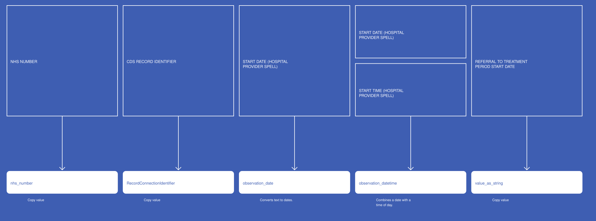</a>

{: .important-title }
> Notes
>
> Observations do not require a standardized test or other activity to generate clinical fact. Typical observations are medical history, family history, lifestyle choices, healthcare utilization patterns, social circumstances etc
>
> Valid Observation Concepts are not enforced to be from any domain.  They should still be standard concepts and typically belong to the Observation or Measurement domain.
>
> Observations can be stored as attribute value pairs, with the attribute as the Observation Concept and the value representing the clinical fact. This fact can be stored as a Concept (value_as_concept), a numerical value (value_as_number) or a verbatim string (value_as_string)
>

[Comment or raise an issue for this mapping.](https://github.com/answerdigital/oxford-omop-data-mapper/issues/new?title=SusAPCReferralReceivedDateForInpatients%20mapping){: .btn }
## SusAPCProcedureObservations
<a href="SusAPCProcedureObservations.svg" target="_blank">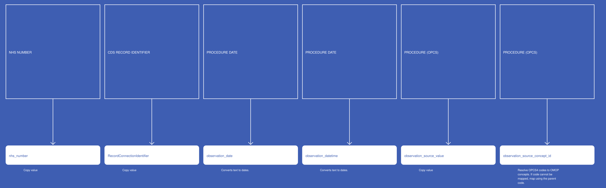</a>

[Comment or raise an issue for this mapping.](https://github.com/answerdigital/oxford-omop-data-mapper/issues/new?title=SusAPCProcedureObservations%20mapping){: .btn }
## SusAPCNumberOfBabies

{: .important-title }
> Notes
>
> Observations do not require a standardized test or other activity to generate clinical fact. Typical observations are medical history, family history, lifestyle choices, healthcare utilization patterns, social circumstances etc
>
> Valid Observation Concepts are not enforced to be from any domain.  They should still be standard concepts and typically belong to the Observation or Measurement domain.
>
> Observations can be stored as attribute value pairs, with the attribute as the Observation Concept and the value representing the clinical fact. This fact can be stored as a Concept (value_as_concept), a numerical value (value_as_number) or a verbatim string (value_as_string)
>

[Comment or raise an issue for this mapping.](https://github.com/answerdigital/oxford-omop-data-mapper/issues/new?title=SusAPCNumberOfBabies%20mapping){: .btn }
## SusAPCSusDiagnosisObservation
<a href="SusAPCSusDiagnosisObservation.svg" target="_blank">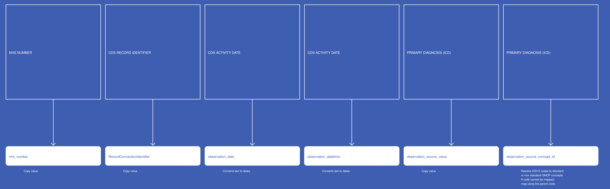</a>

[Comment or raise an issue for this mapping.](https://github.com/answerdigital/oxford-omop-data-mapper/issues/new?title=SusAPCSusDiagnosisObservation%20mapping){: .btn }
## SusAPCGestationLengthLabourOnset

{: .important-title }
> Notes
>
> Observations do not require a standardized test or other activity to generate clinical fact. Typical observations are medical history, family history, lifestyle choices, healthcare utilization patterns, social circumstances etc
>
> Valid Observation Concepts are not enforced to be from any domain.  They should still be standard concepts and typically belong to the Observation or Measurement domain.
>
> Observations can be stored as attribute value pairs, with the attribute as the Observation Concept and the value representing the clinical fact. This fact can be stored as a Concept (value_as_concept), a numerical value (value_as_number) or a verbatim string (value_as_string)
>

[Comment or raise an issue for this mapping.](https://github.com/answerdigital/oxford-omop-data-mapper/issues/new?title=SusAPCGestationLengthLabourOnset%20mapping){: .btn }
## SusAPCCarerSupportIndicator

{: .important-title }
> Notes
>
> Observations do not require a standardized test or other activity to generate clinical fact. Typical observations are medical history, family history, lifestyle choices, healthcare utilization patterns, social circumstances etc
>
> Valid Observation Concepts are not enforced to be from any domain.  They should still be standard concepts and typically belong to the Observation or Measurement domain.
>
> Observations can be stored as attribute value pairs, with the attribute as the Observation Concept and the value representing the clinical fact. This fact can be stored as a Concept (value_as_concept), a numerical value (value_as_number) or a verbatim string (value_as_string)
>

[Comment or raise an issue for this mapping.](https://github.com/answerdigital/oxford-omop-data-mapper/issues/new?title=SusAPCCarerSupportIndicator%20mapping){: .btn }
## SusAPCBirthWeight
<a href="SusAPCBirthWeight.svg" target="_blank">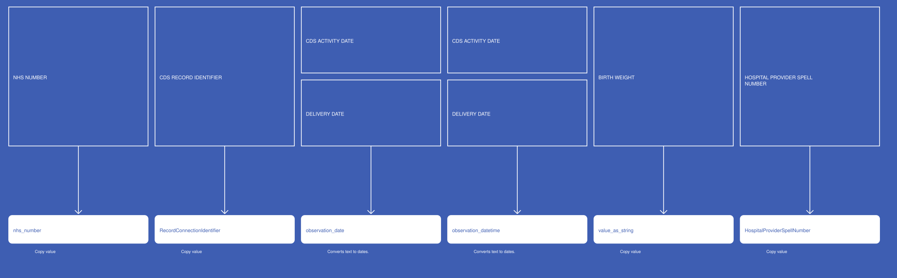</a>

{: .important-title }
> Notes
>
> Observations do not require a standardized test or other activity to generate clinical fact. Typical observations are medical history, family history, lifestyle choices, healthcare utilization patterns, social circumstances etc
>
> Valid Observation Concepts are not enforced to be from any domain.  They should still be standard concepts and typically belong to the Observation or Measurement domain.
>
> Observations can be stored as attribute value pairs, with the attribute as the Observation Concept and the value representing the clinical fact. This fact can be stored as a Concept (value_as_concept), a numerical value (value_as_number) or a verbatim string (value_as_string)
>

[Comment or raise an issue for this mapping.](https://github.com/answerdigital/oxford-omop-data-mapper/issues/new?title=SusAPCBirthWeight%20mapping){: .btn }
## SusAPCAnaestheticGivenPostLabourDelivery
<a href="SusAPCAnaestheticGivenPostLabourDelivery.svg" target="_blank">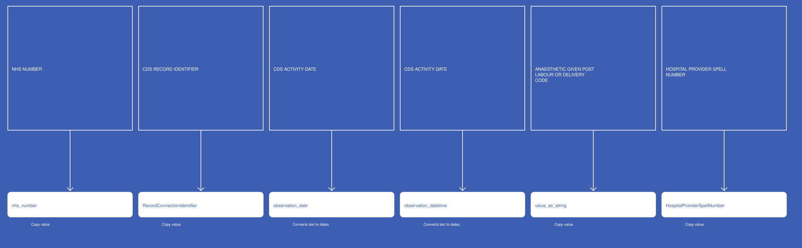</a>

{: .important-title }
> Notes
>
> Observations do not require a standardized test or other activity to generate clinical fact. Typical observations are medical history, family history, lifestyle choices, healthcare utilization patterns, social circumstances etc
>
> Valid Observation Concepts are not enforced to be from any domain.  They should still be standard concepts and typically belong to the Observation or Measurement domain.
>
> Observations can be stored as attribute value pairs, with the attribute as the Observation Concept and the value representing the clinical fact. This fact can be stored as a Concept (value_as_concept), a numerical value (value_as_number) or a verbatim string (value_as_string)
>

[Comment or raise an issue for this mapping.](https://github.com/answerdigital/oxford-omop-data-mapper/issues/new?title=SusAPCAnaestheticGivenPostLabourDelivery%20mapping){: .btn }
## SusAPCAnaestheticDuringLabourDelivery
<a href="SusAPCAnaestheticDuringLabourDelivery.svg" target="_blank">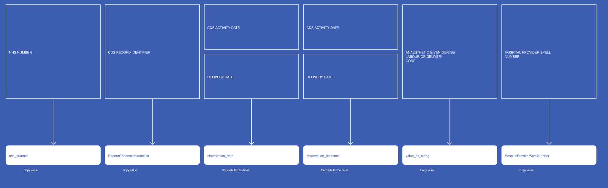</a>

{: .important-title }
> Notes
>
> Observations do not require a standardized test or other activity to generate clinical fact. Typical observations are medical history, family history, lifestyle choices, healthcare utilization patterns, social circumstances etc
>
> Valid Observation Concepts are not enforced to be from any domain.  They should still be standard concepts and typically belong to the Observation or Measurement domain.
>
> Observations can be stored as attribute value pairs, with the attribute as the Observation Concept and the value representing the clinical fact. This fact can be stored as a Concept (value_as_concept), a numerical value (value_as_number) or a verbatim string (value_as_string)
>

[Comment or raise an issue for this mapping.](https://github.com/answerdigital/oxford-omop-data-mapper/issues/new?title=SusAPCAnaestheticDuringLabourDelivery%20mapping){: .btn }
## SusAESourceOfReferralForAE
<a href="SusAESourceOfReferralForAE.svg" target="_blank">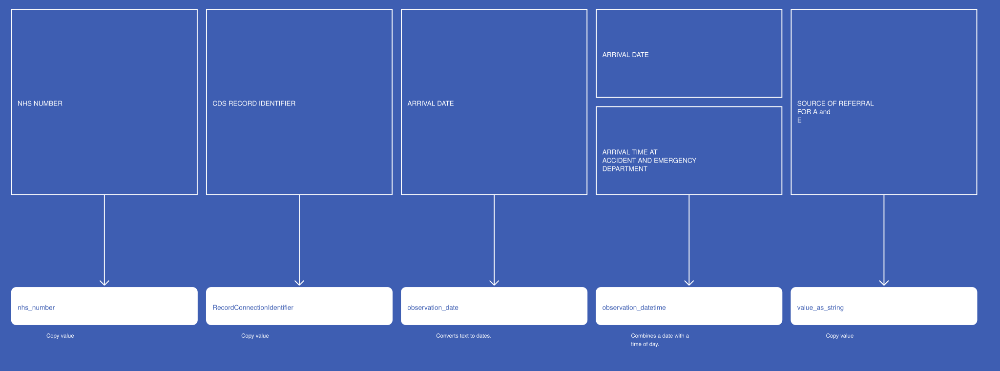</a>

{: .important-title }
> Notes
>
> Observations do not require a standardized test or other activity to generate clinical fact. Typical observations are medical history, family history, lifestyle choices, healthcare utilization patterns, social circumstances etc
>
> Valid Observation Concepts are not enforced to be from any domain.  They should still be standard concepts and typically belong to the Observation or Measurement domain.
>
> Observations can be stored as attribute value pairs, with the attribute as the Observation Concept and the value representing the clinical fact. This fact can be stored as a Concept (value_as_concept), a numerical value (value_as_number) or a verbatim string (value_as_string)
>

[Comment or raise an issue for this mapping.](https://github.com/answerdigital/oxford-omop-data-mapper/issues/new?title=SusAESourceOfReferralForAE%20mapping){: .btn }
## SusAEDiabeticPatient
<a href="SusAEDiabeticPatient.svg" target="_blank">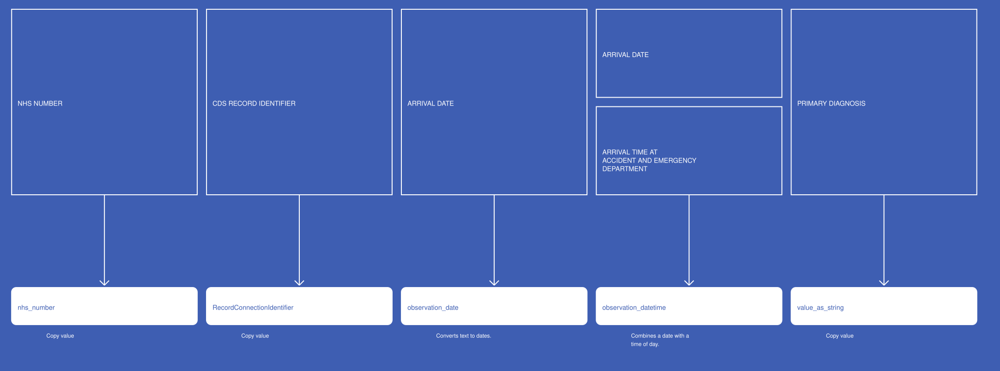</a>

{: .important-title }
> Notes
>
> Observations do not require a standardized test or other activity to generate clinical fact. Typical observations are medical history, family history, lifestyle choices, healthcare utilization patterns, social circumstances etc
>
> Valid Observation Concepts are not enforced to be from any domain.  They should still be standard concepts and typically belong to the Observation or Measurement domain.
>
> Observations can be stored as attribute value pairs, with the attribute as the Observation Concept and the value representing the clinical fact. This fact can be stored as a Concept (value_as_concept), a numerical value (value_as_number) or a verbatim string (value_as_string)
>

[Comment or raise an issue for this mapping.](https://github.com/answerdigital/oxford-omop-data-mapper/issues/new?title=SusAEDiabeticPatient%20mapping){: .btn }
## SusAEAsthmaticPatient

{: .important-title }
> Notes
>
> Observations do not require a standardized test or other activity to generate clinical fact. Typical observations are medical history, family history, lifestyle choices, healthcare utilization patterns, social circumstances etc
>
> Valid Observation Concepts are not enforced to be from any domain.  They should still be standard concepts and typically belong to the Observation or Measurement domain.
>
> Observations can be stored as attribute value pairs, with the attribute as the Observation Concept and the value representing the clinical fact. This fact can be stored as a Concept (value_as_concept), a numerical value (value_as_number) or a verbatim string (value_as_string)
>

[Comment or raise an issue for this mapping.](https://github.com/answerdigital/oxford-omop-data-mapper/issues/new?title=SusAEAsthmaticPatient%20mapping){: .btn }
## SactAdjunctiveTherapyType
<a href="SactAdjunctiveTherapyType.svg" target="_blank">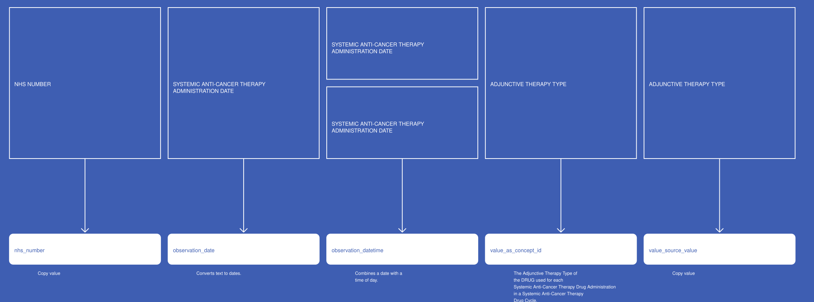</a>

[Comment or raise an issue for this mapping.](https://github.com/answerdigital/oxford-omop-data-mapper/issues/new?title=SactAdjunctiveTherapyType%20mapping){: .btn }
## SactAdministrationRoute
<a href="SactAdministrationRoute.svg" target="_blank">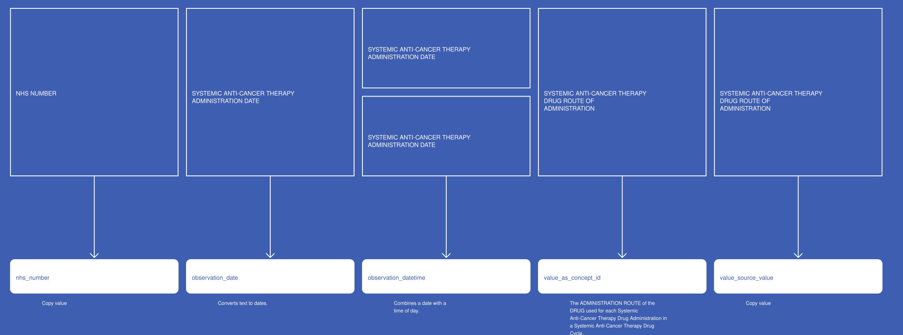</a>

[Comment or raise an issue for this mapping.](https://github.com/answerdigital/oxford-omop-data-mapper/issues/new?title=SactAdministrationRoute%20mapping){: .btn }
## SactClinicalTrial
<a href="SactClinicalTrial.svg" target="_blank">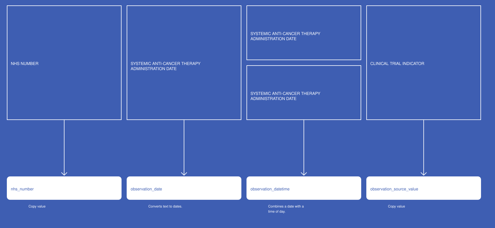</a>

[Comment or raise an issue for this mapping.](https://github.com/answerdigital/oxford-omop-data-mapper/issues/new?title=SactClinicalTrial%20mapping){: .btn }
## SactTreatmentIntent
<a href="SactTreatmentIntent.svg" target="_blank">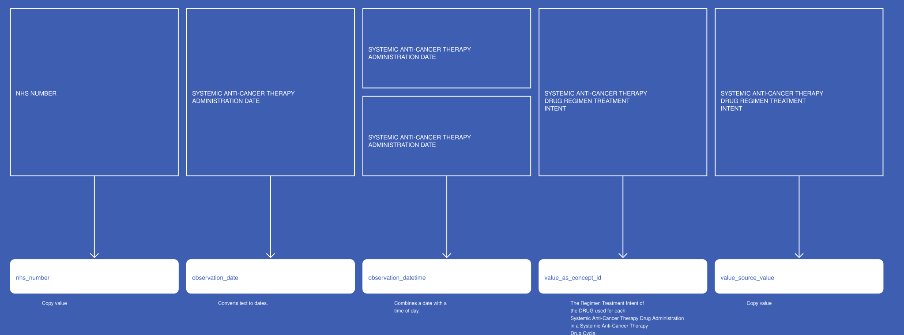</a>

[Comment or raise an issue for this mapping.](https://github.com/answerdigital/oxford-omop-data-mapper/issues/new?title=SactTreatmentIntent%20mapping){: .btn }
## RtdsDecisionToPerformDate
<a href="RtdsDecisionToPerformDate.svg" target="_blank">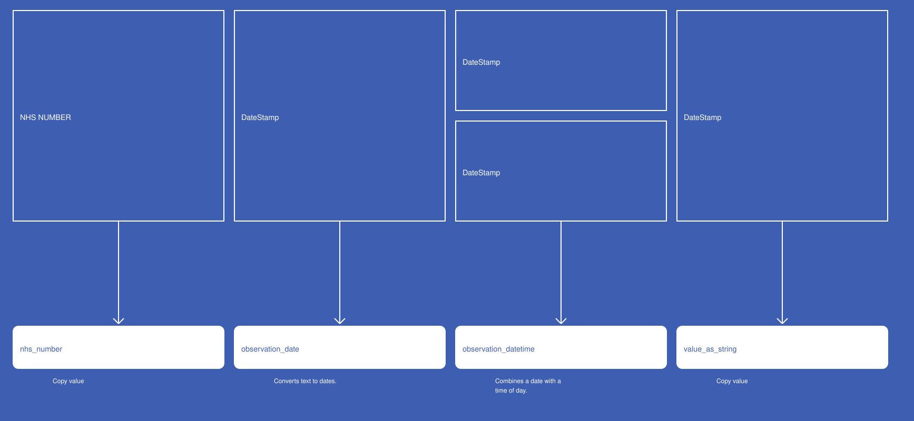</a>

[Comment or raise an issue for this mapping.](https://github.com/answerdigital/oxford-omop-data-mapper/issues/new?title=RtdsDecisionToPerformDate%20mapping){: .btn }
## RtdsExternalBeamEnergy
<a href="RtdsExternalBeamEnergy.svg" target="_blank">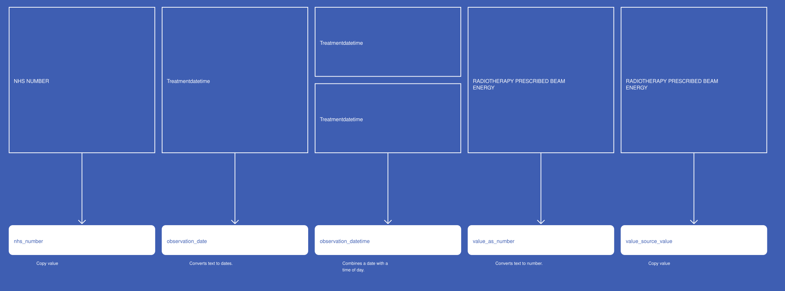</a>

{: .important-title }
> Assumptions
>
> * Multiple records around the same time is indicative of one nominal beam energy with multiple control points being recorded

[Comment or raise an issue for this mapping.](https://github.com/answerdigital/oxford-omop-data-mapper/issues/new?title=RtdsExternalBeamEnergy%20mapping){: .btn }
## RtdsNumberOfFractions

[Comment or raise an issue for this mapping.](https://github.com/answerdigital/oxford-omop-data-mapper/issues/new?title=RtdsNumberOfFractions%20mapping){: .btn }
## RtdsReferralDate

[Comment or raise an issue for this mapping.](https://github.com/answerdigital/oxford-omop-data-mapper/issues/new?title=RtdsReferralDate%20mapping){: .btn }
## RtdsTreatmentAnatomicalSite
<a href="RtdsTreatmentAnatomicalSite.svg" target="_blank">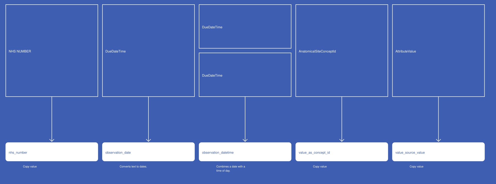</a>

[Comment or raise an issue for this mapping.](https://github.com/answerdigital/oxford-omop-data-mapper/issues/new?title=RtdsTreatmentAnatomicalSite%20mapping){: .btn }
## OxfordLabGeneralComment
<a href="OxfordLabGeneralComment.svg" target="_blank">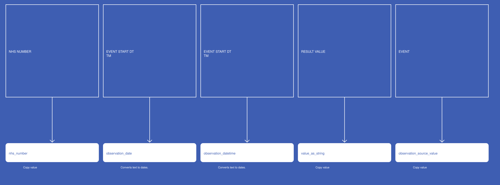</a>

[Comment or raise an issue for this mapping.](https://github.com/answerdigital/oxford-omop-data-mapper/issues/new?title=OxfordLabGeneralComment%20mapping){: .btn }
## COSDv9URObservationSmokingStatusCancer

[Comment or raise an issue for this mapping.](https://github.com/answerdigital/oxford-omop-data-mapper/issues/new?title=COSDv9URObservationSmokingStatusCancer%20mapping){: .btn }
## COSDv9URObservationAlcoholHistoryCancerPast

[Comment or raise an issue for this mapping.](https://github.com/answerdigital/oxford-omop-data-mapper/issues/new?title=COSDv9URObservationAlcoholHistoryCancerPast%20mapping){: .btn }
## COSDv9URObservationAlcoholHistoryCancerCurrent

[Comment or raise an issue for this mapping.](https://github.com/answerdigital/oxford-omop-data-mapper/issues/new?title=COSDv9URObservationAlcoholHistoryCancerCurrent%20mapping){: .btn }
## COSDv8URObservationSmokingStatusCancer

[Comment or raise an issue for this mapping.](https://github.com/answerdigital/oxford-omop-data-mapper/issues/new?title=COSDv8URObservationSmokingStatusCancer%20mapping){: .btn }
## COSDv8URObservationPersonStatedSexualOrientationCodeAtDiagnosis

[Comment or raise an issue for this mapping.](https://github.com/answerdigital/oxford-omop-data-mapper/issues/new?title=COSDv8URObservationPersonStatedSexualOrientationCodeAtDiagnosis%20mapping){: .btn }
## COSDv8URObservationAlcoholHistoryCancerPast

[Comment or raise an issue for this mapping.](https://github.com/answerdigital/oxford-omop-data-mapper/issues/new?title=COSDv8URObservationAlcoholHistoryCancerPast%20mapping){: .btn }
## COSDv8URObservationAlcoholHistoryCancerCurrent

[Comment or raise an issue for this mapping.](https://github.com/answerdigital/oxford-omop-data-mapper/issues/new?title=COSDv8URObservationAlcoholHistoryCancerCurrent%20mapping){: .btn }
## COSDv9UGObservationSmokingStatusCancer

[Comment or raise an issue for this mapping.](https://github.com/answerdigital/oxford-omop-data-mapper/issues/new?title=COSDv9UGObservationSmokingStatusCancer%20mapping){: .btn }
## COSDv9UGObservationAlcoholHistoryCancerPast

[Comment or raise an issue for this mapping.](https://github.com/answerdigital/oxford-omop-data-mapper/issues/new?title=COSDv9UGObservationAlcoholHistoryCancerPast%20mapping){: .btn }
## COSDv9UGObservationAlcoholHistoryCancerCurrent

[Comment or raise an issue for this mapping.](https://github.com/answerdigital/oxford-omop-data-mapper/issues/new?title=COSDv9UGObservationAlcoholHistoryCancerCurrent%20mapping){: .btn }
## COSDv8UGObservationSmokingStatusCancer

[Comment or raise an issue for this mapping.](https://github.com/answerdigital/oxford-omop-data-mapper/issues/new?title=COSDv8UGObservationSmokingStatusCancer%20mapping){: .btn }
## COSDv8UGObservationAlcoholHistoryCancerPast
<a href="COSDv8UGObservationAlcoholHistoryCancerPast.svg" target="_blank">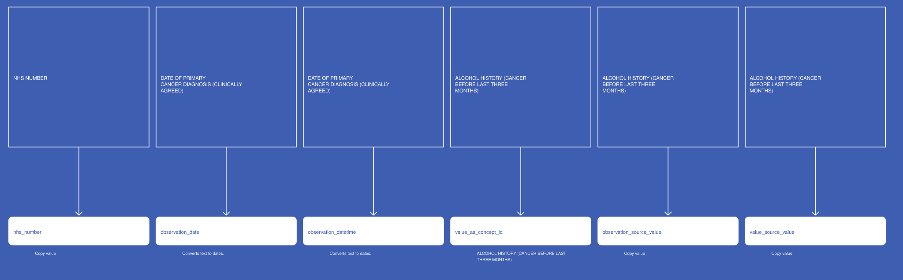</a>

[Comment or raise an issue for this mapping.](https://github.com/answerdigital/oxford-omop-data-mapper/issues/new?title=COSDv8UGObservationAlcoholHistoryCancerPast%20mapping){: .btn }
## COSDv8UGObservationAlcoholHistoryCancerCurrent

[Comment or raise an issue for this mapping.](https://github.com/answerdigital/oxford-omop-data-mapper/issues/new?title=COSDv8UGObservationAlcoholHistoryCancerCurrent%20mapping){: .btn }
## COSDv9SKObservationSmokingStatusCancer

[Comment or raise an issue for this mapping.](https://github.com/answerdigital/oxford-omop-data-mapper/issues/new?title=COSDv9SKObservationSmokingStatusCancer%20mapping){: .btn }
## COSDv9SKObservationAlcoholHistoryCancerPast

[Comment or raise an issue for this mapping.](https://github.com/answerdigital/oxford-omop-data-mapper/issues/new?title=COSDv9SKObservationAlcoholHistoryCancerPast%20mapping){: .btn }
## COSDv9SKObservationAlcoholHistoryCancerCurrent

[Comment or raise an issue for this mapping.](https://github.com/answerdigital/oxford-omop-data-mapper/issues/new?title=COSDv9SKObservationAlcoholHistoryCancerCurrent%20mapping){: .btn }
## COSDv8SKObservationSmokingStatusCancer

[Comment or raise an issue for this mapping.](https://github.com/answerdigital/oxford-omop-data-mapper/issues/new?title=COSDv8SKObservationSmokingStatusCancer%20mapping){: .btn }
## COSDv8SKObservationAlcoholHistoryCancerPast

[Comment or raise an issue for this mapping.](https://github.com/answerdigital/oxford-omop-data-mapper/issues/new?title=COSDv8SKObservationAlcoholHistoryCancerPast%20mapping){: .btn }
## COSDv8SKObservationAlcoholHistoryCancerCurrent

[Comment or raise an issue for this mapping.](https://github.com/answerdigital/oxford-omop-data-mapper/issues/new?title=COSDv8SKObservationAlcoholHistoryCancerCurrent%20mapping){: .btn }
## COSDv9SAObservationSmokingStatusCancer

[Comment or raise an issue for this mapping.](https://github.com/answerdigital/oxford-omop-data-mapper/issues/new?title=COSDv9SAObservationSmokingStatusCancer%20mapping){: .btn }
## COSDv9SAObservationAlcoholHistoryCancerPast

[Comment or raise an issue for this mapping.](https://github.com/answerdigital/oxford-omop-data-mapper/issues/new?title=COSDv9SAObservationAlcoholHistoryCancerPast%20mapping){: .btn }
## COSDv9SAObservationAlcoholHistoryCancerCurrent

[Comment or raise an issue for this mapping.](https://github.com/answerdigital/oxford-omop-data-mapper/issues/new?title=COSDv9SAObservationAlcoholHistoryCancerCurrent%20mapping){: .btn }
## COSDv8SAObservationSmokingStatusCancer

[Comment or raise an issue for this mapping.](https://github.com/answerdigital/oxford-omop-data-mapper/issues/new?title=COSDv8SAObservationSmokingStatusCancer%20mapping){: .btn }
## COSDv8SAObservationAlcoholHistoryCancerPast

[Comment or raise an issue for this mapping.](https://github.com/answerdigital/oxford-omop-data-mapper/issues/new?title=COSDv8SAObservationAlcoholHistoryCancerPast%20mapping){: .btn }
## COSDv8SAObservationAlcoholHistoryCancerCurrent

[Comment or raise an issue for this mapping.](https://github.com/answerdigital/oxford-omop-data-mapper/issues/new?title=COSDv8SAObservationAlcoholHistoryCancerCurrent%20mapping){: .btn }
## COSDv9LVObservationSmokingStatusCancer

[Comment or raise an issue for this mapping.](https://github.com/answerdigital/oxford-omop-data-mapper/issues/new?title=COSDv9LVObservationSmokingStatusCancer%20mapping){: .btn }
## COSDv9LVObservationPerformanceStatusAdult
<a href="COSDv9LVObservationPerformanceStatusAdult.svg" target="_blank">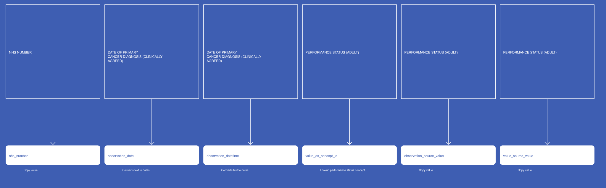</a>

[Comment or raise an issue for this mapping.](https://github.com/answerdigital/oxford-omop-data-mapper/issues/new?title=COSDv9LVObservationPerformanceStatusAdult%20mapping){: .btn }
## COSDv9LVObservationCancerTreatmentIntent

[Comment or raise an issue for this mapping.](https://github.com/answerdigital/oxford-omop-data-mapper/issues/new?title=COSDv9LVObservationCancerTreatmentIntent%20mapping){: .btn }
## COSDv8LVObservationPerformanceStatusAdult

[Comment or raise an issue for this mapping.](https://github.com/answerdigital/oxford-omop-data-mapper/issues/new?title=COSDv8LVObservationPerformanceStatusAdult%20mapping){: .btn }
## COSDv8LVObservationCancerTreatmentIntent

[Comment or raise an issue for this mapping.](https://github.com/answerdigital/oxford-omop-data-mapper/issues/new?title=COSDv8LVObservationCancerTreatmentIntent%20mapping){: .btn }
## CosdV9LungTobaccoSmokingStatus

{: .important-title }
> Notes
>
> Observation dates are approximated using other date fields.
>

[Comment or raise an issue for this mapping.](https://github.com/answerdigital/oxford-omop-data-mapper/issues/new?title=CosdV9LungTobaccoSmokingStatus%20mapping){: .btn }
## CosdV9LungTobaccoSmokingCessation
<a href="CosdV9LungTobaccoSmokingCessation.svg" target="_blank">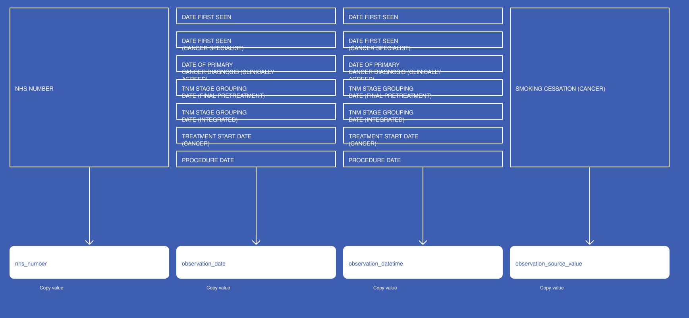</a>

{: .important-title }
> Notes
>
> Observation dates are approximated using other date fields.
>

[Comment or raise an issue for this mapping.](https://github.com/answerdigital/oxford-omop-data-mapper/issues/new?title=CosdV9LungTobaccoSmokingCessation%20mapping){: .btn }
## CosdV9LungSurgicalAccessType
<a href="CosdV9LungSurgicalAccessType.svg" target="_blank">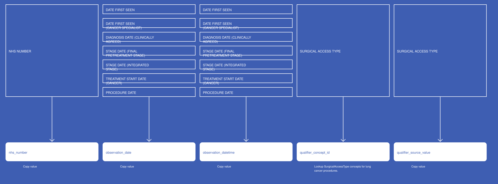</a>

{: .important-title }
> Notes
>
> Observation dates are approximated using other date fields.
>

[Comment or raise an issue for this mapping.](https://github.com/answerdigital/oxford-omop-data-mapper/issues/new?title=CosdV9LungSurgicalAccessType%20mapping){: .btn }
## CosdV9LungSourceOfReferralForOutpatients

{: .important-title }
> Notes
>
> Observation dates are approximated using other date fields.
>

[Comment or raise an issue for this mapping.](https://github.com/answerdigital/oxford-omop-data-mapper/issues/new?title=CosdV9LungSourceOfReferralForOutpatients%20mapping){: .btn }
## CosdV9LungSourceOfReferralForNonPrimaryCancerPathway
<a href="CosdV9LungSourceOfReferralForNonPrimaryCancerPathway.svg" target="_blank">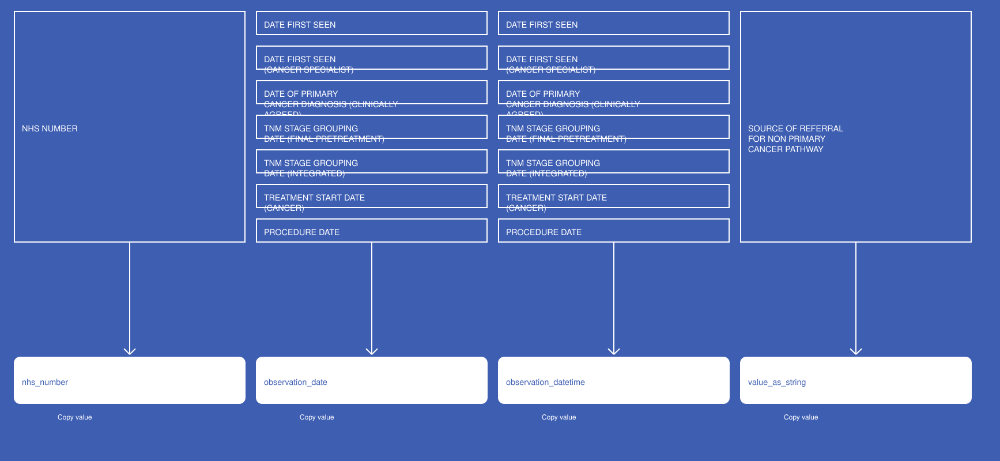</a>

{: .important-title }
> Notes
>
> Observation dates are approximated using other date fields.
>

[Comment or raise an issue for this mapping.](https://github.com/answerdigital/oxford-omop-data-mapper/issues/new?title=CosdV9LungSourceOfReferralForNonPrimaryCancerPathway%20mapping){: .btn }
## CosdV9LungPerformanceStatusAdult

{: .important-title }
> Notes
>
> Observation dates are approximated using other date fields.
>

[Comment or raise an issue for this mapping.](https://github.com/answerdigital/oxford-omop-data-mapper/issues/new?title=CosdV9LungPerformanceStatusAdult%20mapping){: .btn }
## CosdV9LungHistoryOfAlcoholPast
<a href="CosdV9LungHistoryOfAlcoholPast.svg" target="_blank">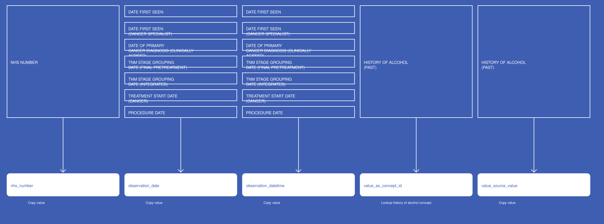</a>

{: .important-title }
> Notes
>
> Observation dates are approximated using other date fields.
>

[Comment or raise an issue for this mapping.](https://github.com/answerdigital/oxford-omop-data-mapper/issues/new?title=CosdV9LungHistoryOfAlcoholPast%20mapping){: .btn }
## CosdV9LungHistoryOfAlcoholCurrent
<a href="CosdV9LungHistoryOfAlcoholCurrent.svg" target="_blank">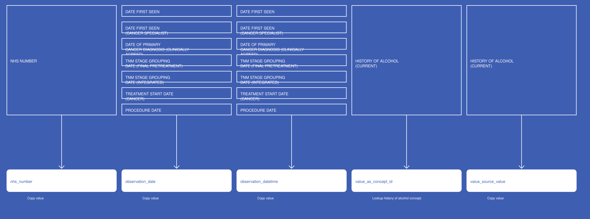</a>

{: .important-title }
> Notes
>
> Observation dates are approximated using other date fields.
>

[Comment or raise an issue for this mapping.](https://github.com/answerdigital/oxford-omop-data-mapper/issues/new?title=CosdV9LungHistoryOfAlcoholCurrent%20mapping){: .btn }
## CosdV9LungFamilialCancerSyndromeSubsidiaryComment

{: .important-title }
> Notes
>
> Observation dates are approximated using other date fields.
>

[Comment or raise an issue for this mapping.](https://github.com/answerdigital/oxford-omop-data-mapper/issues/new?title=CosdV9LungFamilialCancerSyndromeSubsidiaryComment%20mapping){: .btn }
## CosdV9LungAsaScore

{: .important-title }
> Notes
>
> Observation dates are approximated using other date fields.
>

[Comment or raise an issue for this mapping.](https://github.com/answerdigital/oxford-omop-data-mapper/issues/new?title=CosdV9LungAsaScore%20mapping){: .btn }
## CosdV8LungSurgicalAccessType

{: .important-title }
> Notes
>
> Observation dates are approximated using other date fields.
>

[Comment or raise an issue for this mapping.](https://github.com/answerdigital/oxford-omop-data-mapper/issues/new?title=CosdV8LungSurgicalAccessType%20mapping){: .btn }
## CosdV8LungSourceOfReferralOutPatients

{: .important-title }
> Notes
>
> Observation dates are approximated using other date fields.
>

[Comment or raise an issue for this mapping.](https://github.com/answerdigital/oxford-omop-data-mapper/issues/new?title=CosdV8LungSourceOfReferralOutPatients%20mapping){: .btn }
## CosdV8LungSourceOfReferralForOutPatientsNonPrimaryCancerPathway

{: .important-title }
> Notes
>
> Observation dates are approximated using other date fields.
>

[Comment or raise an issue for this mapping.](https://github.com/answerdigital/oxford-omop-data-mapper/issues/new?title=CosdV8LungSourceOfReferralForOutPatientsNonPrimaryCancerPathway%20mapping){: .btn }
## CosdV8LungSmokingStatusCode

{: .important-title }
> Notes
>
> Observation dates are approximated using other date fields.
>

[Comment or raise an issue for this mapping.](https://github.com/answerdigital/oxford-omop-data-mapper/issues/new?title=CosdV8LungSmokingStatusCode%20mapping){: .btn }
## CosdV8LungPersonStatedSexualOrientationCodeAtDiagnosis
<a href="CosdV8LungPersonStatedSexualOrientationCodeAtDiagnosis.svg" target="_blank">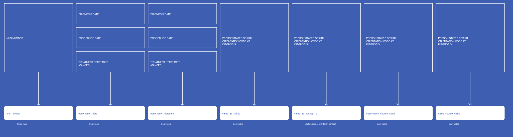</a>

{: .important-title }
> Notes
>
> Observation dates are approximated using other date fields.
>

[Comment or raise an issue for this mapping.](https://github.com/answerdigital/oxford-omop-data-mapper/issues/new?title=CosdV8LungPersonStatedSexualOrientationCodeAtDiagnosis%20mapping){: .btn }
## CosdV8LungAlcoholHistoryCancerPast

{: .important-title }
> Notes
>
> Observation dates are approximated using other date fields.
>

[Comment or raise an issue for this mapping.](https://github.com/answerdigital/oxford-omop-data-mapper/issues/new?title=CosdV8LungAlcoholHistoryCancerPast%20mapping){: .btn }
## CosdV8LungAlcoholHistoryCancerCurrent
<a href="CosdV8LungAlcoholHistoryCancerCurrent.svg" target="_blank">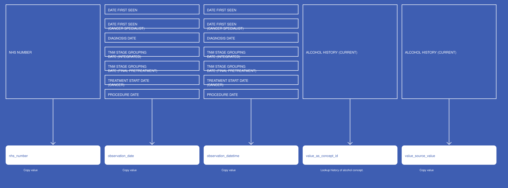</a>

{: .important-title }
> Notes
>
> Observation dates are approximated using other date fields.
>

[Comment or raise an issue for this mapping.](https://github.com/answerdigital/oxford-omop-data-mapper/issues/new?title=CosdV8LungAlcoholHistoryCancerCurrent%20mapping){: .btn }
## CosdV8LungAdultPerformanceStatus

{: .important-title }
> Notes
>
> Observation dates are approximated using other date fields.
>

[Comment or raise an issue for this mapping.](https://github.com/answerdigital/oxford-omop-data-mapper/issues/new?title=CosdV8LungAdultPerformanceStatus%20mapping){: .btn }
## COSDv9HNObservationSmokingStatusCancer

[Comment or raise an issue for this mapping.](https://github.com/answerdigital/oxford-omop-data-mapper/issues/new?title=COSDv9HNObservationSmokingStatusCancer%20mapping){: .btn }
## COSDv9HNObservationPerformanceStatusAdult

[Comment or raise an issue for this mapping.](https://github.com/answerdigital/oxford-omop-data-mapper/issues/new?title=COSDv9HNObservationPerformanceStatusAdult%20mapping){: .btn }
## COSDv9HNObservationCancerTreatmentIntent

[Comment or raise an issue for this mapping.](https://github.com/answerdigital/oxford-omop-data-mapper/issues/new?title=COSDv9HNObservationCancerTreatmentIntent%20mapping){: .btn }
## COSDv9HNObservationAlcoholHistoryCancerPast

[Comment or raise an issue for this mapping.](https://github.com/answerdigital/oxford-omop-data-mapper/issues/new?title=COSDv9HNObservationAlcoholHistoryCancerPast%20mapping){: .btn }
## COSDv9HNObservationAlcoholHistoryCancerCurrent

[Comment or raise an issue for this mapping.](https://github.com/answerdigital/oxford-omop-data-mapper/issues/new?title=COSDv9HNObservationAlcoholHistoryCancerCurrent%20mapping){: .btn }
## COSDv8HNObservationSmokingStatusCancer

[Comment or raise an issue for this mapping.](https://github.com/answerdigital/oxford-omop-data-mapper/issues/new?title=COSDv8HNObservationSmokingStatusCancer%20mapping){: .btn }
## COSDv8HNObservationPerformanceStatusAdult

[Comment or raise an issue for this mapping.](https://github.com/answerdigital/oxford-omop-data-mapper/issues/new?title=COSDv8HNObservationPerformanceStatusAdult%20mapping){: .btn }
## COSDv8HNObservationCancerTreatmentIntent

[Comment or raise an issue for this mapping.](https://github.com/answerdigital/oxford-omop-data-mapper/issues/new?title=COSDv8HNObservationCancerTreatmentIntent%20mapping){: .btn }
## COSDv8HNObservationAlcoholHistoryCancerPast

[Comment or raise an issue for this mapping.](https://github.com/answerdigital/oxford-omop-data-mapper/issues/new?title=COSDv8HNObservationAlcoholHistoryCancerPast%20mapping){: .btn }
## COSDv8HNObservationAlcoholHistoryCancerCurrent

[Comment or raise an issue for this mapping.](https://github.com/answerdigital/oxford-omop-data-mapper/issues/new?title=COSDv8HNObservationAlcoholHistoryCancerCurrent%20mapping){: .btn }
## COSDv9HAObservationSmokingStatusCancer

[Comment or raise an issue for this mapping.](https://github.com/answerdigital/oxford-omop-data-mapper/issues/new?title=COSDv9HAObservationSmokingStatusCancer%20mapping){: .btn }
## COSDv9HAObservationPerformanceStatusAdult

[Comment or raise an issue for this mapping.](https://github.com/answerdigital/oxford-omop-data-mapper/issues/new?title=COSDv9HAObservationPerformanceStatusAdult%20mapping){: .btn }
## COSDv9HAObservationCancerTreatmentIntent

[Comment or raise an issue for this mapping.](https://github.com/answerdigital/oxford-omop-data-mapper/issues/new?title=COSDv9HAObservationCancerTreatmentIntent%20mapping){: .btn }
## COSDv9HAObservationAlcoholHistoryCancerPast

[Comment or raise an issue for this mapping.](https://github.com/answerdigital/oxford-omop-data-mapper/issues/new?title=COSDv9HAObservationAlcoholHistoryCancerPast%20mapping){: .btn }
## COSDv9HAObservationAlcoholHistoryCancerCurrent

[Comment or raise an issue for this mapping.](https://github.com/answerdigital/oxford-omop-data-mapper/issues/new?title=COSDv9HAObservationAlcoholHistoryCancerCurrent%20mapping){: .btn }
## COSDv8HAObservationSmokingStatusCancer

[Comment or raise an issue for this mapping.](https://github.com/answerdigital/oxford-omop-data-mapper/issues/new?title=COSDv8HAObservationSmokingStatusCancer%20mapping){: .btn }
## COSDv8HAObservationPerformanceStatusAdult

[Comment or raise an issue for this mapping.](https://github.com/answerdigital/oxford-omop-data-mapper/issues/new?title=COSDv8HAObservationPerformanceStatusAdult%20mapping){: .btn }
## COSDv8HAObservationCancerTreatmentIntent

[Comment or raise an issue for this mapping.](https://github.com/answerdigital/oxford-omop-data-mapper/issues/new?title=COSDv8HAObservationCancerTreatmentIntent%20mapping){: .btn }
## COSDv8HAObservationAlcoholHistoryCancerPast

[Comment or raise an issue for this mapping.](https://github.com/answerdigital/oxford-omop-data-mapper/issues/new?title=COSDv8HAObservationAlcoholHistoryCancerPast%20mapping){: .btn }
## COSDv8HAObservationAlcoholHistoryCancerCurrent

[Comment or raise an issue for this mapping.](https://github.com/answerdigital/oxford-omop-data-mapper/issues/new?title=COSDv8HAObservationAlcoholHistoryCancerCurrent%20mapping){: .btn }
## COSDv9GYObservationSmokingStatusCancer

[Comment or raise an issue for this mapping.](https://github.com/answerdigital/oxford-omop-data-mapper/issues/new?title=COSDv9GYObservationSmokingStatusCancer%20mapping){: .btn }
## COSDv9GYObservationPerformanceStatusAdult

[Comment or raise an issue for this mapping.](https://github.com/answerdigital/oxford-omop-data-mapper/issues/new?title=COSDv9GYObservationPerformanceStatusAdult%20mapping){: .btn }
## COSDv9GYObservationCancerTreatmentIntent

[Comment or raise an issue for this mapping.](https://github.com/answerdigital/oxford-omop-data-mapper/issues/new?title=COSDv9GYObservationCancerTreatmentIntent%20mapping){: .btn }
## COSDv9GYObservationAlcoholHistoryCancerPast

[Comment or raise an issue for this mapping.](https://github.com/answerdigital/oxford-omop-data-mapper/issues/new?title=COSDv9GYObservationAlcoholHistoryCancerPast%20mapping){: .btn }
## COSDv9GYObservationAlcoholHistoryCancerCurrent

[Comment or raise an issue for this mapping.](https://github.com/answerdigital/oxford-omop-data-mapper/issues/new?title=COSDv9GYObservationAlcoholHistoryCancerCurrent%20mapping){: .btn }
## COSDv8GYObservationSmokingStatusCancer

[Comment or raise an issue for this mapping.](https://github.com/answerdigital/oxford-omop-data-mapper/issues/new?title=COSDv8GYObservationSmokingStatusCancer%20mapping){: .btn }
## COSDv8GYObservationPerformanceStatusAdult

[Comment or raise an issue for this mapping.](https://github.com/answerdigital/oxford-omop-data-mapper/issues/new?title=COSDv8GYObservationPerformanceStatusAdult%20mapping){: .btn }
## COSDv8GYObservationCancerTreatmentIntent

[Comment or raise an issue for this mapping.](https://github.com/answerdigital/oxford-omop-data-mapper/issues/new?title=COSDv8GYObservationCancerTreatmentIntent%20mapping){: .btn }
## COSDv8GYObservationAlcoholHistoryCancerPast

[Comment or raise an issue for this mapping.](https://github.com/answerdigital/oxford-omop-data-mapper/issues/new?title=COSDv8GYObservationAlcoholHistoryCancerPast%20mapping){: .btn }
## COSDv8GYObservationAlcoholHistoryCancerCurrent

[Comment or raise an issue for this mapping.](https://github.com/answerdigital/oxford-omop-data-mapper/issues/new?title=COSDv8GYObservationAlcoholHistoryCancerCurrent%20mapping){: .btn }
## COSDv9CTObservationTobaccoSmokingCessationTreatmentIndicationCode

[Comment or raise an issue for this mapping.](https://github.com/answerdigital/oxford-omop-data-mapper/issues/new?title=COSDv9CTObservationTobaccoSmokingCessationTreatmentIndicationCode%20mapping){: .btn }
## COSDv9CTObservationSmokingStatusCancer

[Comment or raise an issue for this mapping.](https://github.com/answerdigital/oxford-omop-data-mapper/issues/new?title=COSDv9CTObservationSmokingStatusCancer%20mapping){: .btn }
## COSDv9CTObservationPerformanceStatusAdult

[Comment or raise an issue for this mapping.](https://github.com/answerdigital/oxford-omop-data-mapper/issues/new?title=COSDv9CTObservationPerformanceStatusAdult%20mapping){: .btn }
## COSDv9CTObservationCancerTreatmentIntent
<a href="COSDv9CTObservationCancerTreatmentIntent.svg" target="_blank">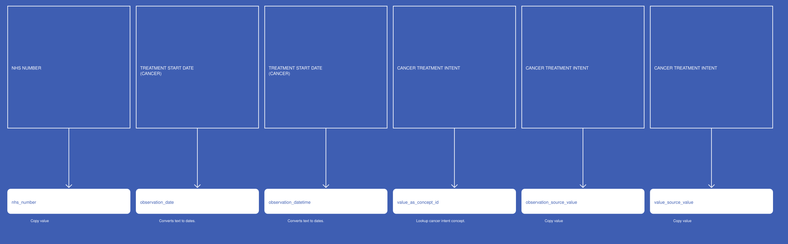</a>

[Comment or raise an issue for this mapping.](https://github.com/answerdigital/oxford-omop-data-mapper/issues/new?title=COSDv9CTObservationCancerTreatmentIntent%20mapping){: .btn }
## COSDv9CTObservationAlcoholHistoryCancerPast

[Comment or raise an issue for this mapping.](https://github.com/answerdigital/oxford-omop-data-mapper/issues/new?title=COSDv9CTObservationAlcoholHistoryCancerPast%20mapping){: .btn }
## COSDv9CTObservationAlcoholHistoryCancerCurrent

[Comment or raise an issue for this mapping.](https://github.com/answerdigital/oxford-omop-data-mapper/issues/new?title=COSDv9CTObservationAlcoholHistoryCancerCurrent%20mapping){: .btn }
## COSDv8CTObservationSmokingStatusCancer

[Comment or raise an issue for this mapping.](https://github.com/answerdigital/oxford-omop-data-mapper/issues/new?title=COSDv8CTObservationSmokingStatusCancer%20mapping){: .btn }
## COSDv8CTObservationPerformanceStatusAdult

[Comment or raise an issue for this mapping.](https://github.com/answerdigital/oxford-omop-data-mapper/issues/new?title=COSDv8CTObservationPerformanceStatusAdult%20mapping){: .btn }
## COSDv8CTObservationAlcoholHistoryCancerPast
<a href="COSDv8CTObservationAlcoholHistoryCancerPast.svg" target="_blank">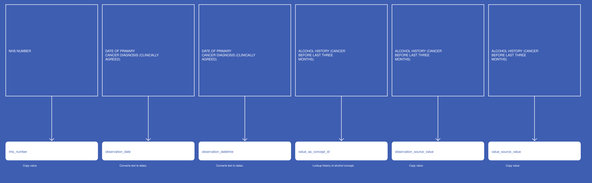</a>

[Comment or raise an issue for this mapping.](https://github.com/answerdigital/oxford-omop-data-mapper/issues/new?title=COSDv8CTObservationAlcoholHistoryCancerPast%20mapping){: .btn }
## COSDv8CTObservationAlcoholHistoryCancerCurrent
<a href="COSDv8CTObservationAlcoholHistoryCancerCurrent.svg" target="_blank">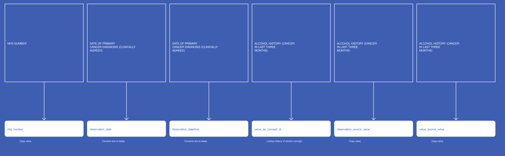</a>

[Comment or raise an issue for this mapping.](https://github.com/answerdigital/oxford-omop-data-mapper/issues/new?title=COSDv8CTObservationAlcoholHistoryCancerCurrent%20mapping){: .btn }
## COSDv9CRObservationTobaccoSmokingCessationTreatmentIndicationCode
<a href="COSDv9CRObservationTobaccoSmokingCessationTreatmentIndicationCode.svg" target="_blank">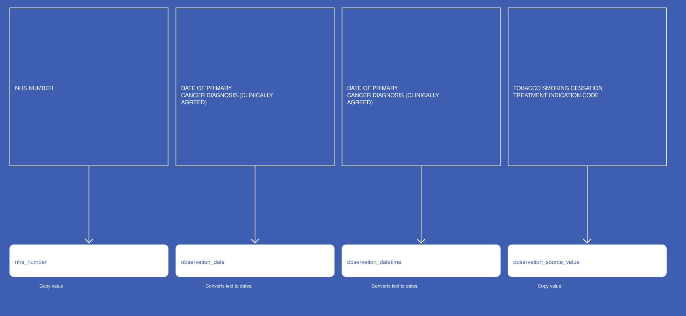</a>

[Comment or raise an issue for this mapping.](https://github.com/answerdigital/oxford-omop-data-mapper/issues/new?title=COSDv9CRObservationTobaccoSmokingCessationTreatmentIndicationCode%20mapping){: .btn }
## COSDv9CRObservationSmokingStatusCancer

[Comment or raise an issue for this mapping.](https://github.com/answerdigital/oxford-omop-data-mapper/issues/new?title=COSDv9CRObservationSmokingStatusCancer%20mapping){: .btn }
## COSDv9CRObservationPerformanceStatusAdult

[Comment or raise an issue for this mapping.](https://github.com/answerdigital/oxford-omop-data-mapper/issues/new?title=COSDv9CRObservationPerformanceStatusAdult%20mapping){: .btn }
## COSDv9CRObservationCancerTreatmentIntent

[Comment or raise an issue for this mapping.](https://github.com/answerdigital/oxford-omop-data-mapper/issues/new?title=COSDv9CRObservationCancerTreatmentIntent%20mapping){: .btn }
## COSDv9CRObservationAlcoholHistoryCancerPast

[Comment or raise an issue for this mapping.](https://github.com/answerdigital/oxford-omop-data-mapper/issues/new?title=COSDv9CRObservationAlcoholHistoryCancerPast%20mapping){: .btn }
## COSDv9CRObservationAlcoholHistoryCancerCurrent

[Comment or raise an issue for this mapping.](https://github.com/answerdigital/oxford-omop-data-mapper/issues/new?title=COSDv9CRObservationAlcoholHistoryCancerCurrent%20mapping){: .btn }
## COSDv8CRObservationSmokingStatusCancer

[Comment or raise an issue for this mapping.](https://github.com/answerdigital/oxford-omop-data-mapper/issues/new?title=COSDv8CRObservationSmokingStatusCancer%20mapping){: .btn }
## COSDv8CRObservationPerformanceStatusAdult

[Comment or raise an issue for this mapping.](https://github.com/answerdigital/oxford-omop-data-mapper/issues/new?title=COSDv8CRObservationPerformanceStatusAdult%20mapping){: .btn }
## COSDv8CRObservationCancerTreatmentIntent

[Comment or raise an issue for this mapping.](https://github.com/answerdigital/oxford-omop-data-mapper/issues/new?title=COSDv8CRObservationCancerTreatmentIntent%20mapping){: .btn }
## COSDv8CRObservationAlcoholHistoryCancerPast

[Comment or raise an issue for this mapping.](https://github.com/answerdigital/oxford-omop-data-mapper/issues/new?title=COSDv8CRObservationAlcoholHistoryCancerPast%20mapping){: .btn }
## COSDv8CRObservationAlcoholHistoryCancerCurrent

[Comment or raise an issue for this mapping.](https://github.com/answerdigital/oxford-omop-data-mapper/issues/new?title=COSDv8CRObservationAlcoholHistoryCancerCurrent%20mapping){: .btn }
## CosdV9TobaccoSmokingStatus

{: .important-title }
> Notes
>
> Observation dates are approximated using other date fields.
>

[Comment or raise an issue for this mapping.](https://github.com/answerdigital/oxford-omop-data-mapper/issues/new?title=CosdV9TobaccoSmokingStatus%20mapping){: .btn }
## CosdV9TobaccoSmokingCessation

{: .important-title }
> Notes
>
> Observation dates are approximated using other date fields.
>

[Comment or raise an issue for this mapping.](https://github.com/answerdigital/oxford-omop-data-mapper/issues/new?title=CosdV9TobaccoSmokingCessation%20mapping){: .btn }
## CosdV9SourceOfReferralForOutpatients
<a href="CosdV9SourceOfReferralForOutpatients.svg" target="_blank">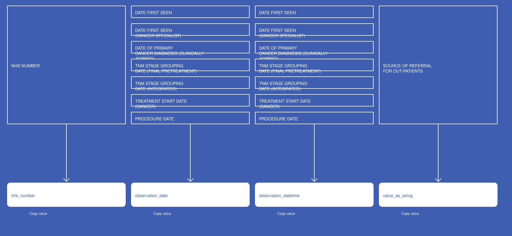</a>

{: .important-title }
> Notes
>
> Observation dates are approximated using other date fields.
>

[Comment or raise an issue for this mapping.](https://github.com/answerdigital/oxford-omop-data-mapper/issues/new?title=CosdV9SourceOfReferralForOutpatients%20mapping){: .btn }
## CosdV9SourceOfReferralForNonPrimaryCancerPathway

{: .important-title }
> Notes
>
> Observation dates are approximated using other date fields.
>

[Comment or raise an issue for this mapping.](https://github.com/answerdigital/oxford-omop-data-mapper/issues/new?title=CosdV9SourceOfReferralForNonPrimaryCancerPathway%20mapping){: .btn }
## CosdV9PersonSexualOrientationCodeAtDiagnosis
<a href="CosdV9PersonSexualOrientationCodeAtDiagnosis.svg" target="_blank">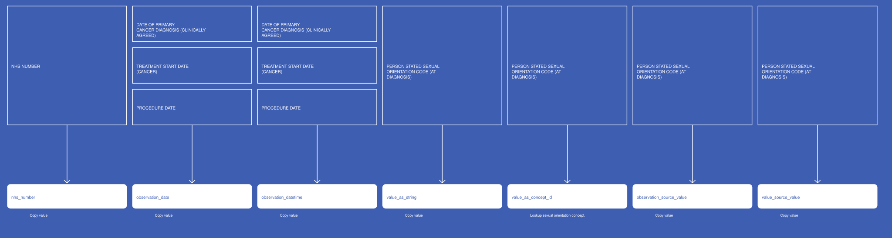</a>

{: .important-title }
> Notes
>
> Observation dates are approximated using other date fields.
>

[Comment or raise an issue for this mapping.](https://github.com/answerdigital/oxford-omop-data-mapper/issues/new?title=CosdV9PersonSexualOrientationCodeAtDiagnosis%20mapping){: .btn }
## CosdV9PerformanceStatusAdult

{: .important-title }
> Notes
>
> Observation dates are approximated using other date fields.
>

[Comment or raise an issue for this mapping.](https://github.com/answerdigital/oxford-omop-data-mapper/issues/new?title=CosdV9PerformanceStatusAdult%20mapping){: .btn }
## CosdV9HistoryOfAlcoholPast
<a href="CosdV9HistoryOfAlcoholPast.svg" target="_blank">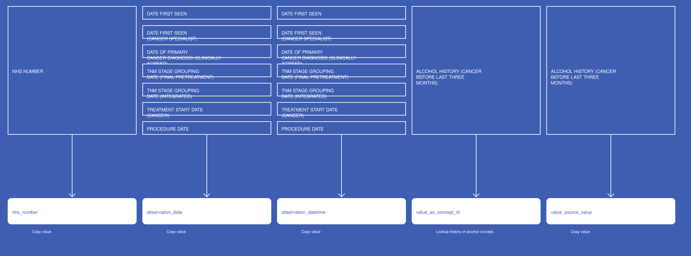</a>

{: .important-title }
> Notes
>
> Observation dates are approximated using other date fields.
>

[Comment or raise an issue for this mapping.](https://github.com/answerdigital/oxford-omop-data-mapper/issues/new?title=CosdV9HistoryOfAlcoholPast%20mapping){: .btn }
## CosdV9HistoryOfAlcoholCurrent

{: .important-title }
> Notes
>
> Observation dates are approximated using other date fields.
>

[Comment or raise an issue for this mapping.](https://github.com/answerdigital/oxford-omop-data-mapper/issues/new?title=CosdV9HistoryOfAlcoholCurrent%20mapping){: .btn }
## CosdV9FamilialCancerSyndromeSubsidiaryComment

{: .important-title }
> Notes
>
> Observation dates are approximated using other date fields.
>

[Comment or raise an issue for this mapping.](https://github.com/answerdigital/oxford-omop-data-mapper/issues/new?title=CosdV9FamilialCancerSyndromeSubsidiaryComment%20mapping){: .btn }
## CosdV9AsaScore
<a href="CosdV9AsaScore.svg" target="_blank">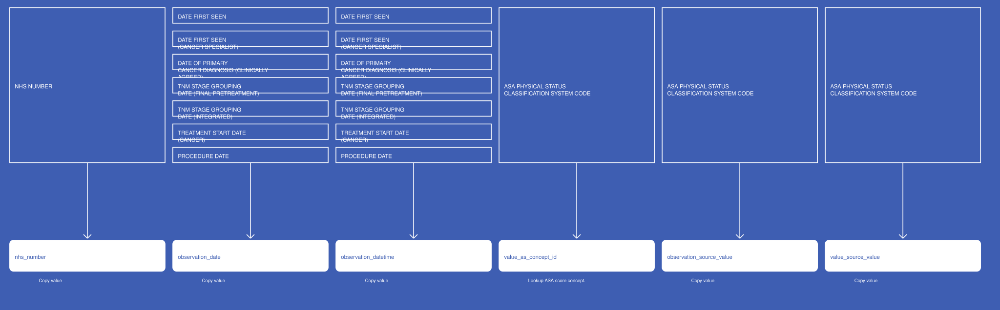</a>

{: .important-title }
> Notes
>
> Observation dates are approximated using other date fields.
>

[Comment or raise an issue for this mapping.](https://github.com/answerdigital/oxford-omop-data-mapper/issues/new?title=CosdV9AsaScore%20mapping){: .btn }
## CosdV8SourceOfReferralOutPatients

{: .important-title }
> Notes
>
> Observation dates are approximated using other date fields.
>

[Comment or raise an issue for this mapping.](https://github.com/answerdigital/oxford-omop-data-mapper/issues/new?title=CosdV8SourceOfReferralOutPatients%20mapping){: .btn }
## CosdV8SourceOfReferralForOutPatientsNonPrimaryCancerPathway
<a href="CosdV8SourceOfReferralForOutPatientsNonPrimaryCancerPathway.svg" target="_blank">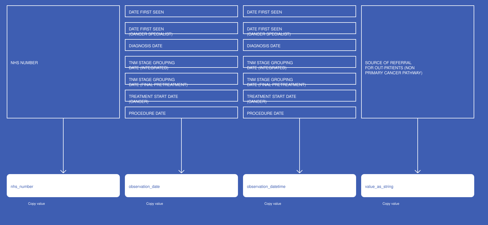</a>

{: .important-title }
> Notes
>
> Observation dates are approximated using other date fields.
>

[Comment or raise an issue for this mapping.](https://github.com/answerdigital/oxford-omop-data-mapper/issues/new?title=CosdV8SourceOfReferralForOutPatientsNonPrimaryCancerPathway%20mapping){: .btn }
## CosdV8SmokingStatusCode

{: .important-title }
> Notes
>
> Observation dates are approximated using other date fields.
>

[Comment or raise an issue for this mapping.](https://github.com/answerdigital/oxford-omop-data-mapper/issues/new?title=CosdV8SmokingStatusCode%20mapping){: .btn }
## CosdV8PersonStatedSexualOrientationCodeAtDiagnosis
<a href="CosdV8PersonStatedSexualOrientationCodeAtDiagnosis.svg" target="_blank">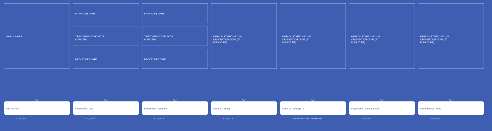</a>

{: .important-title }
> Notes
>
> Observation dates are approximated using other date fields.
>

[Comment or raise an issue for this mapping.](https://github.com/answerdigital/oxford-omop-data-mapper/issues/new?title=CosdV8PersonStatedSexualOrientationCodeAtDiagnosis%20mapping){: .btn }
## CosdV8AlcoholHistoryCancerPast

{: .important-title }
> Notes
>
> Observation dates are approximated using other date fields.
>

[Comment or raise an issue for this mapping.](https://github.com/answerdigital/oxford-omop-data-mapper/issues/new?title=CosdV8AlcoholHistoryCancerPast%20mapping){: .btn }
## CosdV8AlcoholHistoryCancerCurrent
<a href="CosdV8AlcoholHistoryCancerCurrent.svg" target="_blank">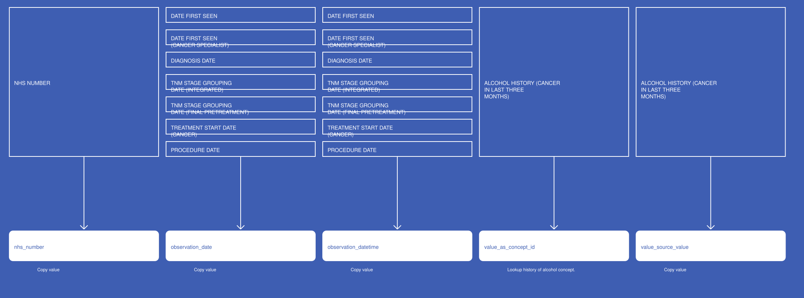</a>

{: .important-title }
> Notes
>
> Observation dates are approximated using other date fields.
>

[Comment or raise an issue for this mapping.](https://github.com/answerdigital/oxford-omop-data-mapper/issues/new?title=CosdV8AlcoholHistoryCancerCurrent%20mapping){: .btn }
## CosdV8AdultPerformanceStatus

{: .important-title }
> Notes
>
> Observation dates are approximated using other date fields.
>

[Comment or raise an issue for this mapping.](https://github.com/answerdigital/oxford-omop-data-mapper/issues/new?title=CosdV8AdultPerformanceStatus%20mapping){: .btn }
## CosdV9BreastSourceOfReferralForOutpatients

{: .important-title }
> Notes
>
> Observation dates are approximated using other date fields.
>

[Comment or raise an issue for this mapping.](https://github.com/answerdigital/oxford-omop-data-mapper/issues/new?title=CosdV9BreastSourceOfReferralForOutpatients%20mapping){: .btn }
## CosdV9BreastSourceOfReferralForNonPrimaryCancerPathway
<a href="CosdV9BreastSourceOfReferralForNonPrimaryCancerPathway.svg" target="_blank">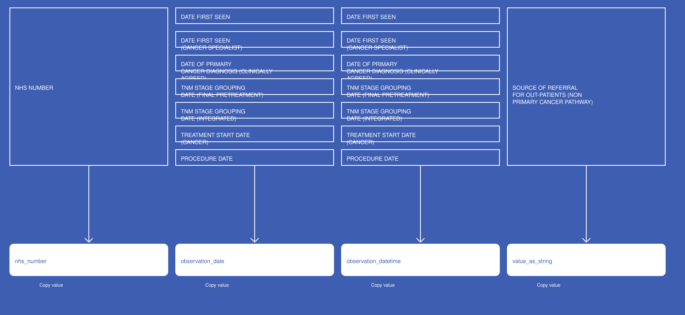</a>

{: .important-title }
> Notes
>
> Observation dates are approximated using other date fields.
>

[Comment or raise an issue for this mapping.](https://github.com/answerdigital/oxford-omop-data-mapper/issues/new?title=CosdV9BreastSourceOfReferralForNonPrimaryCancerPathway%20mapping){: .btn }
## CosdV9BreastPerformanceStatusAdult

{: .important-title }
> Notes
>
> Observation dates are approximated using other date fields.
>

[Comment or raise an issue for this mapping.](https://github.com/answerdigital/oxford-omop-data-mapper/issues/new?title=CosdV9BreastPerformanceStatusAdult%20mapping){: .btn }
## CosdV9BreastHistoryOfAlcoholPast

{: .important-title }
> Notes
>
> Observation dates are approximated using other date fields.
>

[Comment or raise an issue for this mapping.](https://github.com/answerdigital/oxford-omop-data-mapper/issues/new?title=CosdV9BreastHistoryOfAlcoholPast%20mapping){: .btn }
## CosdV9BreastHistoryOfAlcoholCurrent

{: .important-title }
> Notes
>
> Observation dates are approximated using other date fields.
>

[Comment or raise an issue for this mapping.](https://github.com/answerdigital/oxford-omop-data-mapper/issues/new?title=CosdV9BreastHistoryOfAlcoholCurrent%20mapping){: .btn }
## CosdV9BreastFamilialCancerSyndromeSubsidiaryComment

{: .important-title }
> Notes
>
> Observation dates are approximated using other date fields.
>

[Comment or raise an issue for this mapping.](https://github.com/answerdigital/oxford-omop-data-mapper/issues/new?title=CosdV9BreastFamilialCancerSyndromeSubsidiaryComment%20mapping){: .btn }
## CosdV9BreastAsaScore

{: .important-title }
> Notes
>
> Observation dates are approximated using other date fields.
>

[Comment or raise an issue for this mapping.](https://github.com/answerdigital/oxford-omop-data-mapper/issues/new?title=CosdV9BreastAsaScore%20mapping){: .btn }
## CosdV8BreastSourceOfReferralOutPatients
<a href="CosdV8BreastSourceOfReferralOutPatients.svg" target="_blank">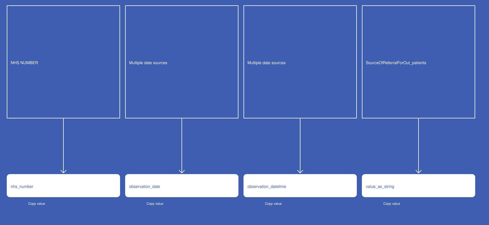</a>

{: .important-title }
> Notes
>
> Observation dates are approximated using other date fields.
>

[Comment or raise an issue for this mapping.](https://github.com/answerdigital/oxford-omop-data-mapper/issues/new?title=CosdV8BreastSourceOfReferralOutPatients%20mapping){: .btn }
## CosdV8BreastSourceOfReferralForOutPatientsNonPrimaryCancerPathway

{: .important-title }
> Notes
>
> Observation dates are approximated using other date fields.
>

[Comment or raise an issue for this mapping.](https://github.com/answerdigital/oxford-omop-data-mapper/issues/new?title=CosdV8BreastSourceOfReferralForOutPatientsNonPrimaryCancerPathway%20mapping){: .btn }
## CosdV8BreastSmokingStatusCode
<a href="CosdV8BreastSmokingStatusCode.svg" target="_blank">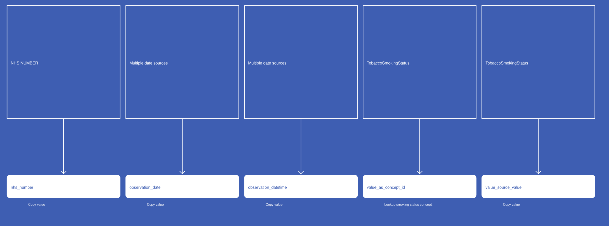</a>

{: .important-title }
> Notes
>
> Observation dates are approximated using other date fields.
>

[Comment or raise an issue for this mapping.](https://github.com/answerdigital/oxford-omop-data-mapper/issues/new?title=CosdV8BreastSmokingStatusCode%20mapping){: .btn }
## CosdV8BreastPersonStatedSexualOrientationCodeAtDiagnosis
<a href="CosdV8BreastPersonStatedSexualOrientationCodeAtDiagnosis.svg" target="_blank">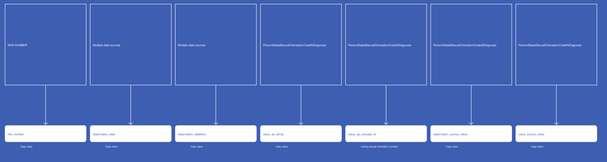</a>

{: .important-title }
> Notes
>
> Observation dates are approximated using other date fields.
>

[Comment or raise an issue for this mapping.](https://github.com/answerdigital/oxford-omop-data-mapper/issues/new?title=CosdV8BreastPersonStatedSexualOrientationCodeAtDiagnosis%20mapping){: .btn }
## COSDv9BAObservationPerformanceStatusAdult

[Comment or raise an issue for this mapping.](https://github.com/answerdigital/oxford-omop-data-mapper/issues/new?title=COSDv9BAObservationPerformanceStatusAdult%20mapping){: .btn }
## COSDv9BAObservationCancerTreatmentIntent

[Comment or raise an issue for this mapping.](https://github.com/answerdigital/oxford-omop-data-mapper/issues/new?title=COSDv9BAObservationCancerTreatmentIntent%20mapping){: .btn }
## COSDv8BAObservationPerformanceStatusAdult

[Comment or raise an issue for this mapping.](https://github.com/answerdigital/oxford-omop-data-mapper/issues/new?title=COSDv8BAObservationPerformanceStatusAdult%20mapping){: .btn }
## COSDv8BAObservationCancerTreatmentIntent

[Comment or raise an issue for this mapping.](https://github.com/answerdigital/oxford-omop-data-mapper/issues/new?title=COSDv8BAObservationCancerTreatmentIntent%20mapping){: .btn }
